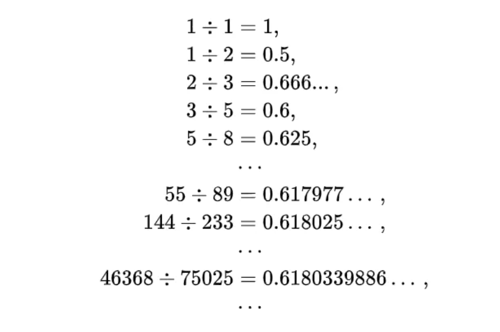
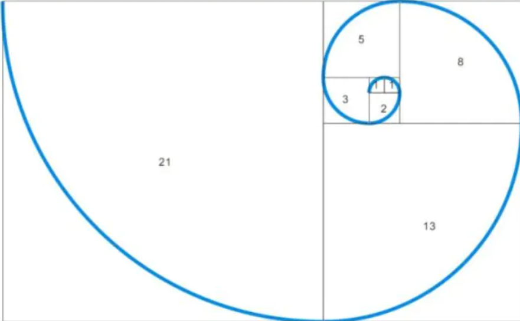

**题目**：
- 斐波那契数列, 输出数列第n个的值
* 百度百科：斐波那契数列（Fibonacci sequence），又称黄金分割数列
* 因数学家莱昂纳多·斐波那契（Leonardoda Fibonacci）以兔子繁殖为例子而引入，故又称为“兔子数列”，（有一对兔子，从出生后第3个月起每个月都生一对兔子，小兔子长到第三个月后每个月又生一对兔子，假如兔子都不死，问每个月的兔子总数为多少对？）
* 指的是这样一个数列：0、1、1、2、3、5、8、13、21、34、……这个数列从第三项开始，每一项都等于前两项之和。裴波那契数列最具有和谐之美的地方是，越往后，相邻两项的比值会无限趋向于黄金比1:0.618




**程序分析**：
* 斐波那契数列（Fibonacci sequence），又称黄金分割数列，指的是这样一个数列：0、1、1、2、3、5、8、13、21、34、……。

在数学上，斐波那契数列以如下被以递推的方法定义：
```
F0 = 0     (n=0)
F1 = 1     (n=1)
Fn = F[n-1]+ F[n-2](n=>2)

```

期望输入输出：
```
输入:
    10
期望输出：
    55
```


程序源代码，解法一, 递推法：
```python
def fib(n):
    a, b = 1, 1
    for i in range(n - 1):
        a, b = b, a + b
    return a

print(fib(int(input("输入："))))


```


程序源代码，解法二，使用递归
```python
# 使用递归
def fib(n):
    if n == 1 or n == 2:
        return 1
    return fib(n - 1) + fib(n - 2)


# 输出了第n个斐波那契数列
print(fib(int(input("输入："))))

```


程序源代码，解法三，使用数组存储之前计算的结果
```
def fib(n):
    if n == 1:
        return [1]
    if n == 2:
        return [1, 1]
    fibs = [1, 1]
    for i in range(2, n):
        fibs.append(fibs[-1] + fibs[-2])
    return fibs


# 输出前 n 个斐波那契数列
input_n = int(input("输入："))
print(fib(input_n)[input_n - 1])

```


参考资料：
* 菜鸟教程 https://www.runoob.com/python/python-100-examples.html
* 知乎 https://zhuanlan.zhihu.com/p/115198225
* 阿里云: https://developer.aliyun.com/article/924780