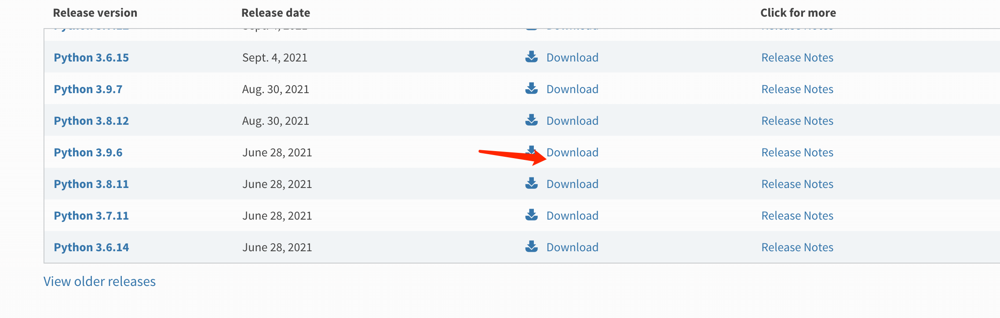
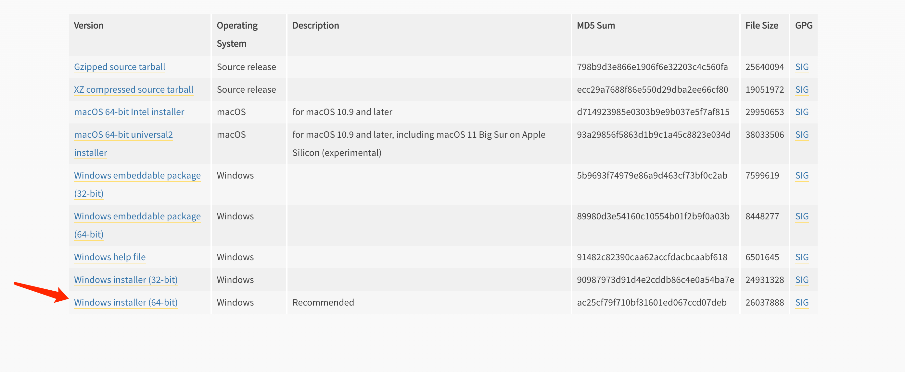
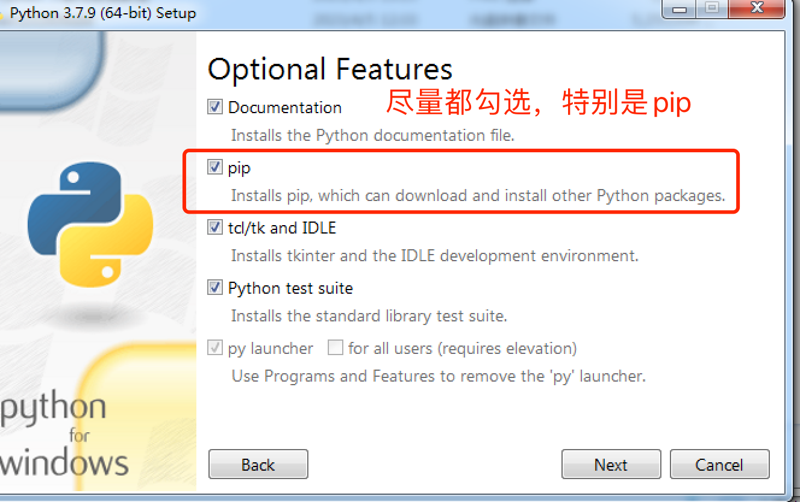
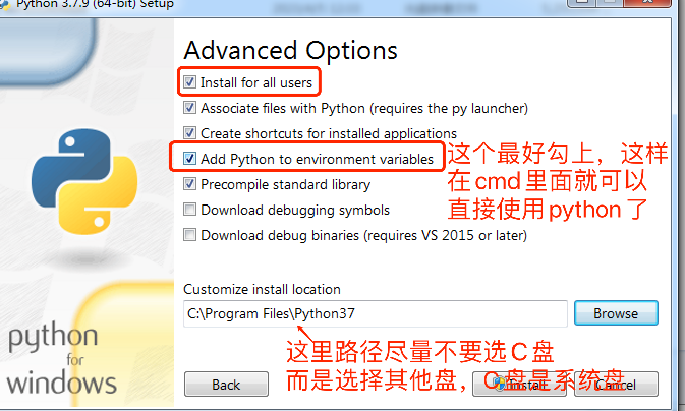
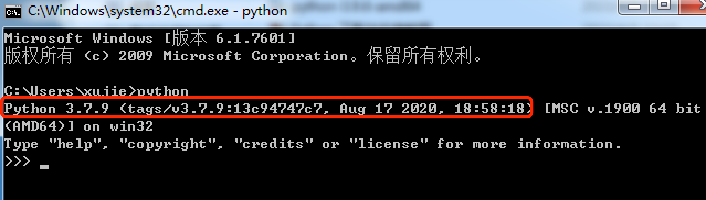
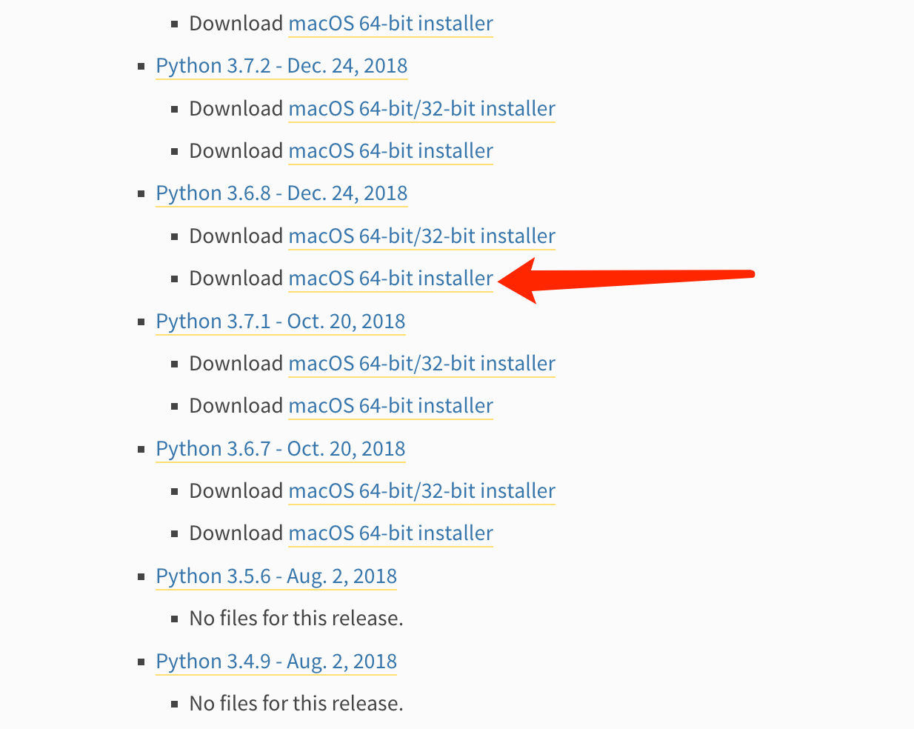
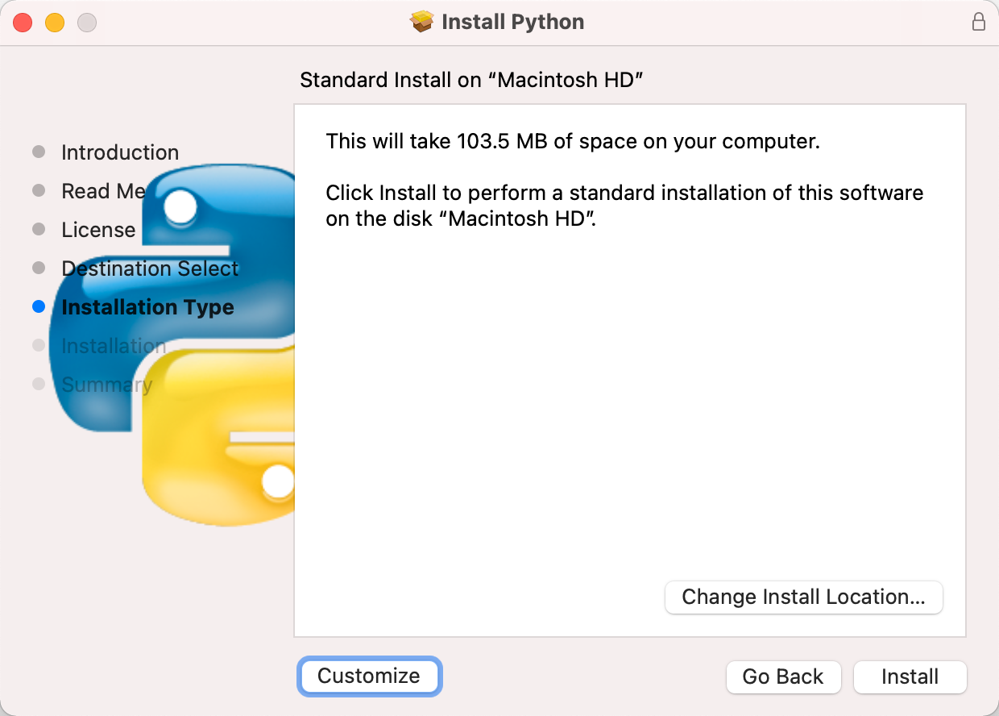
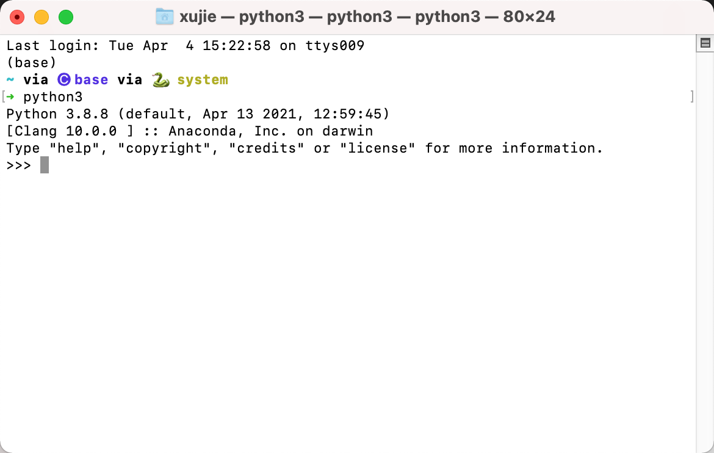
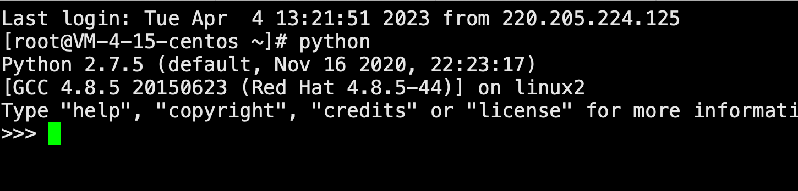
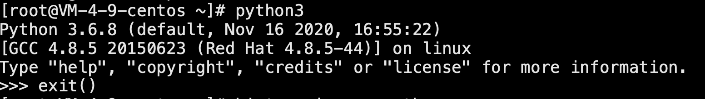

--- 
title: 1.0 各个系统安装python
date: 2024-04-17T09:12
---

# 0. 介绍
本节教程介绍各个系统安装python的方法以及注意事项

这里介绍的是纯python，而不是anaconda等其他方式，

纯python的方式好处是让环境更干净，需要的磁盘空间更小，

最适合部署项目的时候使用，

后续我也会教大家如何对纯python使用工具管理不同的版本，适应平时开发需要

# 1. Windows
进入官网的下载页面 https://www.python.org/downloads/

选择合适的版本进行下载（注意官网上的版本可能没办法兼容一些老的系统版本，比如下面的3.9.6就不支持Windows 7了，如果需要一些老一点的版本，可以在网上找找，或者私我给你发）

下载完成后进行安装：

# 2. Mac
新版mac会自带python2.x, 甚至最新版的会自带python3.x，可以自行尝试一下python版本

## 2.1 软件安装方式
也去官网下载希望安装的版本：`https://www.python.org/downloads/macos/`
下载完之后根据提示进行安装

## 2.2 Homebrew 命令行方式
* 如果还没有安装homebrew，请执行如下命令安装homebrew
	* `/usr/bin/ruby -e "$(curl -fsSL https://raw.githubusercontent.com/Homebrew/install/master/install)"`
* 安装完成后，执行下面的命令安装python
	* `brew install python@3.6`
* 通过如下命令设置python3.6为默认版本
	* `echo 'alias python3="/usr/local/bin/python3.6"' >> ~/.bash_profile

- `source ~/.bash_profile`

# 3. Linux
* 同样Linux也会自带python2.x，甚至会自带python3.x，可以先尝试一下看看

## 3.1 Linux - Centos
* 安装依赖包:
	* `yum -y groupinstall "Development tools"`
	* `yum -y install zlib-devel bzip2-devel openssl-devel ncurses-devel sqlite-devel readline-devel tk-devel gdbm-devel db4-devel libpcap-devel xz-devel`
* 下载Python3安装包
	* https://www.python.org/ftp/python/
	* `wget https://www.python.org/ftp/python/3.6.2/Python-3.6.2.tar.xz`
* 新建python3目录
	* `mkdir /usr/local/python3`
* 安装python3
	* `tar -xvJf  Python-3.6.2.tar.xz`
	* `cd Python-3.6.2`
	* `./configure --prefix=/usr/local/python3`
	* 安装python3.7以上版本，需要先安装新的包 >  `yum install libffi-devel -y`
	* `make && make install`
* 安装python3时，会自动安装pip,如果没有，需要手动安装
	* `yum -y install python-pip`
* 创建软链接
	* `ln -s /usr/local/python3/bin/python3 /usr/bin/python3`
		* 如果遇到错误：`ln: failed to create symbolic link ‘/usr/bin/python3’: File exists`
		* 可以用如下命令代替: `ln -sf /usr/local/python3/bin/python3 /usr/bin/python3` (-f 表示强制执行)
	* `ln -sf /usr/local/python3/bin/pip3 /usr/bin/pip3`
* 安装完成，测试：
	* `python3 --version`

## 3.2 Linux - Ubuntu

* 安装之前，先更新一下源的软件列表
	* `apt-get update`
	* `apt-get install zlib1g-dev libbz2-dev libssl-dev libncurses5-dev libsqlite3-dev libreadline-dev tk-dev libgdbm-dev libdb-dev libpcap-dev xz-utils libexpat1-dev liblzma-dev libffi-dev libc6-dev`
* 下载Python3安装包
	* https://www.python.org/ftp/python/
	* `wget https://www.python.org/ftp/python/3.8.3/Python-3.8.3.tgz`
	* 如果觉得太慢，可以换成阿里的镜像
		* `wget https://cdn.npm.taobao.org/dist/python/3.8.3/Python-3.8.3.tgz`
* 安装python3
	* `tar -xzf Python-3.8.3.tgz`
	* `Python-3.8.3`
	* `./configure --prefix=/usr/local/python3.8`
		* 如果不在意安装耗时，可以设置优化选项`--enable-optimizations`
			* `./configure --prefix=/usr/local/python3.8 --enable-optimizations`
	* 安装python3.7以上版本，需要先安装新的包 >  `yum install libffi-devel -y`
	* `make && make install`
* 创建软链接
	* `ln -s /usr/local/python3.8/bin/python3.8 /usr/bin/python3.8`
	* `ln -s /usr/local/python3.8/bin/python3.8-config /usr/bin/python3.8-config`
	* `ln -s /usr/local/python3.8/bin/pip3 /usr/bin/pip3.8`
* 安装完成，测试：
	* `python3 --version`

# 4. 修改PyPI为国内源：
* 原因：pip默认下载用的是国外源，下载贼慢，用国内的快很多
* 步骤，设置源对各个系统都通用，所以写在一起，pip3记得换成pip 或者你自己的pip命令
	* 升级PIP `pip3 install --upgrade pip`
	* 命令行修改源：`pip3 config set global.index-url https://pypi.douban.com/simple/`
	* 查看当前源: `pip3 config list`
	* 设置回为默认的源：`pip config unset global.index-url`
* 常用源：
	* `http://mirrors.aliyun.com/pypi/simple/`
	* `https://pypi.tuna.tsinghua.edu.cn/simple/`
	* `https://pypi.mirrors.ustc.edu.cn/simple/`
	* `http://pypi.mirrors.ustc.edu.cn/simple/`
	* `https://pypi.douban.com/simple/`