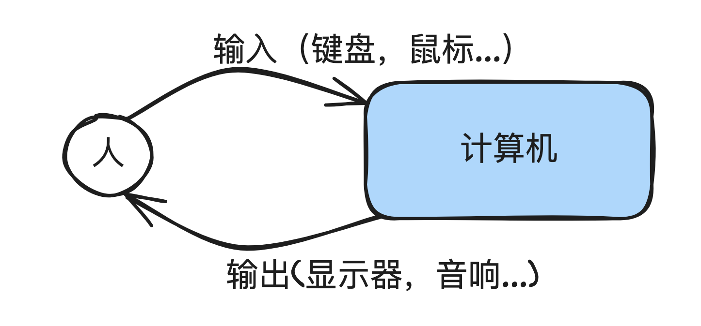

# 1.1 输入、输出以及变量

大家好，本系列课程是小白从入门python到自由使用python进行数据分析，制作网站，编写智能算法的第一阶段，我称之为炼气期，是为最基础阶段，如果您觉得这一阶段对您太简单，也不要紧，我会出一套测试题，如果大部分你都能掌握，那说明可以直接进入下一阶段，话不多说，我们开始吧！

- 我们常见的计算机（包括PC，手机，浏览器等）都是和人们进行交互来工作的，当你想要看小视频的时候，需要打开APP，通过触屏点击某个喜欢的小姐姐小哥哥，来进行播放
    - 这里的输入就是触屏点击
    - 输出就是视频，声音等
        
        
        
        人和计算机交互图示
        

## 1. 如何输出信息到屏幕上

- 所以知道如何用编程语言来和我们进行交互，是最基础也是最重要的，我们从输出信息到命令行开始我们的旅程
- 首先创建一个文件夹，我这里是 `python_lianqi` , 然后创建本章的文件夹 `sample01` , 并创建本章的py文件：`sample_01_print.py` , 此时，你的目录结构看起来应该是：

```bash
python_lianqi
    └── sample01
        └── sample_01_print.py
```

### 1.1 例子🌰

- 在python中，如果希望在屏幕中输出信息，我们一般调用`print` 方法，我们来像大多数程序一样希望在屏幕中输出 `Hello World!` ，在我们的文件中就可以写下：`print("Hello World!")` 来达到我们的目的, 可以通过下面两种方式运行：
- 通过pycharm直接运行
    - 
    
- 通过命令行运行
    - 首先确保你当前的目录在主目录`python_lianqi`下
    - 接着运行 `python sample01/sample_01_print.py` ,可以看到输出
        - 
            

### 1.2 例子解析

#### 1.2.1 print 方法解析

- 首先我们对上面的一行代码进行拆分
    - 一个是python的内置方法 `print()`
    - 另一个是这个内置方法需要的参数


- 此时你可能会纳闷，什么是`“方法”`，而什么是`”参数“`呢？
    - 可以先按如下的方式暂时来理解：
    - `方法` 也可以称为`函数`，还记得小学初中学过的`函数`吗，没错，就是类似 `y=ax+b` 这种，随着`自变量 x` 的变化，`因变量 y` 随之变化
    - 而我们的`方法`也类似，`方法`可以如一个计算函数一样有返回值，也可以是我们希望让计算机做的某件事，这里python帮我们内置了一个`方法`，用来在屏幕上输出我们希望输出的内容
    - 理解了方法，`参数`也就好理解了，类似于`函数`需要一个自变量，有的方法也需要一个`输入`，这个就可以称之为`参数`
    - 整个过程可以参见下图：


- print方法试验
    - 如果什么参数都不给，会得到什么？
        - 比如直接在代码中写下: `print()`
        - 自己尝试后点击查看解析
            
            你将会得到一个空行
            
    - …

#### 1.2.2 字符串

- 此时我们还注意到，我们期望的是在屏幕中输出 `Hello World!` ， 但为什么我们写代码的时候，要多写两个双引号呢？单引号行不行？还有其他方式吗？


- 在python中，用两个双引号包括起来的一串字符，我们称之为字符串，可以把这个字符串看成一个整体作为参数
- 那用单引号行不行？行，可以试试！
    - `print('Hello World!')`
- 还有没有其他方式？有，比如三引号 `print('''Hello World!''')`
- 这么多种用法，我们怎么选择呢？我们先暂时不说，放在后面来详细讲解

- 试验：
    - 我希望输出：`Baozige's baozi`
        - 注意此时用单引号放在字符串两端就不行（暂时不行，嘿嘿，后续有方式可以）
        - 代码见：`sample01/sample_01_string_lianxi_01.py`
        - 自己尝试后点击查看代码
            
            `print("Baozige's baozi")`
            
    - 我希望输出：
        - `我爱你中国! 我爱你中国! 我爱你中国!` 注意中间的空格
        - 代码见：`sample01/sample_01_string_lianxi_02.py`
        - 自己尝试后点击查看代码
            
            `print("我爱你中国!" + " " + "我爱你中国!" + " " + "我爱你中国!")`
            
            `print("我爱你中国! 我爱你中国! 我爱你中国!")`
            

- 注意上面两个字符串之间的 `+` 号，当两个字符串用 `+` 号连接后，就成为了一个新的字符串

## 2. 计算机如何获取我们的输入

### 2.1 input方法

上一节我们学会了如何让计算机输出我们希望的信息，这一节我们来学习计算机如何读取我们的输入：

- 如果需要读取用户的输入，我们需要引入一个新函数 `input()`，可以看到如下例子：
    - `input("你叫什么名字？")`
    - 运行程序后，程序先输出input里面的字符串内容（其实是提示语，用来告诉用户输入什么内容），接着我输入 `包子哥` ，程序才会结束运行
    
    
    
- 那如何将`input()` 输入的内容再次使用呢？看下面的例子
    - `print("你好呀，" + input("你叫什么名字？"))`
    - 这里输入 包子哥 后，程序还会继续输出 `你好呀，包子哥`
    - 看下面两个图
    
    
    
    
    
### 2.2 练习
    
    - 需求如下：
        - 用户输入任意一个字符串，控制台需要显示用户输入的字符串的长度
        - 这里有一个点之前没学过，但是我们应该利用搜索引擎或其他方式来查找，比如搜索“python 获取字符串长度”，未来你遇到的很多需求，你可能都不知道，但没关系，先去网上搜索下吧
        - 输入输出例子：
        
        ```bash
        输入：Hello
        输出：5
        
        输入：Hello World!
        输出: 12
        
        ```
        
    - 请思考并实现后查看代码
        
        `print(len(input("请输入一个字符串: ")))`
        
    
## 3. 变量
### 3.1 引入变量
    
    还记得上一节的问你叫什么名字的代码吗？如果用户输入了他的名字，我们想多次使用这个名字，之前的写法会不会就有问题？此时我们需要引入一个新容器，来存放输入的名字：我们称之为变量
    
    
    
    ```bash
    name = input("你叫什么名字？")
    print("你好呀，" + name + "!")
    print(name + ", 最近怎么样？")
    ```
    
### 3.2 练习：交换变量值
    
    - 需求：
        - 先后输入两个字符串a, b，交换a和b的内容后输出
        - 
        
        ```bash
        例1:
        
        输入：
        23
        32
        
        输出：
        a: 32
        b: 23
        
        例2:
        
        输入：
        包子
        饺子
        
        输出：
        a: 饺子
        b: 包子
        ```
        
        - 思考：
            - 这里要交换a和b的内容，现实生活中，如果你有两个容器，盛放了不同的东西，希望交换，是不是需要第三个容器？那编程也是类似
            
            
            
        - 请思考尝试实现后查看
            
            ```bash
            a = input("请输入第一个字符串：")
            b = input("请输入第二个字符串：")
            
            # 引入中间变量C
            c = a
            a = b
            b = c
            
            print("a: ", a)
            print("b: ", b)
            ```
            
        
### 3.3 变量命名规范

- 我们可以给一个变量起名为a, b, c 这些，但是由于没有实际含义，我们很容易忘记，如果过了十天半个月再来看，保证你记不起来，况且，你的代码可能也会被你的同事所看，所以，尽量起一个容易读懂的名称，比如 `user_name`, `password`
- 但是变量也并不是所有的字符都支持，有如下几种规则
    - 通常由字母，数字，下划线组成
    - 数字不能作为变量名开头
    - 不能以python中的关键字命名
    - 区分大小写
- 比如下面的
    - ✅ user_name
    - ❌ 1_user_name
    - ❌ str(str是关键字,不推荐)
    - ✅ user_1_name