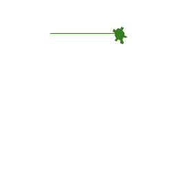

### Python Turtle 是什么？

<!--  -->

* 文档地址：https://docs.python.org/3/library/turtle.html

Turtle 是早期用于Logo编程语言的一门教学库，因为可以方便的通过展示图形来让初学者了解计算机的一些原理

### Python Turtle 可以做什么？

* Turtle 可以用来画优美的画作！比如下图中就是用Python Turtle画的樱花树

- Turtle可以用来让初学者激发学习的乐趣
    - 因为Turtle非常容易理解，可以理解为一个海龟(海龟就是Turtle里面的笔)在画布上移动，产生各种各样的图形,
    - 比如下面的动图展示了如何画一个正方形
        - 第一步：出来一个乌龟
        - 第二步：让乌龟往东爬一定距离A
        - 第三步：让乌龟右转
        - 第四步：让乌龟继续爬行相同的距离A
        - ...

### 我必须要学Python Turtle吗？
答案是：非必要
如果你的python基础比较差，空间想象能力比较弱，或者希望了解简单使用python进行绘图的朋友，那Python Turtle 比较适合你
但是如果您是为了找工作的目的，且时间非常紧迫，那我建议您还是先简单了解下即可，工作中使用这个模块的几率并不高