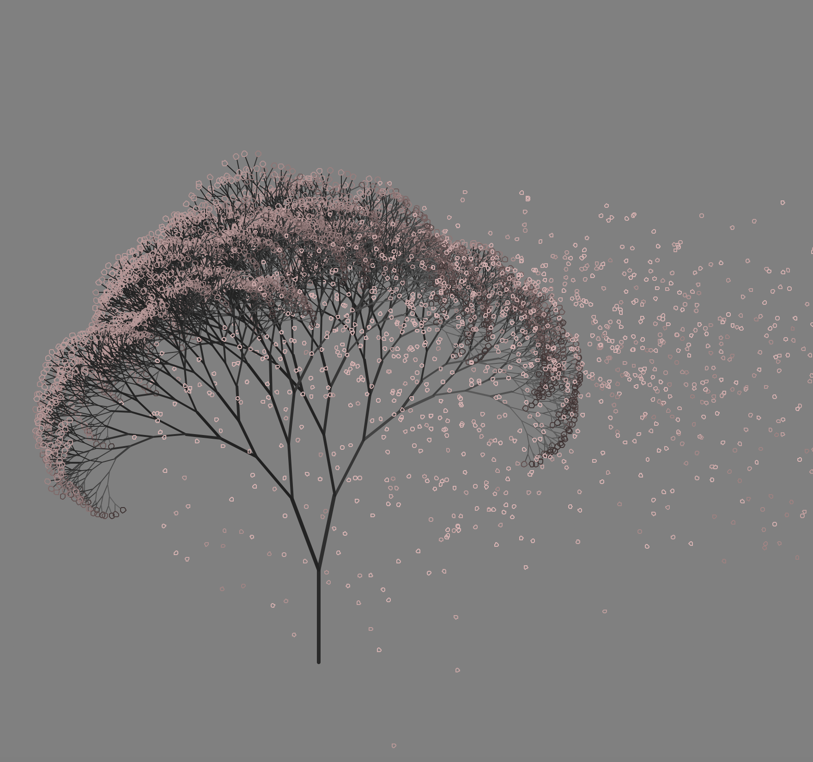
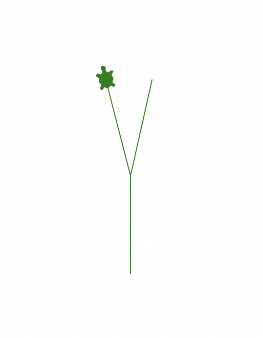
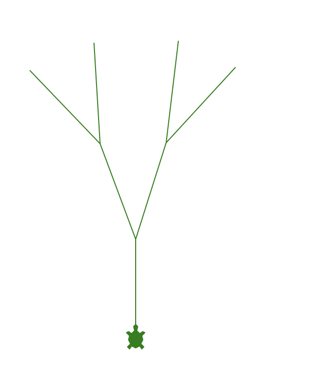
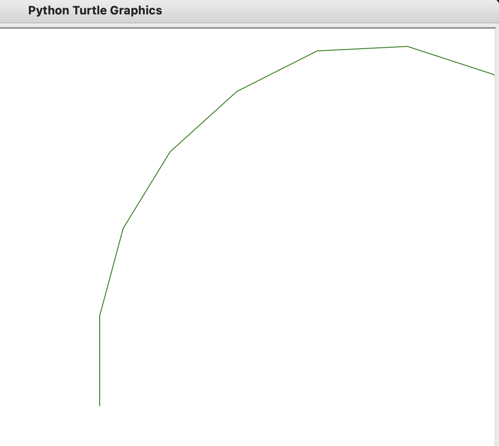
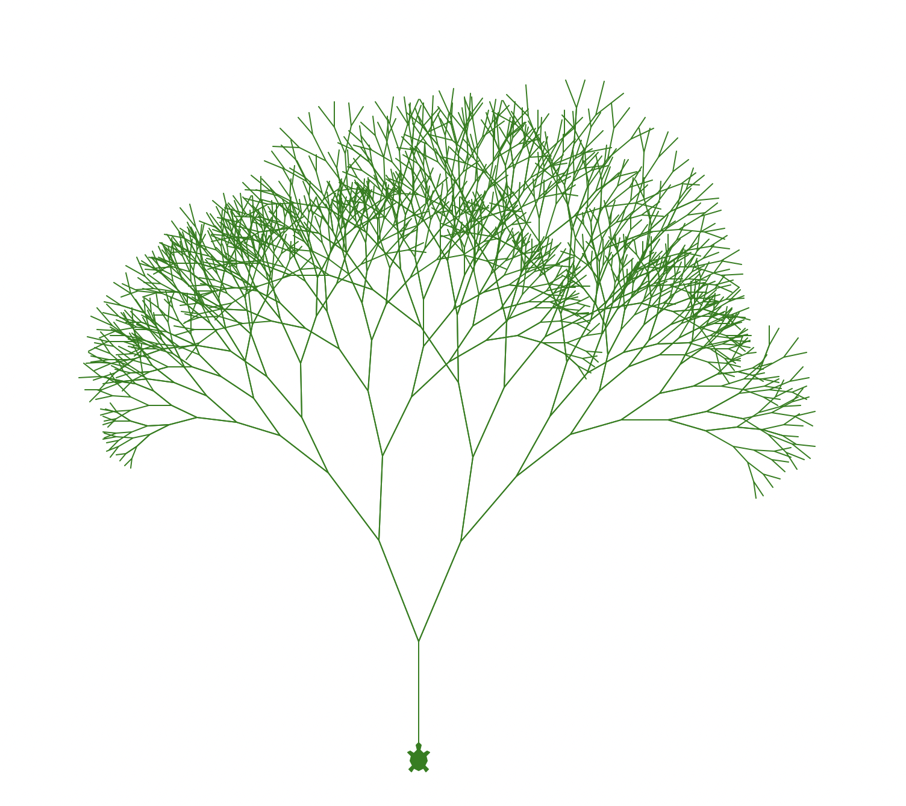

最近武汉大学的樱花还没开，按往常的开放日，要到三月底才能开，所以包子哥一时心血来潮，用python turtle来画一幅樱花

如下图所示，就是这次的成果：


- 主要用到的知识点：Turtle库，递归


### 我们开始绘画吧

#### 1. 画一个树杈
我们先思考下，如果要画一颗茂密的树，是不是先从一棵稀疏的树开始？

那最稀疏的树会长什么样子呢？

答案是：一个二叉树，如下图：


怎么做到？

很简单，根据之前的简单介绍，我们先让乌龟的龟头朝上，因为树是朝上生长的嘛！
`turtle.left(90)  # 龟头得向上`

然后开始绘画
```python
def draw_tree(turtle, tree_length):
    turtle.forward(tree_length)  # 先画树的主干部分
    b = random() * 15 + 10  # 右分支偏转角度
    c = random() * 15 + 10  # 左分支偏转角度
    turtle.right(b)  # 然后画右枝干
    turtle.forward(tree_length)

    turtle.backward(tree_length)  # 退回

    turtle.left(b + c)  # 画左枝干
    turtle.forward(tree_length)

```


整体代码如下：


``` python
from turtle import Turtle, Screen
from random import random

turtle = Turtle()
turtle.shape("turtle")
turtle.color("green")
turtle.speed("slowest")
turtle.left(90)  # 龟头得向上


def draw_tree(turtle, tree_length):
    turtle.forward(tree_length)  # 先画树的主干部分
    b = random() * 15 + 10  # 右分支偏转角度
    c = random() * 15 + 10  # 左分支偏转角度
    turtle.right(b)  # 然后画右枝干
    turtle.forward(tree_length)

    turtle.backward(tree_length)  # 退回

    turtle.left(b + c)  # 画左枝干
    turtle.forward(tree_length)


draw_tree(turtle, 100)

screen = Screen()
screen.exitonclick()


```

#### 2. 接着我们画整体
上面我们画了一个二叉树，

但是他太秃了，

如何增加他的发量呢？

当然是增加他的树枝数量？

但是一个一个去写，不是太费事了么？

是的，所以我门有一个方法是用递归去调用！

那既然要用递归调用，我们是不是得按照最简单的方式来一遍，也就是二叉树的方式，我们有如下代码：


```python
from turtle import Turtle, Screen
from random import random

turtle = Turtle()
turtle.shape("turtle")
turtle.color("green")
turtle.speed("slowest")
turtle.left(90)  # 龟头得向上


def draw_tree(turtle, iteration_times, tree_length):
    turtle.forward(tree_length)  # 先画树的主干部分
    if iteration_times > 0:
        b = random() * 15 + 10  # 右分支偏转角度
        c = random() * 15 + 10  # 左分支偏转角度
        
        turtle.right(b)  # 然后画右枝干
        draw_tree(turtle, iteration_times-1, tree_length)

        turtle.left(b + c)  # 画左枝干
        draw_tree(turtle, iteration_times-1, tree_length)
        
        turtle.right(c)  # 转回来
    turtle.backward(tree_length)


draw_tree(turtle, 1, 100) # 只递归一次

screen = Screen()
screen.exitonclick()


```

注意我们添加了`iteration_times`参数用来让递归终止，然后我门会得到跟之前相似的结果

此时如果修改代码让其递归2次`draw_tree(turtle, 1, 100)`，会得到：



然后，
迭代3次
迭代4次。。。


#### 3. 让树更漂亮

当你迭代多次，比如10次的时候，

会发现小乌龟已经跑出视野之外了。。。


需要做两件事，一件事是让树的根部往底部移动一点
代码如下:

```python
from turtle import Turtle, Screen
from random import random

turtle = Turtle()
turtle.shape("turtle")
turtle.color("green")
turtle.speed("slowest")
turtle.left(90)  # 龟头得向上
turtle.pu()  # 抬笔
turtle.backward(300)

def draw_tree(turtle, iteration_times, tree_length):
    turtle.pd()                  # 下笔
    turtle.forward(tree_length)  # 先画树的主干部分
    if iteration_times > 0:
        b = random() * 15 + 10  # 右分支偏转角度
        c = random() * 15 + 10  # 左分支偏转角度

        turtle.right(b)  # 然后画右枝干
        draw_tree(turtle, iteration_times-1, tree_length)

        turtle.left(b + c)  # 画左枝干
        draw_tree(turtle, iteration_times-1, tree_length)

        turtle.right(c)  # 转回来
    turtle.backward(tree_length)


draw_tree(turtle, 10, 100)

screen = Screen()
screen.exitonclick()


```


另一件事是可以让树枝变短一些，这也比较符合大自然的规律对吧

我们之前是通过`tree_length`这个参数来控制的，这样就可以在每次迭代之后，或者之前，把`tree_length`变更短一些

最终效果如下:



```python
from turtle import Turtle, Screen
from random import random

turtle = Turtle()
turtle.shape("turtle")
turtle.color("green")
turtle.speed("fastest")
turtle.left(90)  # 龟头得向上
turtle.pu()  # 抬笔
turtle.backward(300)

def draw_tree(turtle, iteration_times, tree_length):
    turtle.pd()                  # 下笔
    turtle.forward(tree_length)  # 先画树的主干部分
    if iteration_times > 0:
        b = random() * 15 + 10  # 右分支偏转角度
        c = random() * 15 + 10  # 左分支偏转角度
        next_branch_length = tree_length * (random() * 0.25 + 0.7)  # 下一个分支的长度

        turtle.right(b)  # 然后画右枝干
        draw_tree(turtle, iteration_times-1, next_branch_length)

        turtle.left(b + c)  # 画左枝干
        draw_tree(turtle, iteration_times-1, next_branch_length)

        turtle.right(c)  # 转回来
    turtle.backward(tree_length)


draw_tree(turtle, 10, 100)

screen = Screen()
screen.exitonclick()


```


我旁边的小伙伴又说，樱花树一般是黑色的，树主干比树枝要粗。。
干。。加吧


```python
from turtle import Turtle, Screen
from random import random
import math

turtle = Turtle()
turtle.shape("turtle")
turtle.color("black")
turtle.speed("fastest")
turtle.left(90)  # 龟头得向上
turtle.pu()  # 抬笔
turtle.backward(300)

def draw_tree(turtle, iteration_times, tree_length):
    turtle.pd()                  # 下笔
    t = math.cos(math.radians(turtle.heading() + 45)) / 8 + 0.25
    turtle.pencolor(t, t, t)
    turtle.pensize(iteration_times / 3)
    turtle.forward(tree_length)  # 先画树的主干部分
    if iteration_times > 0:
        b = random() * 15 + 10  # 右分支偏转角度
        c = random() * 15 + 10  # 左分支偏转角度
        next_branch_length = tree_length * (random() * 0.25 + 0.7)  # 下一个分支的长度

        turtle.right(b)  # 然后画右枝干
        draw_tree(turtle, iteration_times-1, next_branch_length)

        turtle.left(b + c)  # 画左枝干
        draw_tree(turtle, iteration_times-1, next_branch_length)

        turtle.right(c)  # 转回来
    turtle.backward(tree_length)


draw_tree(turtle, 10, 100)

screen = Screen()
screen.exitonclick()


```


还得画一些樱花吧

```python
from turtle import Turtle, Screen
from random import random
import math

turtle = Turtle()
turtle.shape("turtle")
turtle.color("black")
turtle.speed("fastest")
turtle.left(90)  # 龟头得向上
turtle.pu()  # 抬笔
turtle.backward(300)

def draw_tree(turtle, iteration_times, tree_length):
    turtle.pd()                  # 下笔
    turtle.pencolor('black')
    turtle.pensize(iteration_times / 3)
    turtle.forward(tree_length)  # 先画树的主干部分
    if iteration_times > 0:
        b = random() * 15 + 10  # 右分支偏转角度
        c = random() * 15 + 10  # 左分支偏转角度
        next_branch_length = tree_length * (random() * 0.25 + 0.7)  # 下一个分支的长度

        turtle.right(b)  # 然后画右枝干
        draw_tree(turtle, iteration_times-1, next_branch_length)

        turtle.left(b + c)  # 画左枝干
        draw_tree(turtle, iteration_times-1, next_branch_length)

        turtle.right(c)  # 转回来
    else:
        # 画叶子
        turtle.right(90)
        turtle.pencolor('pink')
        turtle.circle(3)
        turtle.left(90)
    turtle.pu()
    turtle.backward(tree_length)


draw_tree(turtle, 10, 100)

screen = Screen()
screen.exitonclick()


```


还得画一些飘落的樱花吧，最终代码如下：

```