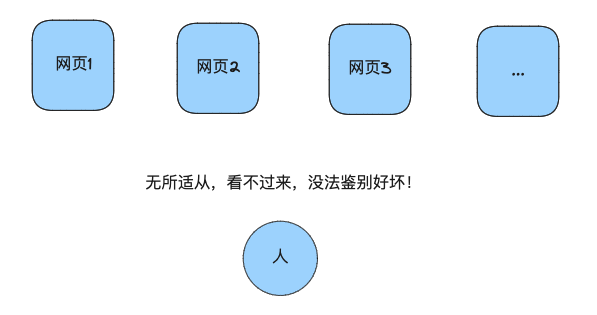

hello，这篇文章来给大家科普下爬虫的前世今生，以及爬虫用到的主要技术以及工具介绍

## 1. 爬虫的前世
...此处省略无数条历史
1990年，蒂姆·伯纳斯-李（Tim Berners-Lee）发明了World Wide Web（WWW），引入了超文本标记语言（HTML）和统一资源定位符（URL），使用户能够通过简单的图形界面浏览和检索信息。
也就是说有人可以提供类似于我们现在的网页供大家浏览：

...此处省略无数条历史

此时有庞大的需求出现了（互联网上每一个巨大的需求都代表着技术或者商业上的进步，同时也伴随着兴起一批浪潮儿公司崛起进而掘金（Google，淘宝，腾讯无不是如此））
**此时互联网上的网页非常多，质量参差不齐，用户不知道在哪去找优质的内容，网站拥有者不知道怎么推广自己的网站**


针对上面的痛点，各类公司主要提供两种办法：
第一种是门户网站，代表公司是雅虎（Yahoo!）,MSN等公司

这类公司做的事就是把人工把各类网站搜索过来，人工分类，供用户来自行选择
（这个解题思路在20年后的今天也频繁出现，之前大家在淘宝拼多多上买东西，但是上面东西稂莠不齐，用户不知道怎么选，于是出现了类似于唯品会，直播间等帮助选品的店铺）


第二种是搜索引擎，代表公司是Excite@Home的Wandex, Google等

这类公司的做法是用一个机器人（一段代码），来无休止的爬取互联网上的内容，把这些内容存储到自己的本地，当用户来搜索的时候，通过关键词匹配或者更高级的算法来给用户展现优质的内容


而我们后面说的爬虫技术，就是类似于Google这里的蜘蛛


## 2. 爬虫的今生
上一节我们知道了爬虫就是把互联网上的网页内容抓取下来存储到目的地。

那现在很多人或者公司，有一个需求就是把特定目标的网站内容抓取并存储到目的地，比如企查查的工商信息，豆瓣的图书电影信息，
用来商业或者个人学术使用，那这类爬虫的原理是什么呢？

我们先来回忆一个小品中的问题，还记得如何把大象放进冰箱中去吗？

如果你知道上面的问题的答案是三步，那么你学会爬虫一定是一件非常容易的事儿！

因为任何一个爬虫程序，也可以分为三步！话不多说，上图：


那我们就可以针对这三步写一个简单的爬虫来获取一个网站我们想要的信息
网址：https://www.scrapethissite.com/pages/
需要的信息：每篇文章的标题


### 2.1 小栗子
我们首先按照第一步需要使用python访问并获取目标网页内容：

此处为了节约时间，我们直接使用 `requests` 库的`get`方法访问并打印出返回的内容：


代码如下:
```
import requests

url = "https://www.scrapethissite.com/pages/"
ret = requests.get(url)
print(ret.content)

```


然后第二步，
解析返回的网页内容，
之前你可能有疑问，为啥要解析呀，

你会发现这里返回的是HTML格式的文本，根本没法看，但是为什么我们看浏览器看到的非常漂亮呢，因为浏览器做了渲染！


所以，我们此时并没有通过浏览器访问网站，而是通过python代码对不对！

那么既然没有浏览器帮我们渲染HTML内容，那么我们得到的必然是原始的HTML内容！


现在如果希望获取到目标文章标题，就需要解析html内容，此时可以引入`BeautifulSoup`包来解析网页内容
(需要安装新的包: `pip install bs4`)

整个代码如下：
```
import requests
from bs4 import BeautifulSoup

url = "https://www.scrapethissite.com/pages/"
ret = requests.get(url)

html_string = ret.content.decode('utf-8')  # 因为我获得的内容是字节类型，需要先转化成字符串

# 使用BeautifulSoup解析HTML字符串
soup = BeautifulSoup(html_string, 'html.parser')

# 现在你可以使用soup对象来提取需要的信息
pages = soup.find_all('div', class_='page')    # 查找所有的class为 page的div信息
for page in pages:
    title = page.find('h3', class_='page-title').find('a').get_text() # 找到其中class为 page-title的h3下面的a标签的内容就是title
    print(f"Title: {title}")

```

到此第二步也完成，我们拿到了我们的title，至于第三步，比较简单，就不在赘述

### 2.2 正文开始
从上一小节，我们知道了现在如何爬取一个简单的网页内容，
那是不是从此可以天下网页随我抓了》

答案是：否, 而且可以说大多数有价值的网页你都抓不到，且听我慢慢分析

我先列一下主要难点，以免遗忘，后续慢慢补充
#### 2.2.1 动态页面加载

#### 2.2.2 Header检测


#### 2.2.3 IP 封锁和限制

#### 2.2.4 验证码

#### 2.2.5 Cookie和Session跟踪

#### 2.2.6 数据加密

#### 2.2.7 反爬虫策略更新

#### 2.2.8 行为分析


## 3. 结束语
### 3.1 爬虫的法律问题

### 3.2 爬虫的伦理问题

## 出场素材来源：
- 蜘蛛：https://cn.dreamstime.com/%E5%8F%AF%E7%88%B1%E7%9A%84%E8%9C%98%E8%9B%9B%E5%8A%A8%E7%94%BB%E7%9F%A2%E9%87%8F%E5%9B%BE-%E7%99%BD%E8%89%B2%E8%83%8C%E6%99%AF%E4%B8%AD%E7%AA%81%E6%98%BE%E7%9A%84%E5%8F%AF%E7%88%B1%E8%9C%98%E8%9B%9B%E5%8A%A8%E7%94%BB%E7%9F%A2%E9%87%8F%E5%9B%BE%E6%8F%92%E5%9B%BE-image271972872