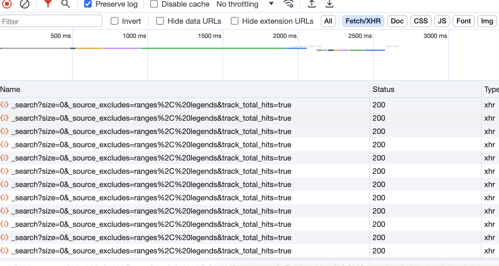

本文实战用例仅用来做技术教学，如果本文的内容对您的网站造成了困难，请联系站长进行删除或者修改，谢谢！

另：本文读者请您一定控制好爬虫访问的速度与次数，否则可能不仅让网站的负责人受损，还可能为自己惹来官司！🙏


## 1. 网站分析
> www.iucnredlist.org 是国际自然保护联盟（IUCN）红色名录的官方网站。IUCN红色名录是一个全球性的生物多样性信息系统，提供有关各种动植物物种濒临灭绝和受威胁程度的信息。这个名录通过对不同物种的评估，将它们分为不同的濒危等级，包括极危、濒危、易危等。
> 该网站提供了广泛的物种信息，包括它们的分布、生态学、威胁因素等。通过这个网站，人们可以了解到全球范围内物种的状况，帮助科学家、决策者和公众更好地了解生物多样性问题，并采取相应的保护措施。

上述内容来自于chatgpt


上面需要我输入一个物种名称，

比如我输入：`Travancore Tortoise`


而我们在这个页面上看不出什么东西，此时就需要借助于Chrome的检查功能（快捷键好像是F12）


检查页面的各个tab中，选择 网络 这个tab


发现暂时什么都没有呀！


此时可以按`F5`刷新页面或者浏览器做上方的刷新按钮：


此时发现出现了我们需要的信息


但是我们只关心HTTP请求信息（只有HTTP请求是去拿我们需要的数据）这部分原理内容后面补充，暂时可以这么理解
此时我们就可以点一个按钮`fetch/xhr`来过滤掉其他不需要的信息


此时发现只有HTTP信息就少了很多


但是此时依旧很多，我们该找哪一个请求去看呢？
答案是：不知道

有两种办法，一种是找比较特殊的，另一种是一个一个去看，

比较特殊的好理解

比如这里这个哥们非常短，与其他的请求显得格格不入

另一种一个一个去看也有技巧：
首先我们需要的是找下图中的内页中的内容
`https://www.iucnredlist.org/species/39548/10247310`
`https://www.iucnredlist.org/species/10825/499158`


那这两个内页肯定也有地址，我们直接点进去看，

发现有两个id一样的数字在地址栏中
那我们就去看，哪一个返回了这几个id的值，他就是我们需要的请求地址


比如上图中第一个HTTP请求确实返回了一个ID，但他是我们需要的吗？

显然不是的，其他的信息都不太像，所以这个API就被排除了，不是我们的菜
用同样的方式我们依次排除其他的

不要觉得无聊，这些API总共也就十几个，扫过去几分钟就够了，
想想万一你成功破解了，后面就不用一个一个名字去人工智障似的挨个搜索了，所以，忍一忍！


好，为了篇幅不要太长（省点我的小破站的流量吧），我们按个快进键，来到了刚才的那个小特殊的API（比较短的那个）


突然惊喜，这两个数不就是我们需要的吗


然后继续寻找中间的ID值，也找到了，就是`fields`下面的`sisTaxonId`

好，到目前为止我们还没写一行代码，但是凭借我们的分析，我们已经胸有成竹了！


## 2. 代码实现

### 2.1 打基层

我们写代码，一定得有架构思维，就是我的输入是什么，我的输出是什么（我需要什么），中间详细怎么做，可以后面再补充，因为实现的方式可能多种多样，没必要一开始就钉死，但是输入和输出一定不会变！

此处给定一个物种名称，我希望返回他的这个搜索页面下的几个子页面的URL对吧，那我只需要其中的两个ID就可以构成这个URL了
```python

species_name = "Travancore Tortoise"  # 物种名称


def crawl_search_page(name):  # 爬取搜索页面
    _id = 0           # 暂时先给初始值0
    sisTaxonId = 0    # 暂时先给初始值0

    return _id, sisTaxonId   # 我需要返回子页面的ID信息列表


if __name__ == '__main__':
    _id, sisTaxonId = crawl_search_page(species_name)
    print(_id, sisTaxonId)


```

### 2.2 模拟调用API拿到数据
还记得之前的那个特殊API吗，我们需要用它了：

发现他是一个post请求，那我们拷贝这里的URL，就有如下代码：
```python
import requests
species_name = "Travancore Tortoise"  # 物种名称

def crawl_search_page(name):  # 爬取搜索页面
    _id = 0           # 暂时先给初始值0
    sisTaxonId = 0    # 暂时先给初始值0

    ret = requests.post(
        "https://www.iucnredlist.org/dosearch/assessments/_search?size=60&_source=false&from=0&track_total_hits=true")
    print(ret.content)  # 打印看是否是我们需要的

    return _id, sisTaxonId   # 我需要返回子页面的ID信息列表


if __name__ == '__main__':
    _id, sisTaxonId = crawl_search_page(species_name)
    print(_id, sisTaxonId)

```

我们打印的这个内容里面并没有包含刚刚的那个ID！

为什么？
因为我们刚才的URL里面没有包含我们输入的乌龟的物种名称
所以得加个body，我们再去看原来的API
请求的body如下（这里requests的讲解以及http的讲解也只能挪到后面，您暂时照搬照套就行）：


而我们的 物种名称，一定得放在post的body里面对吧，我们copy这个body信息


贴到我们代码中存储在`data`变量中后，
点击这个来折叠内容


我们发现他还报错了：


展开后发现，其实是`true`的问题，Python中的Boolean是`False`和`True`


我们修改下,

然后按查找键，找到我们的物种名称，替换为变量`name`


最后我们把地址用变量存储下来传进去，并把data作为参数传进去


跑一下，这次发现是我们需要的了

别急，此时我们还得拿到两个ID呢，
把内容贴到某个json解析网站去看，比如: json.cn ，不然一行里面找这两个实在费劲，


注意别把输出的前后`b''` 给带进去了，不然无法解析成功

经过我们肉眼分析，我们知道了两个ID怎么获得:

```python
fields = resp['hits']['hits'][0]
_id = fields['_id']
sisTaxonId = fields['fields']['sisTaxonId'][0]
```

完善代码：
```python
import requests

species_name = "Travancore Tortoise"  # 物种名称

def crawl_search_page(name):  # 爬取搜索页面

    data = {
              "stored_fields": [
                "hasImage",
                "hasPoints",
                "hasRanges",
                "image.id",
                "image.url",
                "image.urlThumb",
                "image.credit",
                "scopes.id",
                "scopes.code",
                "scopes.jsonDescription",
                "kingdomName",
                "className",
                "commonName",
                "scientificName",
                "sisTaxonId",
                "redListCategory.scaleCode",
                "redListCategory.order",
                "redListCategory.code",
                "redListCategory.jsonDescription",
                "populationTrend.id",
                "populationTrend.code",
                "populationTrend.jsonDescription",
                "hasGreen",
                "greenListCategory.scaleCode",
                "greenListCategory.name"
              ],
              "query": {
                "bool": {
                  "must": [
                    {
                      "multi_match": {
                        "query": name,
                        "type": "phrase_prefix",
                        "fields": [
                          "commonName^12",
                          "commonNames^10",
                          "scientificName^8",
                          "keywords^4",
                          "synonyms^2",
                          "assessors",
                          "sisTaxonId",
                          "id"
                        ],
                        "lenient": True,
                        "max_expansions": 100
                      }
                    }
                  ],
                  "filter": {
                    "bool": {
                      "filter": [
                        {
                          "terms": {
                            "scopes.code": [
                              "1"
                            ]
                          }
                        },
                        {
                          "terms": {
                            "taxonLevel": [
                              "Species"
                            ]
                          }
                        }
                      ],
                      "should": [],
                      "minimum_should_match": 0
                    }
                  },
                  "should": [
                    {
                      "term": {
                        "hasImage": {
                          "value": True,
                          "boost": 6
                        }
                      }
                    }
                  ]
                }
              },
              "sort": [
                {
                  "_score": {
                    "order": "desc"
                  }
                }
              ]
    }
    url = "https://www.iucnredlist.org/dosearch/assessments/_search?size=60&_source=false&from=0&track_total_hits=true"
    ret = requests.post(url=url, json=data).json()  # 发送post请求，并把结果转化为json对象

    fields = ret['hits']['hits'][0]
    _id = fields['_id']
    sisTaxonId = fields['fields']['sisTaxonId'][0]

    return _id, sisTaxonId

if __name__ == '__main__':
    _id, sisTaxonId = crawl_search_page(species_name)
    print(_id, sisTaxonId)


```


### 2.3 继续调用子页面API获取最终数据
好了，刚才我们需要的两个ID获取到了，则意味着我们的子页面URL有了，我们请求后分析：

发现他是get请求


发现报错，于是首先想到，可能是get的时候某些参数没传
我们挨个去尝试，会发现`Referer`是必不可少的内容,加上后发现最终成功了，

最后我们做解析的处理，我这里只去拿 `systems` 信息：

```python
import requests

species_name = "Travancore Tortoise"  # 物种名称

def crawl_search_page(name):  # 爬取搜索页面

    data = {
              "stored_fields": [
                "hasImage",
                "hasPoints",
                "hasRanges",
                "image.id",
                "image.url",
                "image.urlThumb",
                "image.credit",
                "scopes.id",
                "scopes.code",
                "scopes.jsonDescription",
                "kingdomName",
                "className",
                "commonName",
                "scientificName",
                "sisTaxonId",
                "redListCategory.scaleCode",
                "redListCategory.order",
                "redListCategory.code",
                "redListCategory.jsonDescription",
                "populationTrend.id",
                "populationTrend.code",
                "populationTrend.jsonDescription",
                "hasGreen",
                "greenListCategory.scaleCode",
                "greenListCategory.name"
              ],
              "query": {
                "bool": {
                  "must": [
                    {
                      "multi_match": {
                        "query": name,
                        "type": "phrase_prefix",
                        "fields": [
                          "commonName^12",
                          "commonNames^10",
                          "scientificName^8",
                          "keywords^4",
                          "synonyms^2",
                          "assessors",
                          "sisTaxonId",
                          "id"
                        ],
                        "lenient": True,
                        "max_expansions": 100
                      }
                    }
                  ],
                  "filter": {
                    "bool": {
                      "filter": [
                        {
                          "terms": {
                            "scopes.code": [
                              "1"
                            ]
                          }
                        },
                        {
                          "terms": {
                            "taxonLevel": [
                              "Species"
                            ]
                          }
                        }
                      ],
                      "should": [],
                      "minimum_should_match": 0
                    }
                  },
                  "should": [
                    {
                      "term": {
                        "hasImage": {
                          "value": True,
                          "boost": 6
                        }
                      }
                    }
                  ]
                }
              },
              "sort": [
                {
                  "_score": {
                    "order": "desc"
                  }
                }
              ]
    }
    url = "https://www.iucnredlist.org/dosearch/assessments/_search?size=60&_source=false&from=0&track_total_hits=true"
    ret = requests.post(url=url, json=data).json()  # 发送post请求，并把结果转化为json对象

    fields = ret['hits']['hits'][0]
    _id = fields['_id']
    sisTaxonId = fields['fields']['sisTaxonId'][0]

    return _id, sisTaxonId

def crawl_sub_page(_id, sisTaxonId):
    url = "https://www.iucnredlist.org/api/v4/species/{}".format(_id)

    header = {
      "Referer": "https://www.iucnredlist.org/species/{}/{}".format(sisTaxonId, _id),
    }
    ret = requests.get(url, headers=header).json()

    systems = ret['systems'][0]['description']['en']
    return {
      "systems": systems
    }

if __name__ == '__main__':
    _id, sisTaxonId = crawl_search_page(species_name)
    result = crawl_sub_page(_id, sisTaxonId)
    print(result)


```


暂时就说到这里啦，相信会爬一个物种的你，一定会爬100个，1000个乃至更多！

但千万记得注意速率，注意速率，注意速率！，别吃个饭把锅砸了。。