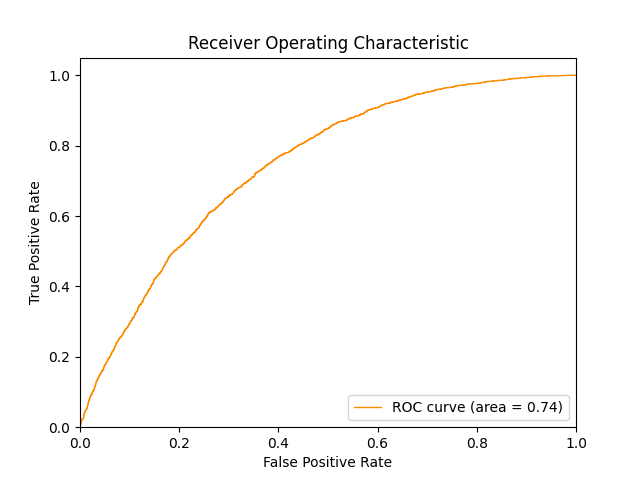

日本麻将，也被称为“立直麻将”，是麻将的一种变体，广泛流行于日本和世界各地。与其他麻将规则相比，日本麻将有其独特的规则和术语。以下是日本麻将的基本玩法和规则概述：

## 基本规则

1. **牌种类**：总共144张牌，包括：
   - 万子牌：一万到九万
   - 筒子牌：一筒到九筒
   - 索子牌：一索到九索
   - 风牌：东、南、西、北
   - 三元牌：中、发、白（包含白板）

2. **胡牌方式**：
   - **基本牌型**：胡牌时必须有一组雀头（对子）和四组面子（刻子或顺子）。
   - **役牌**：白板作为三元牌的一种，与红中和发财一样，通常可以作为役牌。如果有三张或四张白板，它们组成刻子或杠时，算作役牌加分。

## 计分系统

- 和通常的日本麻将一样，得分计算基于符数和翻数。
- 白板可以作为役牌来增加一翻。
- 其他和役种如立直、平和、断幺九、门前清自摸等角色和效果相同。

## 役种

一些常见役种会因为白板的加入而产生变化：

1. **役牌（Yakuhai）**：
   - 白板作为役牌时，如果手中有白板刻子（即三张白板），将获得一翻加成。
   
2. **混一色（Honitsu）**：
   - 使用一种花色牌加上字牌（风牌或三元牌，包括白板）的牌型。

3. **小三元（Shousangen）**：
   - 包含两个三元牌的刻子和一个三元牌雀头（对子）。

## 其他规则

- **杠**：
  - 如果有四张白板，可以选择开杠，获得额外的得分机会。
  
- **流局**：
  - 如果没人胡牌且所有牌都打出时，算作流局。

### 进阶玩法

- **红白中玩法**：有的地方规则会在日本麻将的基础上添加红中、发财和白板的组合役种，例如红白中同时存在于手牌中时加分等。
  
这些规则调整使得麻将玩法更具灵活性和地方特色。如果你有特定的规则变体或玩法，建议在游戏开始前与其他玩家确认具体规则。


## 程序介绍

### 基于Suphx的立直麻将AI

原作者希望通过复现[Suphx](https://arxiv.org/abs/2003.13590)模型来训练一个帮他冲段的麻将AI


### 数据下载

有监督学习部分，需要人类高质量对局作为参考，因此采用最高水平麻雀平台[「天凤」](https://tenhou.net/)的凤凰桌的对局牌谱作为数据来源。

#### 下载近期数据

```shell
$ python dataset/download_logs.py  # 下载天凤平台7日内游戏对局日志到logs目录
$ python dataset/download_data.py  # 通过前面下载的日志下载牌谱信息到data目录
```

#### 下载历年数据

前往[天凤日志记录平台](https://tenhou.net/sc/raw/)手动下载「過去ログ」即可。
解压以后可调用ungz.sh获取其中scc牌谱。

例如：
```shell
$ ./ungz.sh 2022/
```

然后将路径下的所有生成的.txt文件转移到logs/路径下，并调用
```shell
$ python dataset/download_data.py
```

### 有监督学习

- 训练弃牌模型
```shell
$ python sl_train/train_discard_model.py --num_layers 50 --epochs 10
```
- 训练立直模型
```shell
$ python sl_train/train_riichi_model.py --num_layers 20 --epochs 10
```

- 训练副露模型
```shell
$ python sl_train/train_furo_model.py --mode chi --num_layers 50 --epochs 10 --pos_weight 10
```
### 与AI玩耍

实现规则：

- 四人、南风场、有赤牌、有食断、有一发役
- 禁止现物食替、筋食替
- 开杠时即翻宝牌
- 国士无双不可抢暗杠
- 流局包含：荒牌流局、九种九牌、四风连打、四杠散了、四家立直、三家和了
- 流局满贯不计和牌
- 大三元、大小四喜不设包牌

0. 服务端代码写的一坨💩，请大佬们轻喷或提供更好的实现！（欢迎pr）
1. 将训练好的弃牌模型放置于model/saved/discard-model/best.pt
2. 将训练好的其他模型放置在类似的位置
3. 运行服务端程序。使用下面的命令开启带有三个AI的游戏（通过-H参数指定监听的IP地址，默认为0.0.0.0），想在服务端观察到更多游戏细节（如AI做出决策的置信度等），可添加-d参数开启debug模式
```shell
$ python online_game/server.py -A 3 -H 0.0.0.0
```
4. 运行客户端程序（<del>目前只提供终端版的客户端，请见谅</del> 现在已经提供了网页版客户端了！。使用下面的命令以用户名：User1加入游戏（通过-H参数指定连接的IP地址,默认为localhost）
```shell
$ python online_game/client.py -U User1 -H localhost
```

### Self-Play
目前只做了环境，并没有加入任何强化学习的逻辑
```shell
$ python online_game/server.py -A 4 -f  # -f参数开启快速模式，跳过所有AI思考时间和等待时间
$ python online_game/server.py -A 4 -d -ob  # -ob参数开启观战模式(不建议在-f模式下进行观战...)

$ python online_game/client.py -ob "一姬1(简单)"  # 观战某个玩家（现在可以用下面提供的网页版客户端来观战啦～）
```

### 网页版客户端

网页客户端素材(麻将牌的贴图、各种音效等)使用了天凤、雀魂平台的素材，并且在界面风格上仿照了天凤平台。

首先运行服务端程序在9999端口，然后使用下面的命令监听8888端口的websocket流量，并将其转发至服务端端口9999。
然后即可使用网页版客户端进行连接。(可自行修改各种端口号）
```shell
$ websockify 8888 127.0.0.1:9999  # 第一个端口号为网页中websocket连接端口，第二个为服务端socket监听端口。
```
通过任意一种http服务打开online_game/web_client/index.html，即可轻松使用。

最简单的http服务：

```shell
$ python http.server -m 8080
```


## 站长补充

如果没有 GPU，训练还是比较花时间的，下面是我的训练部分截图：




## 运行截图：
