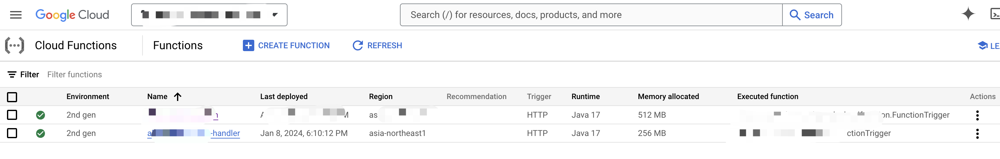

## 如何使用 Gcloud 命令部署一个 Cloud Functions

```

 gcloud functions deploy XXX-1
--entry-point XXX-2 
--runtime java17 
--gen2 
--trigger-http 
--memory 512MB 
--set-env-vars=DB_URL=XXX-3,DB_USERNAME=postgres,PROJECT_ID=XXX-4 --set-secrets="DB_PASSWORD=DEV_DB_PASSWORD:latest" --allow-unauthenticated
```
其中：
- `XXX-1`是 cloud functions 的name
- `XXX-2` 是 function 的入口，比如某个 java 类（需要带上包名）
- `XXX-3` 是数据库的 URL，没有可以不写
- `XXX-4`是project ID
- `DB_PASSWORD` 使用了 secret manager 的值，注意给对应的 service account 添加对应的 secret manager accessor 的权限

部署成功后长这样：
