- 地址：https://zh-hans.react.dev/learn/tutorial-tic-tac-toe

本教程将引导你逐步实现一个简单的井字棋游戏，并且不需要你对 React 有任何了解。

在此过程中你会学习到一些编写 React 程序的基本知识，完全理解它们可以让你对 React 有比较深入的理解。

教程分成以下几个部分：
    - 配置 是一些准备工作。
    - 概览 介绍了 React 的 基础知识：组件、props 和 state。
    - 完成游戏 介绍了 React 开发中 最常用的技术。
    - 添加“时间旅行” 可以让你更深入地了解 React 的独特优势


实现的是什么程序？

本教程将使用 React 实现一个交互式的井字棋游戏。

你可以在下面预览最终成果：

如果你还不是很明白上面的代码，不用担心！本教程的目的就是帮你理解 React 及其语法。

我们建议你在继续本教程之前，先看看上面的井字棋游戏。我们会注意到的一项功能是，棋盘右侧有一个编号列表，它记录了游戏中落子的历史，并随着游戏的进行而更新。

体验完游戏以后，继续阅读本教程吧！我们将从一个更简单的模板开始。下一步将介绍相关配置，以便于你着手实现这个游戏。


## 1. 配置

官网上在在线浏览器里面提供了代码沙盒环境，但是为了自己能随时编辑和查看，我们还是把代码放进了自己的仓库

拉取代码: `git clone https://github.com/www-chengxuyuancd-com/react-dev.git`

或者fork到自己的仓库：`https://github.com/www-chengxuyuancd-com/react-dev.git`

`cd react-dev/game-1` 进入到本次的教程，并切换到`master`分支`git checkout master`看见我为你准备的代码

依次安装：`npm install`

运行: `npm run dev`

启动后如果看到如下的图片，则说明你配置成功了：

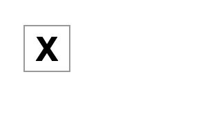


解释下上述部分代码：

### 1.1 `App.jsx`文件解释

此代码创建了一个组件。

在 React 中，组件是一段可重用代码，它通常作为 UI 界面的一部分。

组件用于渲染、管理和更新应用中的 UI 元素。

让我们逐行查看这段代码，看看发生了什么：


```js
export default function Square() {
  return <button className="square">X</button>;
}
```

第一行定义了一个名为 Square 的函数。

JavaScript 的 export 关键字使此函数可以在此文件之外访问。

default 关键字表明它是文件中的主要函数。

第二行返回一个按钮。


JavaScript 的 return 关键字意味着后面的内容都作为值返回给函数的调用者。

`<button>` 是一个 JSX 元素。

JSX 元素是 JavaScript 代码和 HTML 标签的组合，用于描述要显示的内容。

`className="square"` 是一个 button 属性，它决定 CSS 如何设置按钮的样式。

X 是按钮内显示的文本，`</button>` 闭合 JSX 元素以表示不应将任何后续内容放置在按钮内。

### 1.2 `index.css`文件解释

该文件定义了 React 应用的样式。

前两个 CSS 选择器（* 和 body）定义了应用大部分的样式，而 .square 选择器定义了 className 属性设置为 square 的组件的样式。

这与 `App.jsx` 文件中的 Square 组件中的按钮是相匹配的。


### 1.3 `main.jsx`文件解释

```js
import React from 'react'
import ReactDOM from 'react-dom/client'
import App from './App.jsx'
import './index.css'

ReactDOM.createRoot(document.getElementById('root')).render(
  <React.StrictMode>
    <App />
  </React.StrictMode>,
)
```


第 1-5 行将所有必要的部分组合在一起：
    - React
    - React 与 Web 浏览器对话的库（React DOM）
    - 需要引入 `App.jsx` 里面的App组件
    - 组件的样式
其他文件将它们组合在一起，并将最终成果注入 public 文件夹里面的 index.html 中。


## 2. 构建棋盘

让我们回到 `App.jsx`, 接下来我们将专注于这个文件。

目前棋盘只有一个方块，但你需要九个！如果你只是想着复制粘贴来制作两个像这样的方块：

```js
export default function Square() {
  return <button className="square">X</button><button className="square">X</button>;
}
```

你将会得到如下错误：

```js
JSX expressions must have one parent element.
```

React 组件必须返回单个 JSX 元素，不能像两个按钮那样返回多个相邻的 JSX 元素。

要解决此问题，可以使用 Fragment（<> 与 </>）包裹多个相邻的 JSX 元素，如下所示：
```js
export default function Square() {
  return (
    <>
      <button className="square">X</button>
      <button className="square">X</button>
    </>
  );
}
```

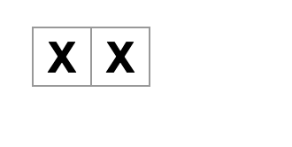

如果我们继续复制来添加9个方块：
```js
export default function Square() {
  return (
    <>
      <button className="square">X</button>
      <button className="square">X</button>
      <button className="square">X</button>
      <button className="square">X</button>
      <button className="square">X</button>
      <button className="square">X</button>
      <button className="square">X</button>
      <button className="square">X</button>
      <button className="square">X</button>
    </>
  );
}
```

可以看到如下效果：
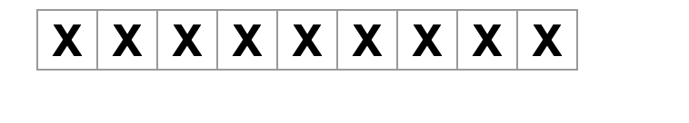

显然不是我们期望的结果，我们期望是类似"井"字的正方形格式排列

此时可以引用`index.css`里面的`board-row`样式：

```css
.board-row:after {
  clear: both;
  content: '';
  display: table;
}
```

应用到之前的代码中，将组件分到每一行的 div 中。最终完成了井字棋棋盘

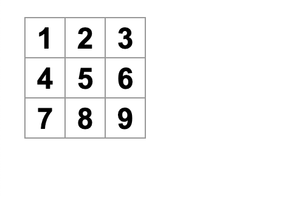

但是现在有个问题，名为 Square 的组件实际上不再是方块了。


我们通过将名称更改为 Board 来解决这个问题
```js

export default function Board() {
  //...
}
```


此时你的代码应如下所示

```js

export default function Board() {
  return (
    <>
      <div className="board-row">
        <button className="square">1</button>
        <button className="square">2</button>
        <button className="square">3</button>
      </div>
      <div className="board-row">
        <button className="square">4</button>
        <button className="square">5</button>
        <button className="square">6</button>
      </div>
      <div className="board-row">
        <button className="square">7</button>
        <button className="square">8</button>
        <button className="square">9</button>
      </div>
    </>
  );
}

```


最终效果参见 `game-1-build-board-1`分支：`git checkout game-1-build-board-1`, 注意commit也体现了我的开发过程，可以参考学习下


## 3. 通过 props 传递数据
接下来，当用户单击方块时，我们要将方块的值从空更改为“X”。

根据目前构建的棋盘，你需要复制并粘贴九次更新方块的代码（每个方块都需要一次）！

但是，React 的组件架构可以创建可重用的组件，以避免混乱、重复的代码。

首先，要将定义第一个方块（`<button className="square">1</button>`）的这行代码从 Board 组件复制到新的 Square 组件中：

```js
function Square() {
  return <button className="square">1</button>;
}

export default function Board() {
  // ...
}
```

然后，更新 Board 组件并使用 JSX 语法渲染 Square 组件：

```js

// ...
export default function Board() {
  return (
    <>
      <div className="board-row">
        <Square />
        <Square />
        <Square />
      </div>
      <div className="board-row">
        <Square />
        <Square />
        <Square />
      </div>
      <div className="board-row">
        <Square />
        <Square />
        <Square />
      </div>
    </>
  );
}

```

需要注意的是，这并不像 div，这些你自己的组件如 Board 和 Square，必须以大写字母开头。

最终代码：
```js

function Square() {
  return <button className="square">1</button>;
}


export default function Board() {
  return (
    <>
      <div className="board-row">
        <Square />
        <Square />
        <Square />
      </div>
      <div className="board-row">
        <Square />
        <Square />
        <Square />
      </div>
      <div className="board-row">
        <Square />
        <Square />
        <Square />
      </div>
    </>
  );
}

```
效果：
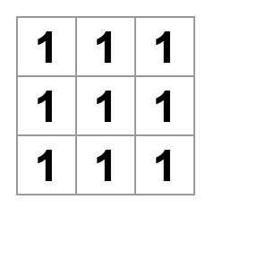

但你失去了你以前有正确编号的方块。现在每个方块都写着“1”。

要解决此问题，需要使用 props 将每个方块应有的值从父组件（Board）传递到其子组件（Square）。

更新 Square 组件，读取从 Board 传递的 value props：

```js

function Square({value}) {
  return <button className="square">{value}</button>;
}


export default function Board() {
  return (
    <>
      <div className="board-row">
        <Square value="1"/>
        <Square value="2"/>
        <Square value="3"/>
      </div>
      <div className="board-row">
        <Square value="4"/>
        <Square value="5"/>
        <Square value="6"/>
      </div>
      <div className="board-row">
        <Square value="7"/>
        <Square value="8"/>
        <Square value="9"/>
      </div>
    </>
  );
}

```

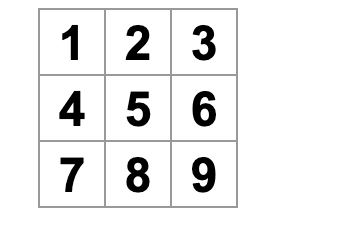

## 4. 创建一个具有交互性的组件

当你单击它的时候，Square 组件需要显示“X”。

在 Square 内部声明一个名为 handleClick 的函数。

然后，将 onClick 添加到由 Square 返回的 JSX 元素的 button 的 props 中：


```js

function Square({ value }) {
  function handleClick() {
    console.log('clicked!');
  }

  return (
    <button
      className="square"
      onClick={handleClick}
    >
      {value}
    </button>
  );
}

```

如果现在单击一个方块，你应该会看到一条日志，上面写着 "clicked!"。
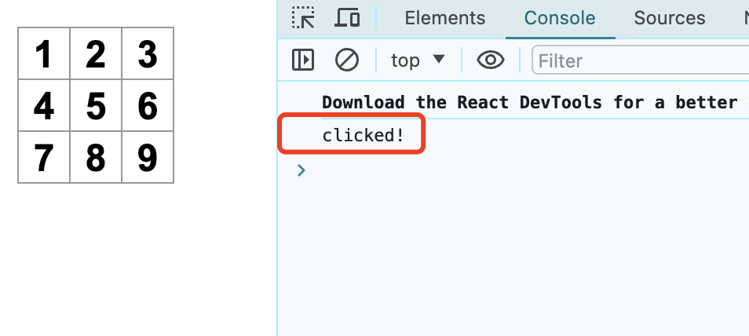

多次单击方块将再次记录 "clicked!"。具有相同消息的重复控制台日志不会在控制台中重复创建。
而你会在第一次 "clicked!" 旁边看到一个递增的计数器。
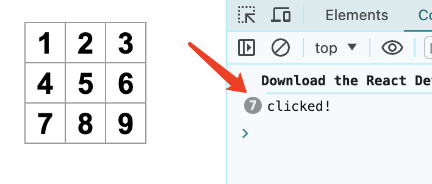


下一步，我们希望 Square 组件能够“记住”它被单击过，并用“X”填充它。为了“记住”一些东西，组件使用 `state。`

React 提供了一个名为 `useState` 的特殊函数，可以从组件中调用它来让它“记住”一些东西。

让我们将 Square 的当前值存储在 `state` 中，并在单击 Square 时更改它。

在文件的顶部导入 `useState。从` Square 组件中移除 `value` props。

在调用 `useState` 的 Square 的开头添加一个新行。让它返回一个名为 `value` 的 `state` 变量：

```js
import { useState } from 'react';

function Square() {
  const [value, setValue] = useState(null);

  function handleClick() {
    //...

```


`value` 存储值，而 `setValue` 是可用于更改值的函数。传递给 `useState` 的 `null` 用作这个 `state` 变量的初始值，因此此处 `value` 的值开始时等于 null。

由于 Square 组件不再接受 props，我们从 Board 组件创建的所有九个 Square 组件中删除 `value` props：

```js
// ...
export default function Board() {
  return (
    <>
      <div className="board-row">
        <Square />
        <Square />
        <Square />
      </div>
      <div className="board-row">
        <Square />
        <Square />
        <Square />
      </div>
      <div className="board-row">
        <Square />
        <Square />
        <Square />
      </div>
    </>
  );
}

```


现在将更改 Square 以在单击时显示“X”。

不再使用 console.log("clicked!"); 

而使用 setValue('X'); 的事件处理程序。现在你的 Square 组件看起来像这样：

```js


function Square() {
  const [value, setValue] = useState(null);

  function handleClick() {
    setValue('X');  // 注意这里
  }

  return (
    <button
      className="square"
      onClick={handleClick}
    >
      {value}
    </button>
  );
}

```

通过从 onClick 处理程序调用此 set 函数，你告诉 React 在单击其 `<button>` 时要重新渲染该 Square。

更新后，方块的值将为“X”，因此会在棋盘上看到“X”。点击任意方块，“X”应该出现：

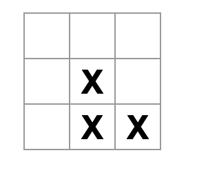


每个 Square 都有自己的 state：存储在每个 Square 中的 value 完全独立于其他的 Square。当你在组件中调用 set 函数时，React 也会自动更新内部的子组件。

完成上述更改后，代码将如下所示：

```js

import {useState} from 'react';

function Square() {
  const [value, setValue] = useState(null);

  function handleClick() {
    setValue("X"); // 注意这里
  }

  return (
    <button
      className="square"
      onClick={handleClick}
    >
      {value}
    </button>
  );
}


export default function Board() {
  return (
    <>
      <div className="board-row">
        <Square />
        <Square />
        <Square />
      </div>
      <div className="board-row">
        <Square />
        <Square />
        <Square />
      </div>
      <div className="board-row">
        <Square />
        <Square />
        <Square />
      </div>
    </>
  );
}

```


## 5. 完成这个游戏 

至此，你已经拥有井字棋游戏的所有基本构建块。

要玩完整的游戏，你现在需要在棋盘上交替放置“X”和“O”，并且你需要一种确定获胜者的方法。

### 5.1 状态提升

目前，每个 Square 组件都维护着游戏 `state` 的一部分。要检查井字棋游戏中的赢家，Board 需要以某种方式知道 9 个 Square 组件中每个组件的 state。

你会如何处理？起初，你可能会猜测 Board 需要向每个 Square“询问”Square 的 state。尽管这种方法在 React 中在技术上是可行的，但我们不鼓励这样做，因为代码变得难以理解、容易出现错误并且难以重构。相反，最好的方法是将游戏的 state 存储在 Board 父组件中，而不是每个 Square 中。Board 组件可以通过传递一个 props 来告诉每个 Square 显示什么，就像你将数字传递给每个 Square 时所做的那样。

** 要从多个子组件收集数据，或让两个子组件相互通信，请改为在其父组件中声明共享 state。**

** 父组件可以通过 props 将该 state 传回给子组件。这使子组件彼此同步并与其父组件保持同步。**

重构 React 组件时，将状态提升到父组件中很常见。

让我们借此机会尝试一下。编辑 Board 组件，使其声明一个名为 squares 的 state 变量，该变量默认为对应于 9 个方块的 9 个空值数组：

```js

export default function Board() {
  const [squares, setSquares] = useState(Array(9).fill(null));
  return (
    // ...
  );
}

```

`Array(9).fill(null)` 创建了一个包含九个元素的数组，并将它们中的每一个都设置为 null。

包裹它的 useState() 声明了一个初始设置为该数组的 squares state 变量。

数组中的每个元素对应于一个 square 的值。当你稍后填写棋盘时，squares 数组将如下所示：

> ['O', null, 'X', 'X', 'X', 'O', 'O', null, null]

现在你的 Board 组件需要将 value props 向下传递给它渲染的每个 Square， 也就是把这个数组的值依次传给9个Square：

```js

export default function Board() {
  const [squares, setSquares] = useState(Array(9).fill(null));
  return (
    <>
      <div className="board-row">
        <Square value={squares[0]} />
        <Square value={squares[1]} />
        <Square value={squares[2]} />
      </div>
      <div className="board-row">
        <Square value={squares[3]} />
        <Square value={squares[4]} />
        <Square value={squares[5]} />
      </div>
      <div className="board-row">
        <Square value={squares[6]} />
        <Square value={squares[7]} />
        <Square value={squares[8]} />
      </div>
    </>
  );
}
```

那上面既然允许你传递参数，我们就得修改Square定义让其可以接受参数，而且我们期望将状态管理以及事件挪走：
```js

function Square({value}) {
  return <button className="square">{value}</button>;
}

```

再来看下整体代码：
```js
import {useState} from 'react';

function Square({value}) {
  return <button className="square">{value}</button>;
}

export default function Board() {
  const [squares, setSquares] = useState(Array(9).fill(null));
  return (
    <>
      <div className="board-row">
        <Square value={squares[0]} />
        <Square value={squares[1]} />
        <Square value={squares[2]} />
      </div>
      <div className="board-row">
        <Square value={squares[3]} />
        <Square value={squares[4]} />
        <Square value={squares[5]} />
      </div>
      <div className="board-row">
        <Square value={squares[6]} />
        <Square value={squares[7]} />
        <Square value={squares[8]} />
      </div>
    </>
  );
}
```

效果如下，因为9个数组里面填充的都是null，所以我们能看到的也就是简单的空内容：

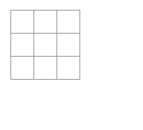


我们继续，

现在每个Square都收到了一个参数，这个参数应该是'X' , 'O' 或者 'null'中的一个。


下面，我们需要添加一个效果，让我们在单击的时候，棋盘发生变化。

那思考下，棋盘的内容其实是从`squares`数组中获得的，我们只需要在单击的时候改变这个数组里面的内容即可

那我们思考下，跟之前一样，如下给`Square`添加`onClick`行不行？
```js

function Square({ value }) {
  return (
    <button className="square" onClick={onSquareClick}>
      {value}
    </button>
  );
}

```

不行，因为**state内容对于定义它的组件是私有的，所以Square不能更新Board的state内容**

但是我们得知道这里Square需要一个onClick事件或者说函数触发点击事件。

所以我们可以这样做：把onSquareClick函数也添加到参数中，让上层传下来:


```js
function Square({ value, onSquareClick }) {
  return (
    <button className="square" onClick={onSquareClick}>
      {value}
    </button>
  );
}

```

然后需要在外层也就是Board里面定义一个函数传递到Square的参数中：

```js
export default function Board() {
  const [squares, setSquares] = useState(Array(9).fill(null));

  return (
    <>
      <div className="board-row">
        <Square value={squares[0]} onSquareClick={handleClick} /> // 注意这里的不一样
        //...
  );
}
```

最后我们思考下如何定义`handleClick`函数：
  - 首先这个函数需要可以设置`squares` state
  - 我们先任意修改一个squares的内容

比如：

```js
 function handleClick() {
    const nextSquares = squares.slice();
    nextSquares[0] = "X";
    setSquares(nextSquares);
 }
```

`handleClick` 函数使用 JavaScript 数组的 `slice()` 方法创建 squares 数组（nextSquares）的副本。

然后，`handleClick` 更新 nextSquares 数组，将 X 添加到第一个（[0] 索引）方块。

调用 setSquares 函数让 React 知道组件的 state 已经改变。

这将触发使用 squares state 的组件（Board）及其子组件（构成棋盘的 Square 组件）的重新渲染。

> 注意: JavaScript 支持闭包，这意味着内部函数（例如 `handleClick`）可以访问外部函数（例如 Board）中定义的变量和函数。
> `handleClick` 函数可以读取 squares state 并调用 setSquares 方法，因为它们都是在 Board 函数内部定义的。

现在修改下上述方法，让他可以支持修改对应的Square, 我们为这个方法增加一个参数，表示square的序号：

```js
function handleClick(i) {
    const nextSquares = squares.slice();
    nextSquares[i] = "X";
    setSquares(nextSquares);
}
```

接下来，你需要将 i 传递给 handleClick。你可以尝试像这样在 JSX 中直接将 square 的 onSquareClick props 设置为 handleClick(0)，但这是行不通的：

`<Square value={squares[0]} onSquareClick={handleClick(0)} />`

为什么会是这样呢？handleClick(0) 调用将成为渲染 Board 组件的一部分。

因为 handleClick(0) 通过调用 setSquares 改变了棋盘组件的 state，所以你的整个棋盘组件将再次重新渲染。

但这再次运行了 handleClick(0)，导致无限循环：

```Uncaught Error: Too many re-renders. React limits the number of renders to prevent an infinite loop.```

为什么这个问题没有早点发生？

当你传递 `onSquareClick={handleClick}` 时，你将 `handleClick` 函数作为 props 向下传递。你不是在调用它！但是现在你立即调用了该函数——注意 `handleClick(0)` 中的括号——这就是它运行得太早的原因。你不想在用户点击之前调用 handleClick！


你可以通过创建调用 `handleClick(0)` 的函数（如 `handleFirstSquareClick`）、调用 `handleClick(1)` 的函数（如 `handleSecondSquareClick`）等来修复。你可以将这些函数作为 `onSquareClick={handleFirstSquareClick}` 之类的 props 传递（而不是调用）。这将解决无限循环的问题。

但是，定义九个不同的函数并为每个函数命名过于冗余。让我们这样做：

```js
export default function Board() {
  // ...
  return (
    <>
      <div className="board-row">
        <Square value={squares[0]} onSquareClick={() => handleClick(0)} /> // 注意这一行
        // ...
  );
}

```

注意新的 `() => `语法。这里，`() => handleClick(0)` 是一个箭头函数，它是定义函数的一种较短的方式。单击方块时，=>“箭头”之后的代码将运行，调用 handleClick(0)。

现在你需要更新其他八个方块以从你传递的箭头函数中调用 handleClick。确保 handleClick 的每次调用的参数对应于正确的 square 索引：

```js

import {useState} from 'react';

function Square({value, handleSquareClick}) {
  return <button className="square" onClick={handleSquareClick}>{value}</button>;
}

export default function Board() {
  const [squares, setSquares] = useState(Array(9).fill(null));

  function handleClick(i) {
    const nextSquares = squares.slice();
    nextSquares[i] = "X";
    setSquares(nextSquares);
  }

  return (
    <>
      <div className="board-row">
        <Square value={squares[0]} handleSquareClick={() => handleClick(0)} />
        <Square value={squares[1]} handleSquareClick={() => handleClick(1)}/>
        <Square value={squares[2]} handleSquareClick={() => handleClick(2)}/>
      </div>
      <div className="board-row">
        <Square value={squares[3]} handleSquareClick={() => handleClick(3)}/>
        <Square value={squares[4]} handleSquareClick={() => handleClick(4)}/>
        <Square value={squares[5]} handleSquareClick={() => handleClick(5)}/>
      </div>
      <div className="board-row">
        <Square value={squares[6]} handleSquareClick={() => handleClick(6)}/>
        <Square value={squares[7]} handleSquareClick={() => handleClick(7)}/>
        <Square value={squares[8]} handleSquareClick={() => handleClick(8)}/>
      </div>
    </>
  );
}

```


现在，我们在 Board 组件中处理 state， Board 父组件将 props 传递给 Square 子组件，以便它们可以正确显示。

单击 Square 时， Square 子组件现在要求 Board 父组件更新棋盘的 state。当 Board 的 state 改变时，Board 组件和每个子 Square 都会自动重新渲染。
保存 Board 组件中所有方块的 state 将使得它可以确定未来的赢家。

让我们回顾一下当用户单击你的棋盘左上角的方块以向其添加 X 时会发生什么：
  1. 单击左上角的方块运行 button 从 Square 接收到的 onClick props 的函数。Square 组件从 Board 通过 onSquareClick props 接收到该函数。Board 组件直接在 JSX 中定义了该函数。它使用参数 0 调用 handleClick。
  2. handleClick 使用参数（0）将 squares 数组的第一个元素从 null 更新为 X。
  3. Board 组件的 squares state 已更新，因此 Board 及其所有子组件都将重新渲染。这会导致索引为 0 的 Square 组件的 value props 从 null 更改为 X。
最后，用户看到左上角的方块在单击后从空变为 X。

注意：
> DOM `<button>` 元素的 onClick props 对 React 有特殊意义，因为它是一个内置组件。对于像 Square 这样的自定义组件，命名由你决定。你可以给 Square 的 onSquareClick props 或 Board 的 handleClick 函数起任何名字，代码还是可以运行的。在 React 中，通常使用 onSomething 命名代表事件的 props，使用 handleSomething 命名处理这些事件的函数。


## 5.2 为什么不变性很重要
请注意在 handleClick 中，你调用了 .slice() 来创建 squares 数组的副本而不是修改现有数组。为了解释原因，我们需要讨论不变性以及为什么学习不变性很重要。

通常有两种更改数据的方法。第一种方法是通过直接更改数据的值来改变数据。第二种方法是使用具有所需变化的新副本替换数据。如果你改变 squares 数组，它会是这样的：

```js

const squares = [null, null, null, null, null, null, null, null, null];
squares[0] = 'X';
// Now `squares` is ["X", null, null, null, null, null, null, null, null];

```

如果你在不改变 squares 数组的情况下更改数据，它会是这样的：

```js

const squares = [null, null, null, null, null, null, null, null, null];
const nextSquares = ['X', null, null, null, null, null, null, null, null];
// Now `squares` is unchanged, but `nextSquares` first element is 'X' rather than `null`


```

结果是一样的，但通过不直接改变（改变底层数据），你可以获得几个好处。

不变性使复杂的功能更容易实现。在本教程的后面，你将实现一个“时间旅行”功能，让你回顾游戏的历史并“跳回”到过去的动作。此功能并非特定于游戏——撤消和重做某些操作的能力是应用程序的常见要求。避免数据直接突变可以让你保持以前版本的数据完好无损，并在以后重用它们。

不变性还有另一个好处。默认情况下，当父组件的 state 发生变化时，所有子组件都会自动重新渲染。这甚至包括未受变化影响的子组件。尽管重新渲染本身不会引起用户注意（你不应该主动尝试避免它！），但出于性能原因，你可能希望跳过重新渲染显然不受其影响的树的一部分。不变性使得组件比较其数据是否已更改的成本非常低。你可以在 memo API 参考 中了解更多关于 React 如何选择何时重新渲染组件的信息。

### 5.3 交替落子 

现在是时候修复这个井字棋游戏的一个主要缺陷了：棋盘上无法标记“O”。

默认情况下，你会将第一步设置为“X”。让我们通过向 Board 组件添加另一个 state 来跟踪这一点：

```js
function Board() {
  const [xIsNext, setXIsNext] = useState(true);
  const [squares, setSquares] = useState(Array(9).fill(null));

  // ...
}
```

每次玩家落子时，xIsNext（一个布尔值）将被翻转以确定下一个玩家，游戏 state 将被保存。你将更新 Board 的 handleClick 函数以翻转 xIsNext 的值：

```js

export default function Board() {
  const [xIsNext, setXIsNext] = useState(true);
  const [squares, setSquares] = useState(Array(9).fill(null));

  function handleClick(i) {
    const nextSquares = squares.slice();
    if (xIsNext) {
      nextSquares[i] = "X";
    } else {
      nextSquares[i] = "O";
    }
    setSquares(nextSquares);
    setXIsNext(!xIsNext);
  }

  return (
    //...
  );
}

```

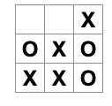

现在，当你点击不同的方块时，它们会在 X 和 O 之间交替，这是它们应该做的！

但是等等，有一个问题。尝试多次点击同一个方块：
X 被 O 覆盖！虽然这会给游戏带来非常有趣的变化，但我们现在将坚持原来的规则。

当你用 X 或 O 标记方块时，你没有检查该方块是否已经具有 X 或 O 值。

你可以通过提早返回来解决此问题。我们将检查方块是否已经有 X 或 O。

如果方块已经填满，你将尽早在 handleClick 函数中 return——在它尝试更新棋盘 state 之前。

```js
function handleClick(i) {
  if (squares[i]) {
    return;
  }
  const nextSquares = squares.slice();
  //...
}
```

现在你只能将 X 或 O 添加到空方块中！此时你的代码应该如下所示：

```js

import {useState} from 'react';

function Square({value, handleSquareClick}) {
  return <button className="square" onClick={handleSquareClick}>{value}</button>;
}

export default function Board() {
  const [xIsNext, setXIsNext] = useState(true);
  const [squares, setSquares] = useState(Array(9).fill(null));

  function handleClick(i) {
    if (squares[i]) {
      return;
    }
    const nextSquares = squares.slice();
    if (xIsNext) {
      nextSquares[i] = "X";
    } else {
      nextSquares[i] = "O";
    }
    setSquares(nextSquares);
    setXIsNext(!xIsNext);
  }

  return (
    <>
      <div className="board-row">
        <Square value={squares[0]} handleSquareClick={() => handleClick(0)} />
        <Square value={squares[1]} handleSquareClick={() => handleClick(1)}/>
        <Square value={squares[2]} handleSquareClick={() => handleClick(2)}/>
      </div>
      <div className="board-row">
        <Square value={squares[3]} handleSquareClick={() => handleClick(3)}/>
        <Square value={squares[4]} handleSquareClick={() => handleClick(4)}/>
        <Square value={squares[5]} handleSquareClick={() => handleClick(5)}/>
      </div>
      <div className="board-row">
        <Square value={squares[6]} handleSquareClick={() => handleClick(6)}/>
        <Square value={squares[7]} handleSquareClick={() => handleClick(7)}/>
        <Square value={squares[8]} handleSquareClick={() => handleClick(8)}/>
      </div>
    </>
  );
}

```

### 5.4 宣布获胜者
现在你可以轮流对战了，接下来我们应该显示游戏何时获胜。为此，你将添加一个名为 calculateWinner 的辅助函数，它接受 9 个方块的数组，检查获胜者并根据需要返回 'X'、'O' 或 null。不要太担心 calculateWinner 函数；它不是 React 才会有的：

```js
export default function Board() {
  //...
}

function calculateWinner(squares) {
  const lines = [
    [0, 1, 2],
    [3, 4, 5],
    [6, 7, 8],
    [0, 3, 6],
    [1, 4, 7],
    [2, 5, 8],
    [0, 4, 8],
    [2, 4, 6]
  ];
  for (let i = 0; i < lines.length; i++) {
    const [a, b, c] = lines[i];
    if (squares[a] && squares[a] === squares[b] && squares[a] === squares[c]) {
      return squares[a];
    }
  }
  return null;
}

```

> 在 Board 之前还是之后定义 calculateWinner 并不重要。让我们把它放在最后，这样你就不必在每次编辑组件时都滚动过去。

你将在 Board 组件的 handleClick 函数中调用 calculateWinner(squares) 来检查玩家是否获胜。你可以在检查用户是否单击了已经具有 X 或 O 的方块的同时执行此检查。在这两种情况下，我们都希望尽早返回：

```js

function handleClick(i) {
  if (squares[i] || calculateWinner(squares)) {
    return;
  }
  const nextSquares = squares.slice();
  //...
}

```

为了让玩家知道游戏何时结束，你可以显示“获胜者：X”或“获胜者：O”等文字。为此，你需要将 status 部分添加到 Board 组件。

如果游戏结束，将显示获胜者，如果游戏正在进行，你将显示下一轮将会是哪个玩家：

```js

export default function Board() {
  // ...
  const winner = calculateWinner(squares);
  let status;
  if (winner) {
    status = "Winner: " + winner;
  } else {
    status = "Next player: " + (xIsNext ? "X" : "O");
  }

  return (
    <>
      <div className="status">{status}</div>
      <div className="board-row">
        // ...
  )
}


```

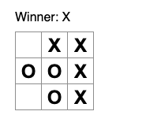

整体代码如下：
```js

import {useState} from 'react';

function Square({value, handleSquareClick}) {
  return <button className="square" onClick={handleSquareClick}>{value}</button>;
}

export default function Board() {
  const [xIsNext, setXIsNext] = useState(true);
  const [squares, setSquares] = useState(Array(9).fill(null));

  const winner = calculateWinner(squares);
  let status;
  if (winner) {
    status = "Winner: " + winner;
  } else {
    status = "Next player: " + (xIsNext ? "X" : "O");
  }

  function handleClick(i) {
    if (squares[i] || calculateWinner(squares)) {
      return;
    }
    const nextSquares = squares.slice();
    if (xIsNext) {
      nextSquares[i] = "X";
    } else {
      nextSquares[i] = "O";
    }
    setSquares(nextSquares);
    setXIsNext(!xIsNext);
  }

  return (
    <>
      <div className="status">{status}</div>
      <div className="board-row">
        <Square value={squares[0]} handleSquareClick={() => handleClick(0)} />
        <Square value={squares[1]} handleSquareClick={() => handleClick(1)}/>
        <Square value={squares[2]} handleSquareClick={() => handleClick(2)}/>
      </div>
      <div className="board-row">
        <Square value={squares[3]} handleSquareClick={() => handleClick(3)}/>
        <Square value={squares[4]} handleSquareClick={() => handleClick(4)}/>
        <Square value={squares[5]} handleSquareClick={() => handleClick(5)}/>
      </div>
      <div className="board-row">
        <Square value={squares[6]} handleSquareClick={() => handleClick(6)}/>
        <Square value={squares[7]} handleSquareClick={() => handleClick(7)}/>
        <Square value={squares[8]} handleSquareClick={() => handleClick(8)}/>
      </div>
    </>
  );
}

function calculateWinner(squares) {
  const lines = [
    [0, 1, 2],
    [3, 4, 5],
    [6, 7, 8],
    [0, 3, 6],
    [1, 4, 7],
    [2, 5, 8],
    [0, 4, 8],
    [2, 4, 6]
  ];
  for(let i = 0; i < lines.length; i++) {
    const [a, b, c] = lines[i];
    if (squares[a] && squares[a] === squares[b] && squares[a] === squares[c]) {
      return squares[a];
    }
  }
  return null;
}

```
