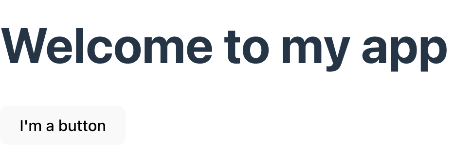
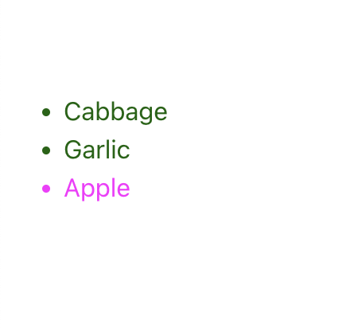
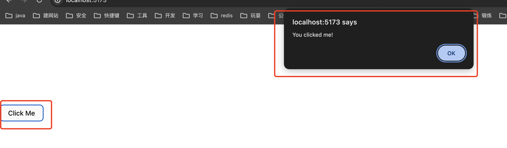
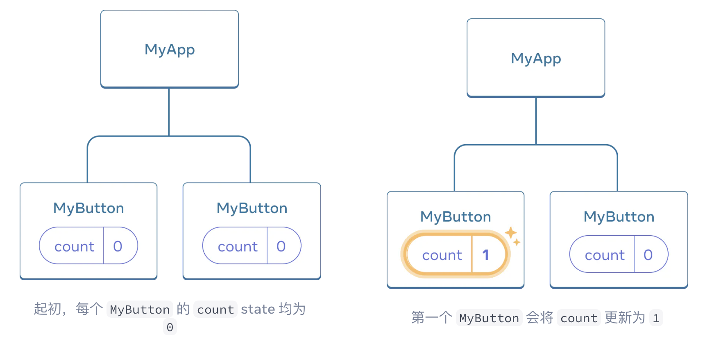
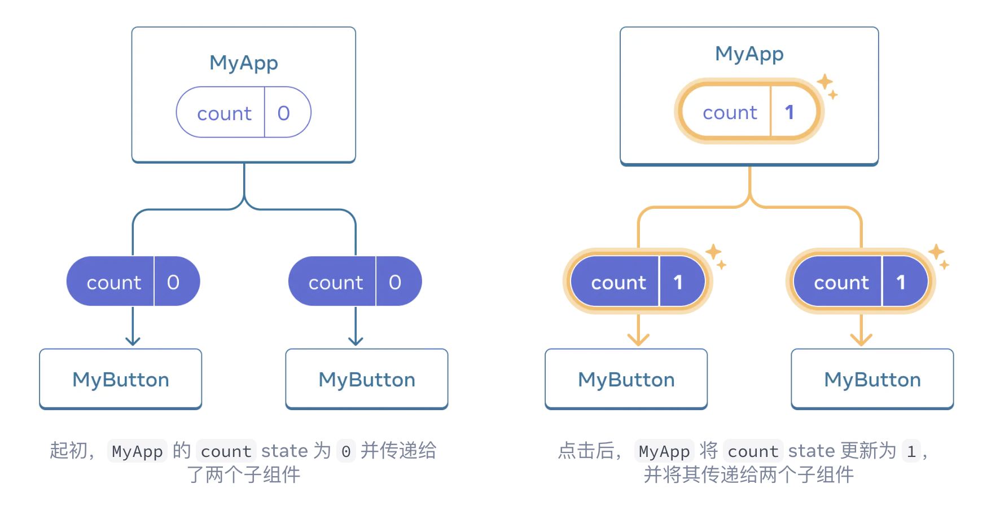
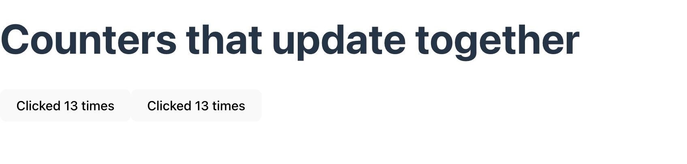

# 1. 前言
- 我要开始学前端了，TL贴心的帮我列出了希望快速入门需要学习的点
- 学习网站地址：https://zh-hans.react.dev/learn

# 2. 准备
- 学习开发很容易受IDE的影响，上面的网站可以直接来编辑达到期望的效果，但是为了能更快的融入真实的开发环境，我选择使用IDE，而不是网站提供的代码编辑环境

- 因此我们这里可以使用vite来创建基本的脚手架（当然会引入很多不必要的包，但是没关系，我们只把注意力放在我们将要学习的react部分即可）

- vite的官方文档：https://cn.vitejs.dev/guide/

- 找到一个地方，执行命令: `npm create vite@latest`
     - 将会提示问你一些问题：
     - 依次如下就行：


```shell
(base) ➜  react-dev npm create vite@latest
Need to install the following packages:
  create-vite@5.2.3
Ok to proceed? (y) y
✔ Project name: … project-1
✔ Select a framework: › React
✔ Select a variant: › JavaScript

Scaffolding project in /Users/jie.xu/coding/front-end/react/learning/react-dev/project-1...

Done. Now run:

  cd project-1
  npm install
  npm run dev
```

依次执行：`cd project-1`, `npm install`, `npm run dev`之后，就可以看到在某个地址启动了，进入后可以看到欢迎界面

简单看下vite创建的工程里面有什么：
```shell

(base) ➜  project-1 tree -I node_modules
.
├── README.md
├── index.html
├── package-lock.json
├── package.json
├── public
│   └── vite.svg
├── src
│   ├── App.css
│   ├── App.jsx
│   ├── assets
│   │   └── react.svg
│   ├── index.css
│   └── main.jsx
└── vite.config.js

4 directories, 11 file

```

这里面对我们初学react最重要的是`src/App.jsx`文件


# 3. 第一个React 程序

- 我们清空`src/App.jsx`文件的内容，写入：

```js

function MyButton() {
  return (
    <button>I'm a button</button>
  );
}

export default function App() {
  return (
    <div>
       <h1>Welcome to my app</h1>
      <MyButton />
    </div>
  )
}
```

在项目目录下执行`npm run dev`

将会看到 一句话以及一个按钮



先来解释下上述代码：

React应用程序是由组件组成的。

一个组件是UI（用户界面）的一部分，拥有自己的逻辑和外观。

组件可以小到是一个按钮，也可以大到是整个页面。

React 组件是返回标签的 JavaScript 函数，比如上面的 `MyButton`组件，

React中组件是可以嵌套的，上面`MyButton`组件就被嵌入到了`App`组件中。


其中React组件必须以大写字母开头，而HTML标签则必须是小写字母。

# 4. 继续深入

## 4.1 使用JSX编写标签

上面所使用的标签语法被称为 JSX。它是可选的，但大多数 React 项目会使用 JSX，主要是它很方便。


JSX 比 HTML 更加严格。你必须闭合标签，如 <br />。你的组件也不能返回多个 JSX 标签。你必须将它们包裹到一个共享的父级中，比如 <div>...</div> 或使用空的 <>...</> 包裹：

```js
function AboutPage() {
  return (
    <>
      <h1>About</h1>
      <p>Hello there.<br />How do you do?</p>
    </>
  );
}

```

如果你有大量的 HTML 需要移植到 JSX 中，你可以使用 [在线编辑器](https://transform.tools/html-to-jsx)


## 4.2 添加样式
在 React 中，可以使用 `className` 来指定一个 CSS 的 class。它与 HTML 的 `class` 属性的工作方式相同：
```js

```

然后，你可以在一个单独的 CSS 文件中为它编写 CSS 规则：

```css
/* In your CSS */
.avatar {
  border-radius: 50%;
}
```

React 并没有规定你如何添加 CSS 文件。最简单的方式是使用 HTML 的 `<link>` 标签。如果你使用了构建工具或框架，请阅读其文档来了解如何将 CSS 文件添加到你的项目中。


## 4.3 显示数据
JSX 会让你把标签放到 JavaScript 中。而大括号会让你 “回到” JavaScript 中，这样你就可以从你的代码中嵌入一些变量并展示给用户。例如，这将显示 user.name：

```js
return (
  <h1>
    {user.name}
  </h1>
);
```

还可以将 JSX 属性 “转义到 JavaScript”，但必须使用大括号 而非 引号。

例如，className="avatar" 是将 "avatar" 字符串传递给 className，作为 CSS 的 class。

但 `src={user.imageUrl}` 会读取 JavaScript 的 user.imageUrl 变量，然后将该值作为 src 属性传递：

```js
return (
  
);
```


你也可以把更为复杂的表达式放入 JSX 的大括号内，例如 字符串拼接：

同样的，用命令：`npm create vite@latest` 新建一个项目，称为`project-2` 

删除`src/App.jsx`的内容，然后替换为如下内容,然后安装，启动，可以看到：


```js
const user = {
  name: 'Hedy Lamarr',
  imageUrl: 'https://i.imgur.com/yXOvdOSs.jpg',
  imageSize: 90,
};

function Profile() {
  return (
    <>
      <h1>{user.name}</h1>
      
    </>
  );
};

export default function App() {
  return (
    <div>
      <Profile />
    </div>
  )
}
```


在上面示例中，`style={{}}` 并不是一个特殊的语法，而是 `style={ }` JSX 大括号内的一个普通 `{}` 对象。

当你的样式依赖于 JavaScript 变量时，你可以使用 style 属性。

## 4.4 条件渲染

React 没有特殊的语法来编写条件语句，因此你使用的就是普通的 JavaScript 代码。例如使用 if 语句根据条件引入 JSX：

```js
let content;
if (isLoggedIn) {
  content = <AdminPanel />;
} else {
  content = <LoginForm />;
}
return (
  <div>
    {content}
  </div>
);

```

如果你喜欢更为紧凑的代码，可以使用 条件 ? 运算符。与 if 不同的是，它工作于 JSX 内部：

```js
<div>
  {isLoggedIn ? (
    <AdminPanel />
  ) : (
    <LoginForm />
  )}
</div>

```

当你不需要 else 分支时，你还可以使用 逻辑 && 语法：


```js
<div>
  {isLoggedIn && <AdminPanel />}
</div>

```

所有这些方法也适用于有条件地指定属性。如果你对 JavaScript 语法不熟悉，你可以从一直使用 if...else 开始。

## 4.5 渲染列表
你将依赖 JavaScript 的特性，例如 for 循环 和 array 的 map() 函数 来渲染组件列表。

假设你有一个产品数组：

```js
const products = [
  { title: 'Cabbage', id: 1 },
  { title: 'Garlic', id: 2 },
  { title: 'Apple', id: 3 },
];

```

在你的组件中，使用 map() 函数将这个数组转换为 `<li>` 标签构成的列表:

```js
const listItems = products.map(product =>
  <li key={product.id}>
    {product.title}
  </li>
);

return (
  <ul>{listItems}</ul>
);
```

注意， `<li>` 有一个 key 属性。

对于列表中的每一个元素，你都应该传递一个字符串或者数字给 key，用于在其兄弟节点中唯一标识该元素。

通常 key 来自你的数据，比如数据库中的 ID。

如果你在后续插入、删除或重新排序这些项目，React 将依靠你提供的 key 来思考发生了什么。


同样的，用命令：`npm create vite@latest` 新建一个项目，称为`project-3` 

删除`src/App.jsx`的内容，然后替换为如下内容,然后安装，启动，可以看到：



```js
const products = [
  { title: 'Cabbage', isFruit: false, id: 1 },
  { title: 'Garlic', isFruit: false, id: 2 },
  { title: 'Apple', isFruit: true, id: 3 },
];

function ShoppingList() {
  const listItems = products.map(product =>
    <li
      key={product.id}
      style={{
        color: product.isFruit ? 'magenta' : 'darkgreen'
      }}
    >
      {product.title}
    </li>
  );

  return (
    <ul>{listItems}</ul>
  );
};

export default function App() {
  return (
    <div>
      <ShoppingList/>
    </div>
  );
}

```

## 4.6 响应事件


同样的，用命令：`npm create vite@latest` 新建一个项目，称为`project-4` 

删除`src/App.jsx`的内容，然后替换为如下内容,然后安装，启动，可以看到：




注意，`onClick={handleClick}` 的结尾没有小括号！不要 调用 事件处理函数：你只需 把函数传递给事件 即可。当用户点击按钮时 React 会调用你传递的事件处理函数。


## 4.7 更新界面

通常你会希望你的组件 “记住” 一些信息并展示出来，比如一个按钮被点击的次数。

要做到这一点，你需要在你的组件中添加 state。

首先，从 React 引入 useState：

`import { useState } from 'react';`

现在你可以在你的组件中声明一个 state 变量：

```js
function MyButton() {
  const [count, setCount] = useState(0);
  // ...
```

你将从 useState 中获得两样东西：当前的 state（count），以及用于更新它的函数（setCount）。

你可以给它们起任何名字，但按照惯例会像 [something, setSomething] 这样为它们命名。

第一次显示按钮时，count 的值为 0，因为你把 0 传给了 useState()。

当你想改变 state 时，调用 setCount() 并将新的值传递给它。点击该按钮计数器将递增：

React 将再次调用你的组件函数。第一次 count 变成 1。接着点击会变成 2。继续点击会逐步递增。

如果你多次渲染同一个组件，每个组件都会拥有自己的 state。你可以尝试点击不同的按钮：


同样的，用命令：`npm create vite@latest` 新建一个项目，称为`project-5` 

删除`src/App.jsx`的内容，然后替换为如下内容,然后安装，启动，可以看到：


```js
import { useState } from 'react';


function MyButton() {
  const [count, setCount] = useState(0);

  function handleClick() {
    setCount(count + 1);
  }

  return (
    <button onClick={handleClick}>
      Clicked {count} times
    </button>
  );
}


export default function App() {
  return (
    <div>
      <MyButton/>
    </div>
  )
}
```

注意，每个按钮会 “记住” 自己的 count，而不影响其他按钮。

## 4.8 使用Hook

以 use 开头的函数被称为 Hook。

useState 是 React 提供的一个内置 Hook。

你可以在 [React API 参考](https://zh-hans.react.dev/reference/react) 中找到其他内置的 Hook。

你也可以通过组合现有的 Hook 来编写属于你自己的 Hook。

Hook 比普通函数更为严格。

你只能在你的组件（或其他 Hook）的 顶层 调用 Hook。

如果你想在一个条件或循环中使用 useState，请提取一个新的组件并在组件内部使用它。

## 4.9 组件间共享数据 

在前面的示例中，每个 MyButton 都有自己独立的 count，当每个按钮被点击时，只有被点击按钮的 count 才会发生改变：



然而，你经常需要组件 共享数据并一起更新。

为了使得 MyButton 组件显示相同的 count 并一起更新，你需要将各个按钮的 state “向上” 移动到最接近包含所有按钮的组件之中。

在这个示例中，它是 MyApp：



此刻，当你点击任何一个按钮时，MyApp 中的 count 都将改变，同时会改变 MyButton 中的两个 count。

用命令：`npm create vite@latest` 新建一个项目，称为`project-6` 

删除`src/App.jsx`的内容，然后替换为如下内容,然后安装，启动，可以看到：


具体代码如下：

首先，将 MyButton 的 state 上移到 MyApp 中：


```js
export default function MyApp() {
  const [count, setCount] = useState(0);

  function handleClick() {
    setCount(count + 1);
  }

  return (
    <div>
      <h1>Counters that update separately</h1>
      <MyButton />
      <MyButton />
    </div>
  );
}

function MyButton() {
  // ... we're moving code from here ...
}
```

接着，将 MyApp 中的点击事件处理函数以及 state 一同向下传递到 每个 MyButton 中。你可以使用 JSX 的大括号向 MyButton 传递信息。就像之前向 `` 等内置标签所做的那样:

```js

export default function MyApp() {
  const [count, setCount] = useState(0);

  function handleClick() {
    setCount(count + 1);
  }

  return (
    <div>
      <h1>Counters that update together</h1>
      <MyButton count={count} onClick={handleClick} />
      <MyButton count={count} onClick={handleClick} />
    </div>
  );
}
```

使用这种方式传递的信息被称作 prop。此时 MyApp 组件包含了 count state 以及 handleClick 事件处理函数，并将它们作为 prop 传递给 了每个按钮。

最后，改变 MyButton 以 读取 从父组件传递来的 prop：

```js
function MyButton({ count, onClick }) {
  return (
    <button onClick={onClick}>
      Clicked {count} times
    </button>
  );
}
```

现在综合看下代码`src/App.jsx`
```js

import { useState } from 'react';

function MyApp() {
  const [count, setCount] = useState(0);

  function handleClick() {
    setCount(count + 1);
  }

  return (
    <div>
      <h1>Counters that update together</h1>
      <MyButton count={count} onClick={handleClick} />
      <MyButton count={count} onClick={handleClick} />
    </div>
  );
}

function MyButton({ count, onClick }) {
  return (
    <button onClick={onClick}>
      Clicked {count} times
    </button>
  );
}

export default function App() {
  return (
    <div>
      <MyApp/>
    </div>
  )
}

```




当你点击按钮时，onClick 处理程序会启动。

每个按钮的 onClick prop 会被设置为 MyApp 内的 handleClick 函数，所以函数内的代码会被执行。

该代码会调用 setCount(count + 1)，使得 state 变量 count 递增。

新的 count 值会被作为 prop 传递给每个按钮，因此它们每次展示的都是最新的值。

这被称为“状态提升”。

通过向上移动 state，我们实现了在组件间共享它。


# 5. 下一节 
至此，你已经了解了如何编写 React 代码的基本知识。

接下来你可以查看 实战教程 并把它们付诸实践，用 React 建立第一个迷你应用程序。