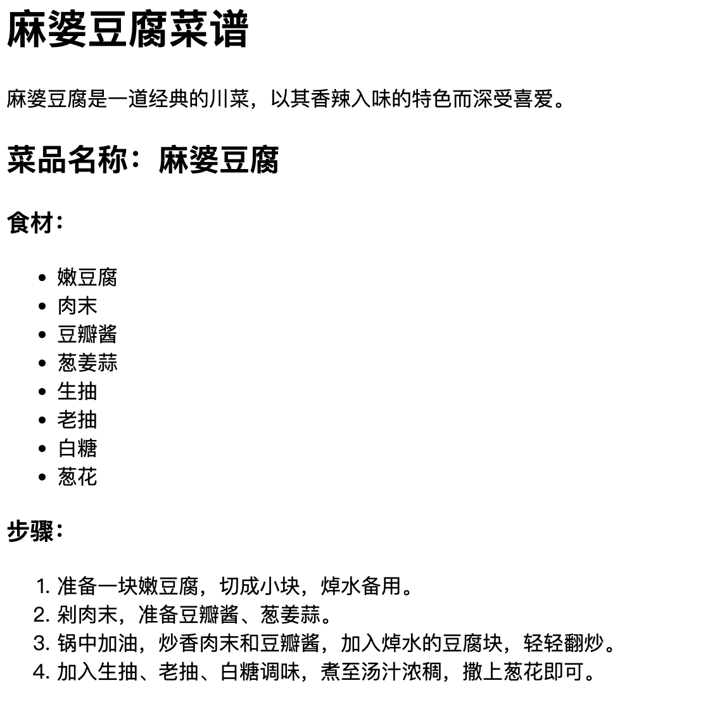

## 无序 List

```html
<ul>
    <li>鸡蛋</li>
    <li>牛奶</li>
    <li>玉米</li>
</ul>
```

## 有序 list

```html
<ol>
    <li>起床</li>
    <li>洗漱</li>
    <li>吃饭</li>
</ol>
```

- 属性
    - `start`
    - `reverse`

## 练习

- 比如给下面这个麻婆豆腐食谱，希望你给他搞成如下图片的模式


```html
麻婆豆腐菜谱
麻婆豆腐是一道经典的川菜，以其香辣入味的特色而深受喜爱。
菜品名称：麻婆豆腐
食材：
嫩豆腐
肉末
豆瓣酱
葱姜蒜
生抽
老抽
白糖
葱花
步骤：
准备一块嫩豆腐，切成小块，焯水备用。
剁肉末，准备豆瓣酱、葱姜蒜。
锅中加油，炒香肉末和豆瓣酱，加入焯水的豆腐块，轻轻翻炒。
加入生抽、老抽、白糖调味，煮至汤汁浓稠，撒上葱花即可。
```

- 目标样式：



- 示例代码：