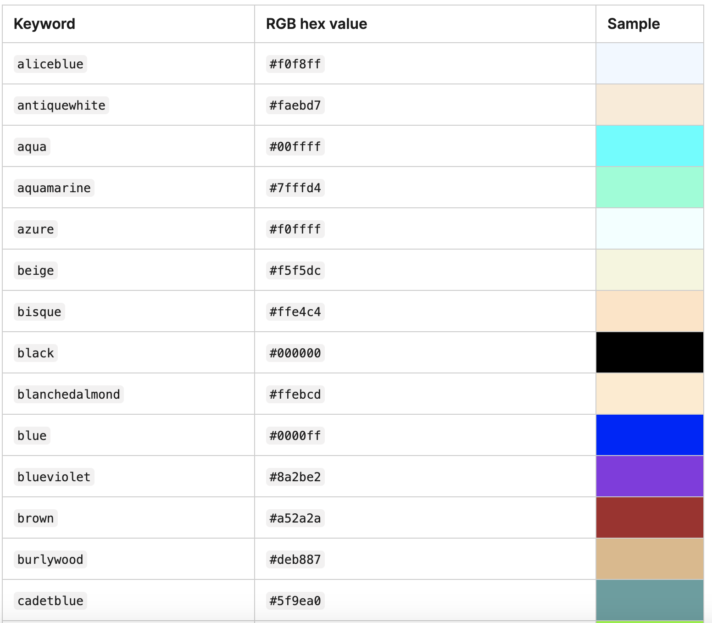

```css
html {
    background-color: red;
}

h1 {
    color: blue;
}

```

- named color
    - `https://developer.mozilla.org/en-US/docs/Web/CSS/named-color`



- colorhunt.co
- csfieldguide.org.nz


- 练习

