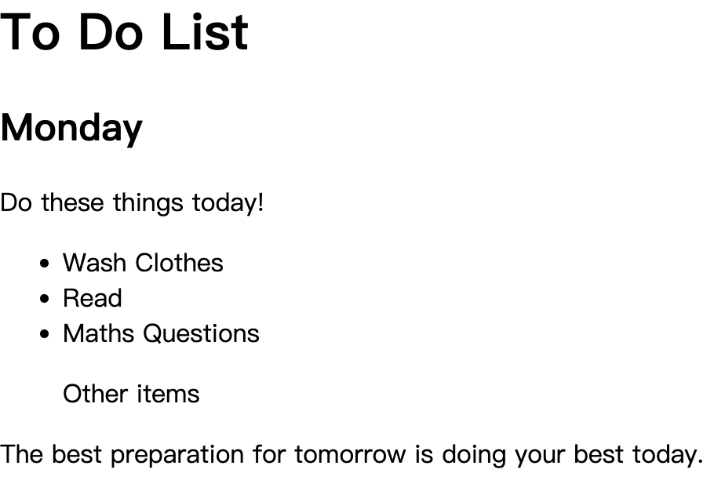
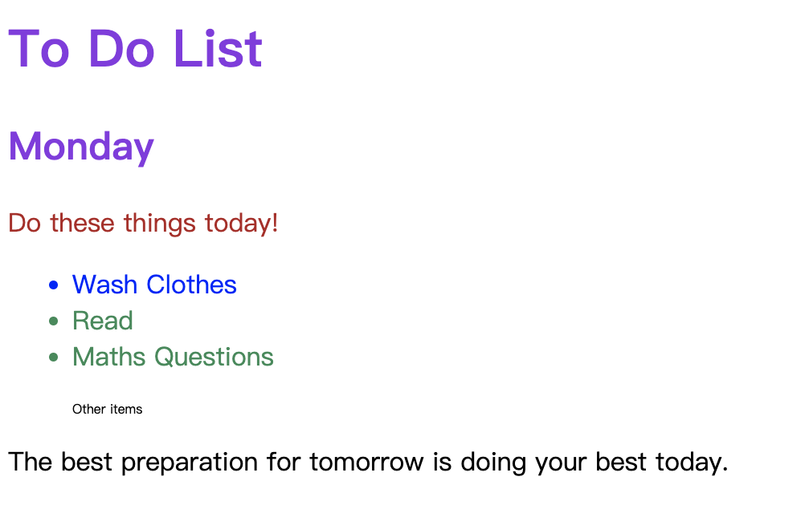

- Group Selector
    - Select both selectors
- Child Selector
- Descendant = Apply to a descendent of left side
- Chaining = Apply where all selectors are true
- combining combiners


- 练习

初始样式：


## 基本要求
- 不要动 HTML
- 只修改 HTML

## 实现要求：
- h1，和h2 的标题颜色改为 blueviolet
- 让“Do these things today!”这句话的颜色成为 firebrick。
- 把三个 list 变成蓝色
- 把最后两个 list 变成绿色
- 把"Other items"的 size 变成 0.5rem

预计效果：


参考实现方法：
```css
/* Write your code here: */
h1, h2 {
    color: blueviolet;
}

/* .box > .done {
    color: firebrick;
} */

.box > p {
    color: firebrick;
}

.box li {
    color: blue;
}

li.done {
    color: seagreen;
}

ul p.done {
    font-size: 0.5rem;
}
```