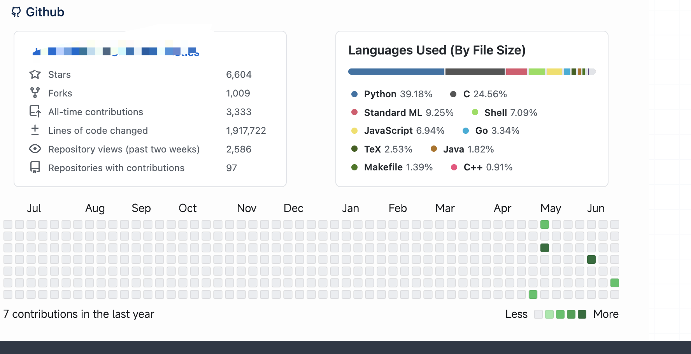
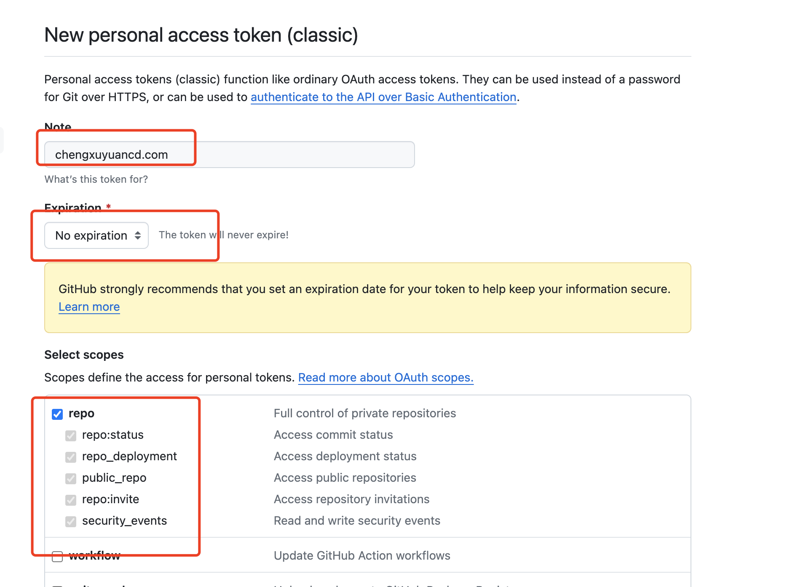
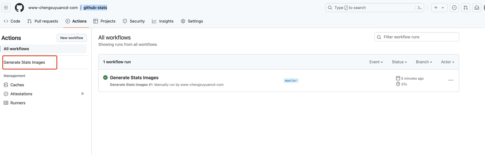

为了让个人博客网站可以展现下方 github 的统计，一来可以用来吹牛，说看哥哥有多少 star，另一方面可以经常查看自己的github 状态，以便对自己的水平有所了解激励自己



包子哥最近刚开始用新的 github 账号来进行教学和分享，所以 star 不多，我一定会努力的。。


## 工具引入

是用的工具是这个老哥的[仓库 github-stats](https://github.com/jstrieb/github-stats)

1. 先 fork 到你自己的仓库

2. generate 的方式，这种方式不会复制大量的 git commit 历史纪录

### 配置token

进入到 [github settings 界面](https://github.com/settings/profile)

点击最下方的 [Developer Settings](https://github.com/settings/apps)

'Personal access tokens' -> 'Tokens' -> 'Generate new token'



### 复制一份 github-stats到自己的仓库

有多种方式：

- fork

- [generate](https://github.com/new?template_name=github-stats&template_owner=jstrieb)


### 创建 secret

进入到创建secret 的界面： `https://github.com/www-chengxuyuancd-com/github-stats/settings/secrets/actions`

创建 Repository secrets

name: ACCESS_TOKEN
value: 就是之前创建的 token 的 value

### 运行 workflow

进入到你自己的 github-stats repo 里面，

点击'Actions' Tab


可以看到左侧有一个'Generate Stats Images'的 workflow，默认是被 disable 的

在右侧 enable 一下，并且点击'run workflow'一次

即可看到任务开始启动了，以后会每 24 小时运行一次

当任务跑完之后会变成绿色，之后可以在自己repo github-stats/tree/master/generated目录中看到刚刚生成的svg 矢量图，


## 是用 github-stats 生成的 svg 图片

比如我使用的方式：


 


```html

 


```
