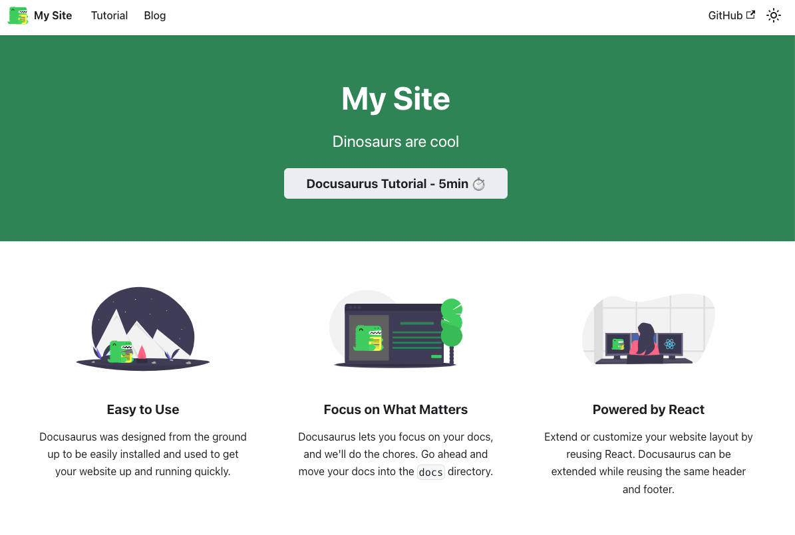

如果你也希望和我一样利用 Docusaurus 从 0 打造属于自己的网站，以便记录生活，知识等，请按如下教程进行操作：

## 安装

Docusaurus 目前已经更新到 3.4版本了，安装非常简单

前提条件：
 需要有 npm 

我们直接按照[官网](https://docusaurus.io/docs)的建议：

`npx create-docusaurus@latest docusaurus-website classic`

会问你：
```shell
Need to install the following packages:
  create-docusaurus@3.4.0
Ok to proceed? (y)
```

直接输入 y 表示 Yes 即可

接着问你希望用何种语言，选择自己最熟悉的即可，我这里选择了 TypeScript：

```shell
? Which language do you want to use? › - Use arrow-keys. Return to submit.
    JavaScript
❯   TypeScript
```

完了就创建好了，会给你如下提示:

```shell
[SUCCESS] Created docusaurus-website.
[INFO] Inside that directory, you can run several commands:

  `npm start`
    Starts the development server.

  `npm run build`
    Bundles your website into static files for production.

  `npm run serve`
    Serves the built website locally.

  `npm run deploy`
    Publishes the website to GitHub pages.

We recommend that you begin by typing:

  `cd docusaurus-website`
  `npm start`

Happy building awesome websites!
```

## 简单使用

我们按照命令行的提示来简单使用下 Docusaurus 网站

先 `cd docusaurus-website` 进入到工程目录，运行`npm start`



## 开始修改
上面启动后还是有很多地方不太令人满意，我们可以做一些修改：

在修改之前，我们初始化 git，并修改.gitignore 以追踪我们的记录：

在项目跟目下执行： `git init .`

### 修改配置文件

配置文件是一定需要修改的，比如网站名称，logo 等


