# 1. 小程序简介

## 1.1 小程序与普通网页开发的区别

- **运行环境不同**
 - 网页运行在浏览器环境中
 - 小程序运行在微信环境中
- API不同
    - 由于运行环境的不同，所以小程序中，无法调用DOM和BOM的API
    - 但是小程序中可以调用微信环境提供的各种API，
        - 比如：
        - 地理定位
        - 扫码
        - 支付

- 开发模式不同
    - 网页的开发模式：浏览器+代码编辑器
    - 小程序有自己的一套标准开发模式
        - 申请小程序开发账号
        - 安装小程序开发者工具
        - 创建和配置小程序项目


## 1.2 小程序体验
- 使用手机微信（6.7.2）扫码下方小程序码，体验小程序：


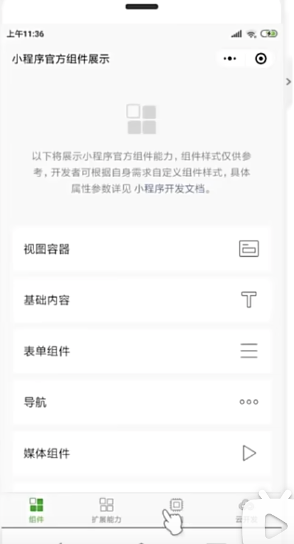

# 2. 第一个小程序

## 2.1 注册小程序开发账号

- 打开网页： https://mp.weixin.qq.com/
- 点击右上角"立即注册"
- 选择点击"小程序"
- 点击"前往注册"
- 分别填入
    - 邮箱
    - 密码
    - 确认密码
    - 验证码
- 最后点击注册，进入邮箱激活步骤，
- 进入自己的邮箱，按要求激活
- 激活成功后进入"信息登记"模块
    - 注册国家/地区
    - 主体类型
    - 然后填写个人或者企业信息，并验证

## 2.2 获取小程序的AppID
登陆到小程序的开发后台，左侧菜单栏选择"开发"->"开发设置"->即可看见AppID


## 2.3 安装开发者工具


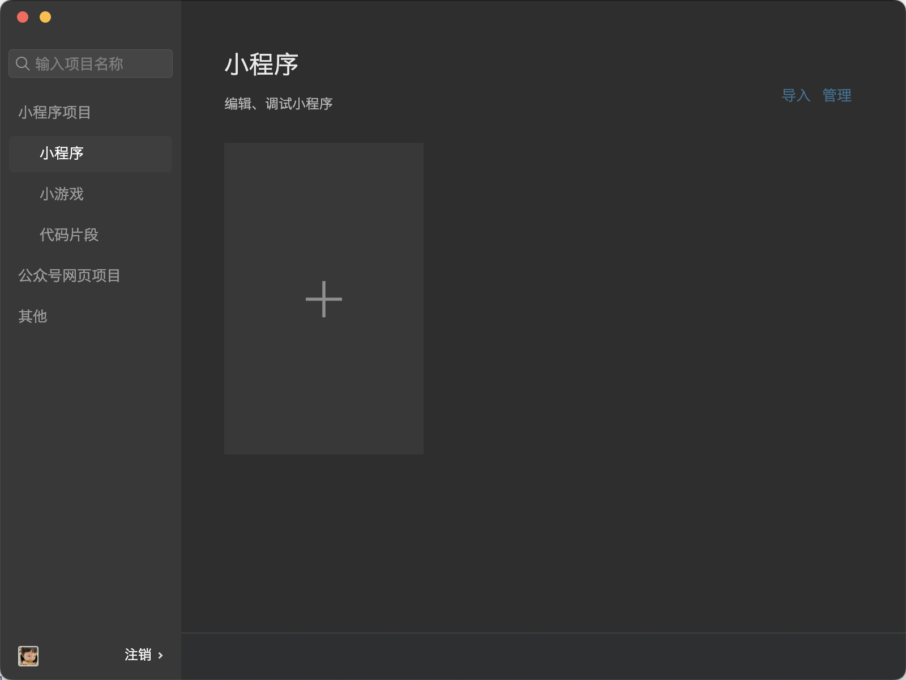

修改外观：
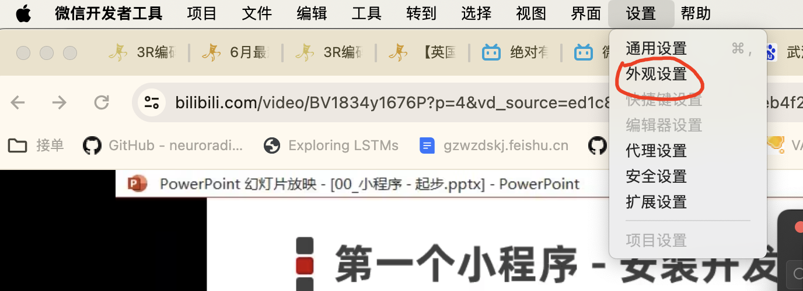

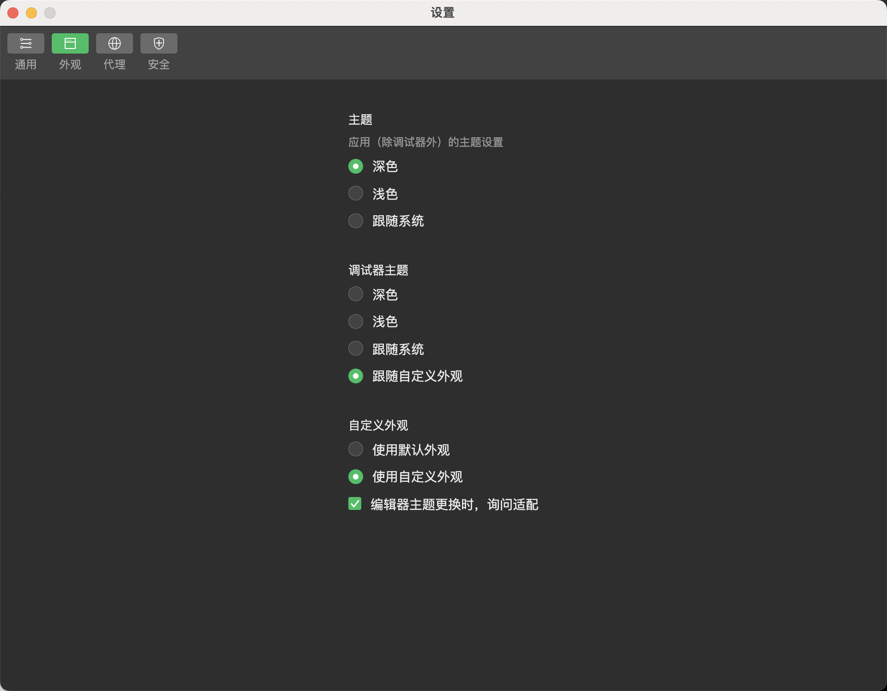


代理模式修改：
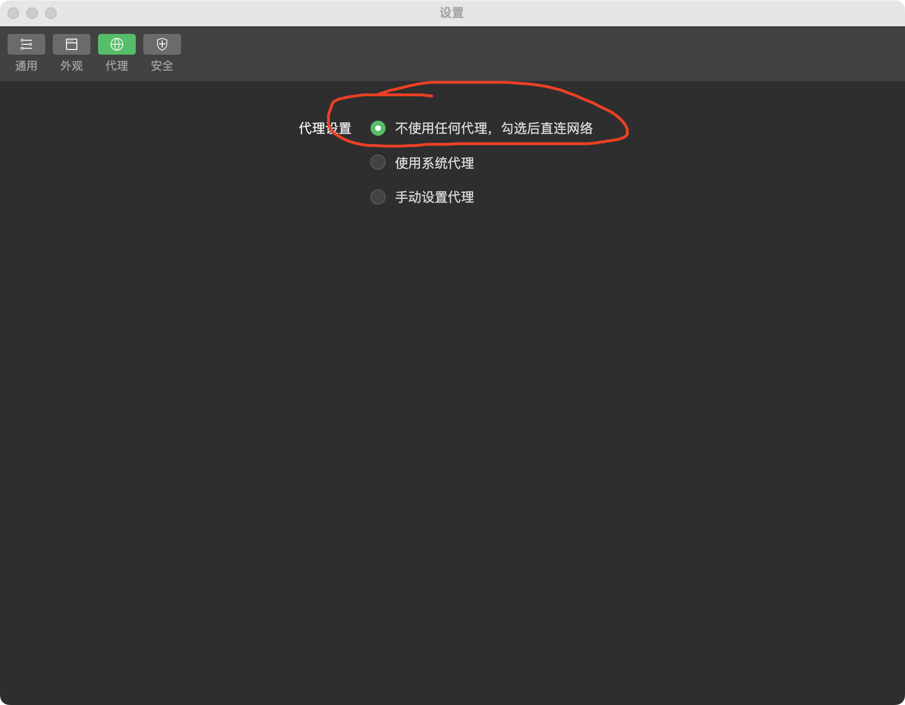

## 2.4 创建小程序
- 填写项目信息
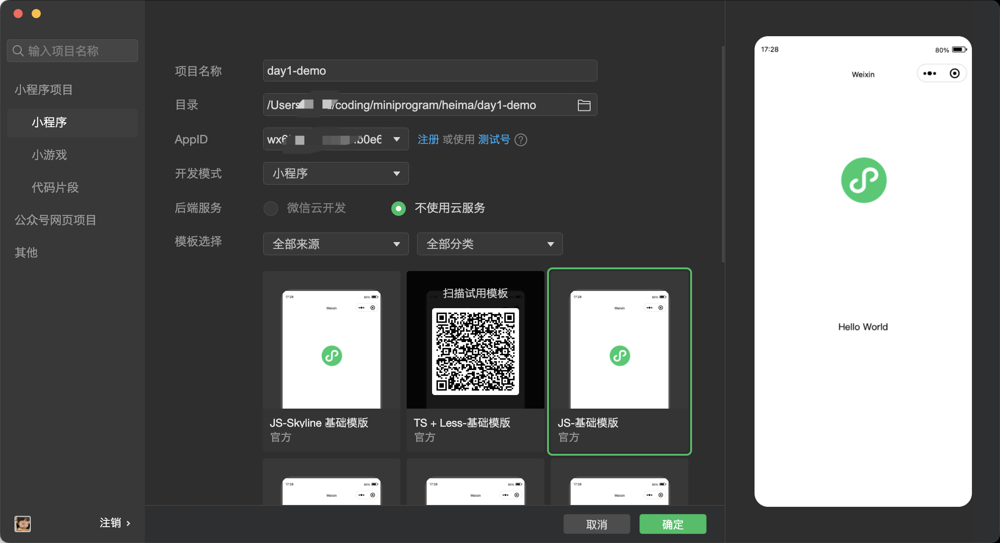

点击确定后出现界面：
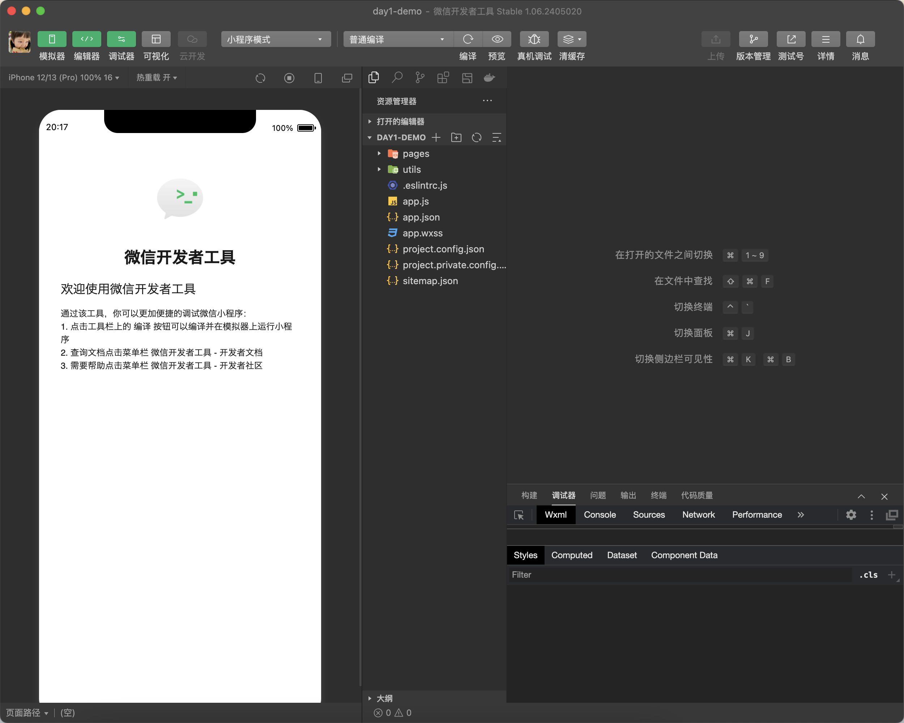


### 2.4.1 查看效果

**使用模拟器查看效果**

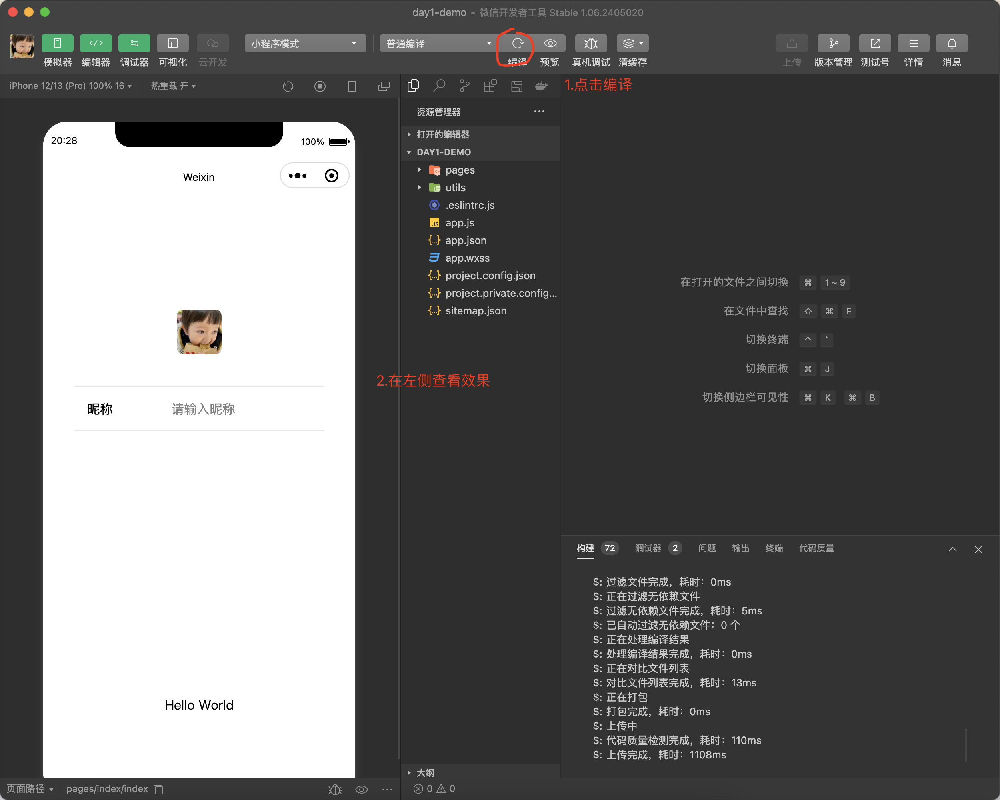


**在手机上查看**

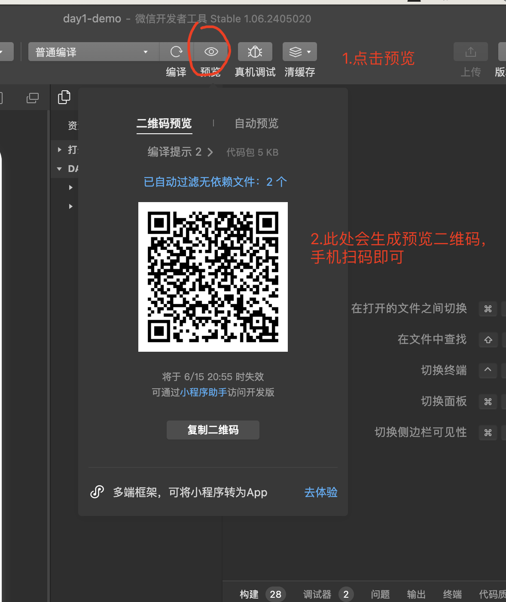

### 2.4.2 认识主界面

- 菜单栏
- 工具栏
    - 详情
- 模拟器
    - 预览
        - 机型选择，缩放
- 代码编辑器
- 调试器

### 2.4.3 小程序代码构成
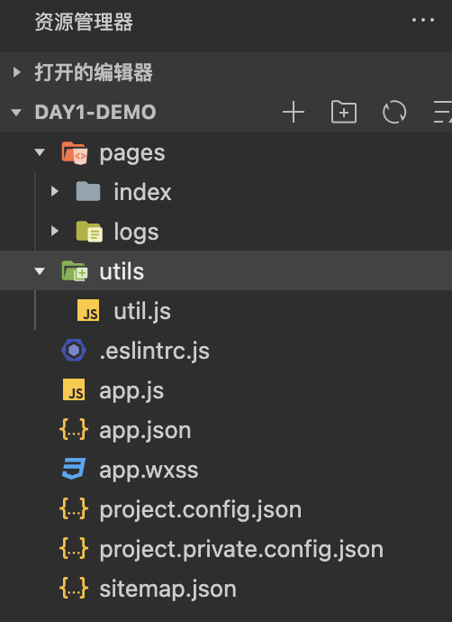

- `pages`用来存放所有小程序的页面
- `utils`用来存放工具性质的模块
- `app.js` 小程序项目的入口文件
- `app.json` 小程序项目的全局配置文件
- `app.wxss` 小程序项目的全局样式文件
- `project.config.json` 项目的配置文件
- `sitemap.json` 用来配置小程序及其页面是否允许被微信索引

### 2.4.4 项目构成

- 小程序官方建议把所有小程序的页面，都存放在 pages 目录中，以单独的文件夹存在，如图：
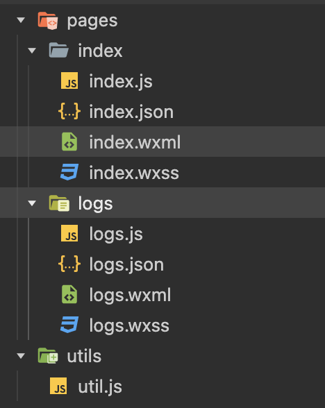

- 每个页面由 4 个基本文件组成：
    - `.js`文件（页面的脚本文件，存放页面的数据，事件处理函数）
    - `.json` 文件(当前页面的配置文件，配置窗口的外观，表现)
    - `.wxml` 文件（页面的模板结构文件）
    - `.wxss`文件（当前页面的样式表文件）


## 2.5 配置文件介绍

### 2.5.1 JSON配置文件

1. **JSON 配置文件的作用**

JSON 是一种数据格式，在实际开发中，JSO总是以配置文件的形式出现。小程序项目中也不例外: 通过不同的 .json 配置文件，可以对小程序项目进行不同级别的配置。

- 小程序项目中有 4 种 json 配置文件，分别是
    - 项目根目录中的 app.json 配置文件
    - 文件项目根目录中的 project.config.json 配置文件
    - 项目根目录中的 sitemap.json 配置文件
    - 每个页面文件夹中的 json 配置文件，比如`index.json`和`logs.json`

2. **`app.json`文件** 

`app.json`是当前小程序的全局配置，包括小程序的所有页面路径，窗口外观，界面表现，底部 tab 等

Demo 项目里面的`app.json`配置内容如下：

`pages`, `window`, `style`, `sitemapLocation`, `componentFramework`, `lazyCodeLoading`

- `pages`: 记录当前小程序所有页面的路径
- `window` 全局定义小程序所有页面的背景色，文字颜色等
- `style` 全局定义小程序组件所使用的样式版本
- `sitemapLocation` 指明`sitemap.json`文件的位置


3. `project.config.json`文件

`project.config.json` 是项目配置文件，用来记录我们对小程序开发所做的个性化配置

- 例如：
    - `setting`中保存了编译相关的配置
    - `appid`中保存的是小程序的账号 ID


4. `sitemap.json`文件
- 微信现已开放小程序内搜索，效果类似于 PC 网页版的 SEO，sitemap.json 文件用来配置小程序页面是否允许微信索引。

当开发者允许微信索引的时候，微信会通过爬虫的形式，为小程序的页面内容建立索引，当用户的搜索关键字和页面的索引匹配成功的时候，小程序的页面将可能展示在搜索结果中。

- `action` 的值为`allow`或者`disallow`

- 注意: sitemap 的索引提示是默认开启的，如果需要关闭 sitemap 的索引提示，可以在小程序项目配置文件`project.config.json`的`setting`中配置字段`checkSiteMap`为 false


5. 页面的`.json`配置文件

小程序中的每一个页面，可以使用.json 文件来对本页面的窗口外观进行配置，页面中的配置项会覆盖 app.json 的 window 中相同的配置项。


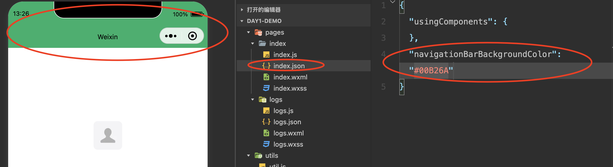


### 2.5.2 新建小程序页面

- 只需要在`app.json` -> `pages`中新增页面的存放路径，小程序开发者工具即可帮我们自动创建对应的页面文件


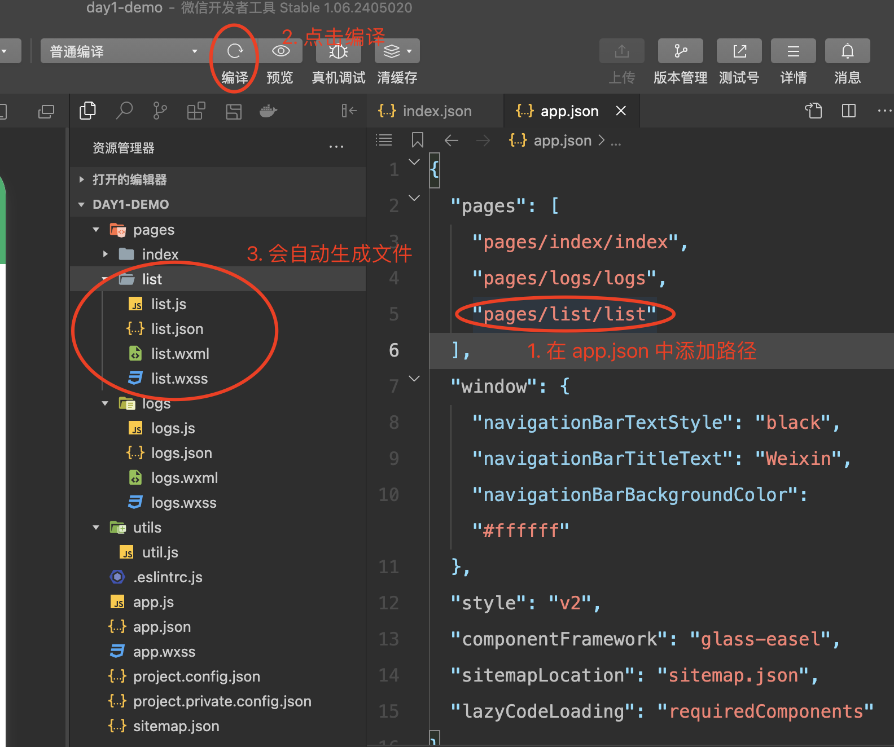


### 2.5.3 修改项目首页

- 只需要调整 `app.json` -> `pages`数组中页面路径的前后顺序，即可修改项目的首页。小程序会把排在第一位的页面，当做项目首页进行渲染：
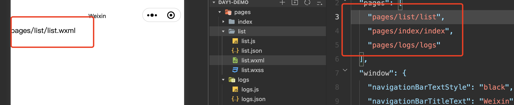


## 2.6 WXML 模板

- WXML(Weixin markup Language) 是小程序框架设计的一套标签语言，
用来构建小程序页面的结构，其作用类似于网页开发中的 HTML

1. WXML和 HTML 的区别

- 标签名称不同
    - HTML(div, span, img, a)
    - WXML(view, text, image, navigator)


- 属性节点不同
    - `<a href="#">超链接</a>`
    - `<navigator url="/pages/home/home"></navigator>`

- 提供类似于 Vue 中的模板语法
    - 数据绑定
    - 列表渲染
    - 条件渲染


## 2.7 WXSS 样式

- 什么是 WXSS

WXSS(WeiXin Style Sheets)是一套样式语言，用于描述 WXML 的组件样式，类似于网页开发中的 CSS。

- WXSS 和 CSS 的区别
    - 新增了 rpx 尺寸单位
        - CSS 中需要手动进行像素单位换算，例如 rem
        - WXSS 在底层支持新的尺寸单位 rpx,在不同大小的屏幕上小程序会自动进行换算
    - 提供了全局的样式和局部样式
        - 项目根目录中的`app.wxss`会作用于所有小程序页面
        - 局部页面的`.wxss`样式仅对当前页面生效
    - WXSS 仅支持部分 CSS 选择器
        - `.class`和`#id`
        - `element`
        - 并集选择器，后代选择器
        - `::after`和`::before`等伪类选择器

## 2.7 JS逻辑交互

1. 小程序中的.js 文件分类
小程序中的 JS 文件分为三大类，分别是：

- `app.js`
    - 是整个小程序项目的入口文件，通过调用`App()`函数来启动整个小程序

- 页面的`.js`文件
    - 页面的入口文件，通过调用`Page()`函数来调用创建并运行页面

- 普通的`.js`文件
    - 是普通的功能模块文件，用来封装公共的函数或属性供页面使用


## 2.9 小程序的宿主环境 - 宿主环境简介

1. 什么是宿主环境

宿主环境(host environment)指的是程序运行所必须的依赖环境，比如：

Android 系统和 IOS 系统是两个不同的宿主环境，安卓版的微信 APP 是不能在 IOS 环境下运行的。

所以 Android 是安卓软件的宿主环境，脱离了宿主环境的软件是没有任何意义的！

2. 小程序的宿主环境

- 手机微信是小程序的宿主环境

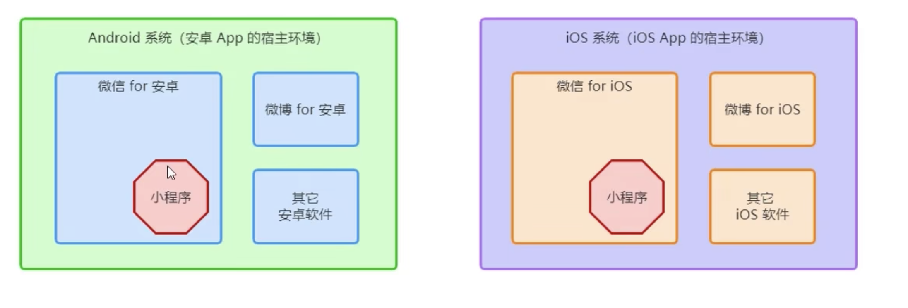

- 小程序借助宿主环境提供的能力，可以完成许多普通网页无法完成的功能，比如：

微信扫码，微信支付，微信登录，地理定位，etc


3. 小程序宿主环境包含的内容

- 通信模型

- 运行机制

- 组件

- API


### 2.9.1 通信模型

1. 通信的主体

- 小程序中通信的主体是渲染层和逻辑层，其中：

WXML 模板和 WXSS 样式工作在渲染层

JS 脚本工作在逻辑层

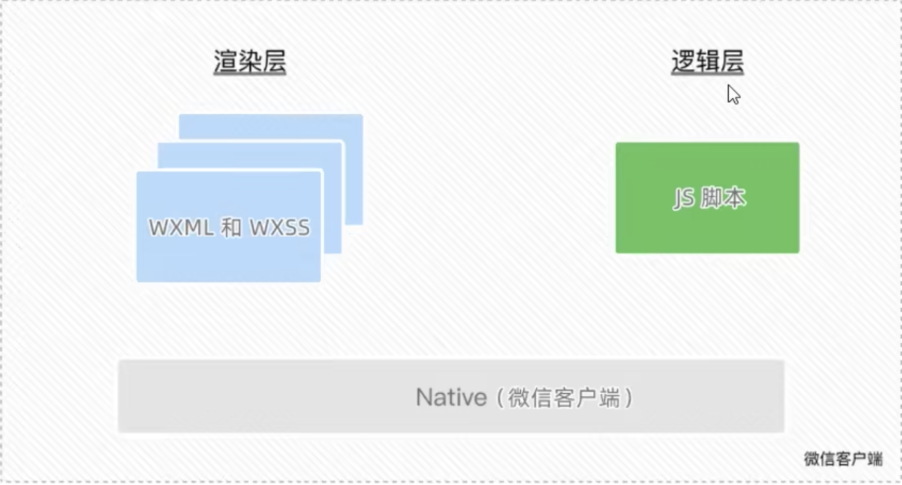


2. 小程序的通信模型

- 渲染层和逻辑层之间的通信
    - 由微信客户端进行转发
- 逻辑层和第三方服务器之间的通信
    - 由微信客户端进行转发

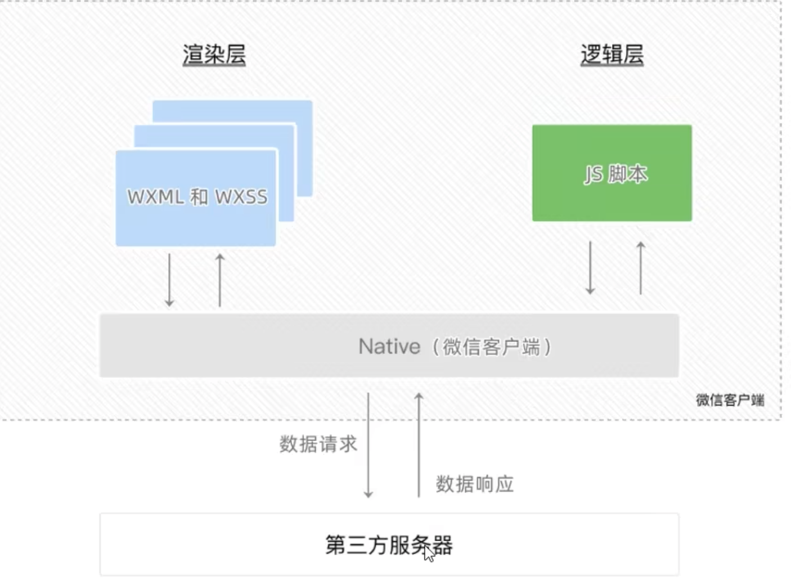


### 2.9.2 运行机制

1. 小程序启动的过程

- 把小程序的代码包下载到本地

- 解析`app.json`全局配置文件

- 执行 `app.js`小程序入口文件，调用 APP()创建小程序实例

- 渲染小程序首页

- 小程序启动完成

2. 页面渲染过程

- 加载解析页面的`.json`配置文件

- 加载页面的`.wxml`模板和`.wxss`样式

- 执行页面的`.js`文件,调用`Page()`创建页面实例

### 2.9.3 组件

1. 组件的分类

- 小程序中的组件也是由宿主环境提供的，开发者可以基于组件快速搭建出漂亮的页面结构。

官方把组件分为 9 大类：

- 常用组件
    - 视图容器
    - 基础内容
    - 表单组件
    - 导航组件
- 不常用
    - 媒体组件
    - map 地图组件
    - canvas 画布组件
    - 开放能力
    - 无障碍访问

#### 2.9.3.1 视图容器类组件

1. view

- 普通视图区域
- 类似于 HTML 中的 div，是一个块级元素
- 常用来实现页面的布局效果

2. scroll-view
- 可滚动的视图区域
- 常用来实现滚动列表效果


3. swiper 和 swiper-item
- 轮播图容器组件 和 轮播图 item 组件


4. view 组件的基本使用

实现如图的 flex 横向布局效果
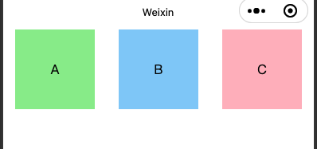

- `pages/list/list.wxml:`

```html
<!--pages/list/list.wxml-->
<view class="container1">
  <view>A</view>
  <view>B</view>
  <view>C</view>
</view>
```

- `pages/list/list.wxss`
```css
/* pages/list/list.wxss */

.container1 view {
  width: 100px;
  height: 100px;
  text-align: center;
  line-height: 100px;
}

.container1 view:nth-child(1){
  background-color: lightgreen;
}

.container1 view:nth-child(2){
  background-color: lightskyblue;
}

.container1 view:nth-child(3){
  background-color: lightpink;
}

.container1 {
  display: flex;
  justify-content: space-around;
}
``` 

5. scroll-view 组件的基本使用情况

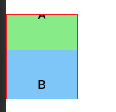


- `pages/list/list.wxml:`

```html
<scroll-view class="container1" scroll-y>
  <view>A</view>
  <view>B</view>
  <view>C</view>
</scroll-view>
```

- `pages/list/list.wxss` 其他不变，改动如下：

```css
.container1 {
  border: 1px solid red;
  width: 100px;
  height: 120px;
}
```

6. swiper 组件

```html
<!--pages/swiper/swiper-demo01.wxml-->
<swiper class="swiper-container">
  <swiper-item>
    <view class="item">A</view>
  </swiper-item>
  <swiper-item>
    <view class="item">B</view>
  </swiper-item>
  <swiper-item>
    <view class="item">C</view>
  </swiper-item>
</swiper>
```

```css
/* pages/swiper/swiper-demo01.wxss */

.swiper-container {
  height: 150px;
}

.item {
  height: 100%;
  line-height: 150px;
  text-align: center;
}

swiper-item:nth-child(1) .item {
  background-color: lightgreen;
}

swiper-item:nth-child(2) .item {
  background-color: lightblue;
}

swiper-item:nth-child(3) .item {
  background-color: lightpink;
}

```

7. swiper 组件的常用属性

| 属性 | 类型 | 默认值 | 说明 |
|-----|-----|------|------|
| indicator | boolean   | false | 是否显示面板指示点 |
| indicator-color | color   | rgba(0, 0, 0, .3) | 指示点颜色 |
| indicator-activate-color | color   | #000000 | 当前选中指示点的颜色 |
| autoplay | boolean   | false | 是否自动切换 |
| interval | number   | 5000 | 自动切换时间间隔 |
| circular | boolean   | false | 是否采用衔接滑动 |

```html
<!--pages/swiper/swiper-demo01.wxml-->
<swiper class="swiper-container" 
indicator-color="white"
indicator-active-color="black"
interval="2000"
circular
autoplay
indicator-dots>
  <swiper-item>
    <view class="item">A</view>
  </swiper-item>
  <swiper-item>
    <view class="item">B</view>
  </swiper-item>
  <swiper-item>
    <view class="item">C</view>
  </swiper-item>
</swiper>
```

#### 2.9.3.2 内容组件

1. 常用的基础内容组件
- text
    - 文本组件
    - 类似于 HTML 中的 span 标签，是一个行内元素
- rich-text
    - 富文本组件
    - 支持把 HTML 字符串渲染位 WXML 结构

2. text 组件的使用
通过 text组件的 selectable 属性，实现长按选中文本内容的效果：

```html
<view>
  手机号支持长按选中效果：
  <text selectable>18888888888</text>
</view>
```

3. rich-text 组件的基本使用
通过 rich-text 组件的 nodes 属性节点，把 HTML 字符串渲染位对应的 UI 结构：

```html
<rich-text nodes="<h1 style='color: red;'>标题</h1>"></rich-text>
```


- 可能的使用场景：商品详情页，服务器返回商品的 HTML，我们使用 nodes 来渲染

#### 2.9.3.3 其他常用组件

- button
    - 按钮组件
    - 功能比 HTML 中的 button 按钮丰富
    - 通过 open-type 属性可以调用微信提供的各种功能（客服，转发，获取用户授权，获取用户信息等）
- image
    - 图片组件
    - image 组件默认宽度约为 300px, 高度约为 240px
- navigator(后面课程会专门讲解)

1. 按钮组件

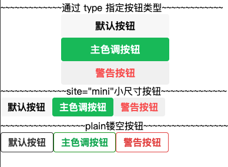

```html
<!--pages/button/button-demo01.wxml-->
<view>~~~~~~~~~~~~~通过 type 指定按钮类型~~~~~~~~~~~~~</view>

<button>默认按钮</button>
<button type="primary">主色调按钮</button>
<button type="warn">警告按钮</button>


<view>~~~~~~~~~~~~~~site="mini"小尺寸按钮~~~~~~~~~~~~~~</view>

<button size="mini">默认按钮</button>
<button type="primary" size="mini">主色调按钮</button>
<button type="warn" size="mini">警告按钮</button>

<view>~~~~~~~~~~~~~~~~~~plain镂空按钮~~~~~~~~~~~~~~~~~~</view>

<button size="mini" plain>默认按钮</button>
<button type="primary" size="mini" plain>主色调按钮</button>
<button type="warn" size="mini" plain>警告按钮</button>
```


2. image 组件
- image 组件的 mode 属性用来指定图片的裁剪和缩放模式，常用的 mode 属性值如下：

| mode 值 | 说明 |
|-----|-----|
| scaleToFill | (默认值)缩放模式，不保持纵横比缩放图片，使图片的宽度完全拉伸至填满 image 元素 |
| aspectFit | 缩放模式，保持纵横比缩放图片，使图片的长边能完全显示出来，也就是说，可以完整地将图片显示出来 |
| aspectFill | 缩放模式，保持纵横比缩放图片，只保证图片的短边能完全显示出来。也就是说，图片通常只在水平或垂直方向是完整的，另一个方向将会发生截取 |
| widthFix | 缩放模式，宽度不变，高度自动化，保持原图宽高比不变|
| hieghtFix | 缩放模式，高度不变，宽度自动化，保持原图宽高比不变|


### 2.9.4 API

- 小程序 API 的 3 大分类
    - 事件监听 API
        - 特点，以 on 开头，用来监听某些事件的触发
        - 举例: `wx.onWindowResize(function callback)`监听窗口尺寸变化的事件
    - 同步 API
        - 特点 1：以 Sync 结尾的 API 都是同步 API
        - 特点 2：同步 API 的执行结果，可以通过函数返回值直接获取，如果执行出错会抛出异常
        - 举例：`wx.setStorageSync('key', 'value')`向本地存储中写入内容
    - 异步 API
        - 特点：类似于 jQuery 中的 `$.ajax(options)`函数，需要通过 success, fail, complete 接收调用的结果
        - 举例：`wx.request()`发起网络数据请求，通过 success 回调函数接收数据


# 3. 协同工作和发布

## 3.1 协同工作

- 对不同岗位，不同角色的员工的权限进行边界划分，能够高效的进行协同工作

- 了解项目成员的组织结构
    - 项目管理者
        - 产品组
        - 设计组
        - 开发组
        - 测试组

## 3.2 小程序成员管理

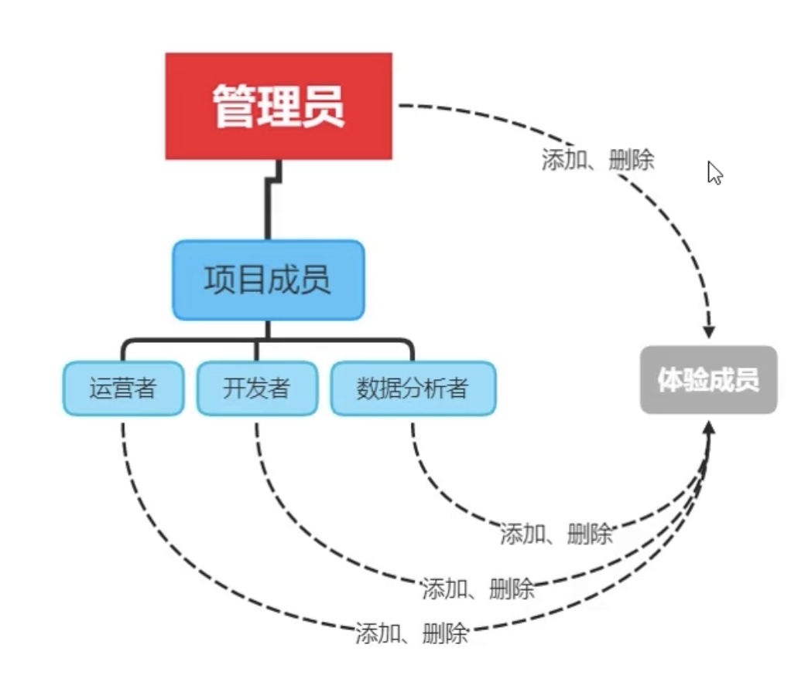

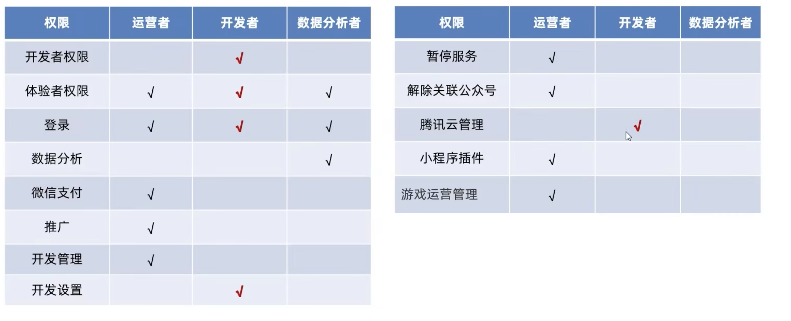
 
1. 开发者的权限说明
- 开发者权限: 可使用小程序开发者工具.对小程序的功能进行代码开发
- 体验者权限:可使用体验版小程序
- 登录权限: 可登录小程序管理后台，无需管理员确认
- 开发设置: 设置小程序服务器域名、消息推送及扫描普通链接二维码打开小程序
- 腾讯云管理: 云开发相关设置

2. 添加项目成员和体验成员


## 3.3 小程序的版本

- 开发版本
- 体验版本
- 发布正式版

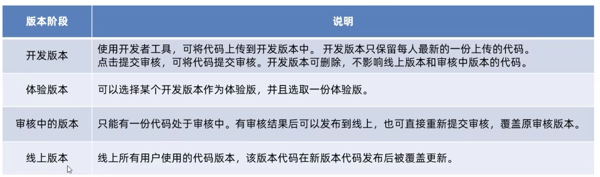

### 3.3.1 发布上线
1. 小程序发布上线的整体步骤

上传代码-> 提交审核->发布

 2. 上传代码

 - 点击开发者工具顶部工具栏中的"上传"按钮
 - 填写版本号以及项目备注


 3. 在后台查看上传之后的版本

 登录小程序管理后台 -> 管理 -> 版本管理 -> 开发版本


 4. 提交审核

 为什么需要提交审核: 保证小程序的质量，以及符合相关的规范

 - 方式：点击“提交审核”，填写相关信息


 5.发布

 审核通过之后，管理员的微信会收到小程序通过审核的通知，此时在审核版本的列表中，点击“发布”按钮之后，即可把“审核通过”的版本发布为“线上版本”，供所有小程序用户访问和使用


 6. 基于小程序码进行推广

 

 获取小程序码的步骤：
 登录小程序管理后台-> 设置-> 基本设置-> 基本信息-> 小程序码及线下物料下载


 ### 3.3.2 运营数据
 1. 查看小程序运营数据的两种方式

 - 在小程序后台查看
    - 管理后台
    - 侧边栏”统计”
    - 点击相应的 tab 可以看到相关的数据

- 使用”小程序数据助手“查看
    - 打开微信
    - 搜索”小程序数据助手“
    - 查看已发布的小程序相关的数据

