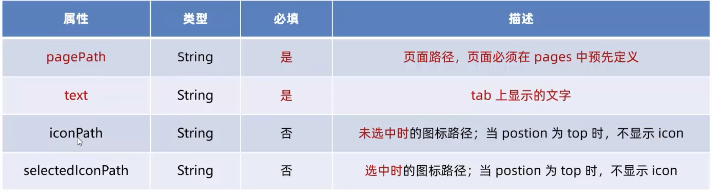

# 1. WXML 模板语法

## 1.1 数据绑定

1. 数据绑定的基本原则

- 在 data 中定义数据

在页面对应的.js 文件中，把数据定义到 data 对象中即可：


- 在 WXML 中使用数据

2. Mustache 语法的格式（双大括号）


例子：
- `pages/index/index.js`

```js
Page({
  data: {
    info: 'hello world'
  }
})
```

- `pages/index/index.wxml`
```html
<!--index.wxml-->
<view>{{info}}</view>
```

3. Mustache 语法的应用场景

Mustache 语法的主要应用场景如下：
- 绑定内容
- 绑定属性
- 运算（三元运算，算术运算等）


动态绑定属性：

- wxml

```js
// pages/shujubangding/shuxing.js
Page({

  /**
   * 页面的初始数据
   */
  data: {
    imgSrc: 'https://pic3.zhimg.com/80/v2-d2281f9328fa812c296e37e550ad9de2_1440w.webp'
  },

  ...
})
```

- wxml

```html
<image src="{{imgSrc}}" mode="aspectFit"></image>
```

三元运算：
```html
<view>
{{randomNumber >= 5 ? '随机数字大于或者等于 5' : '随机数字小于 5'}}
</view>
```


```js
 data: {
    randomNumber: Math.random() * 10
  },

```


算数运算：
```html
<view>
  100 以内的随机数:{{randomNumber*100}}
</view>
```

```js
 data: {
    randomNumber: Math.random().toFixed(2)
  },
```


## 1.2 事件绑定

1. 什么是事件

事件是渲染层到逻辑层的通讯方式，通过事件可以将用户在渲染层产生的行为，反馈到逻辑层进行业务的处理。


2. 小程序中常用的事件


3. 事件对象的属性列表

当事件回调触发的时候，会收到一个事件对象 event，他的详细属性如下表所示：


4. target 和 currentTarget 的区别
target 是触发该事件的源头组件，而 currentTarget 则是当前事件所绑定的组件


点击内部的按钮时，点击事件以冒泡的方式向外扩散，也会触发外层 view 的 tap 事件处理函数。
此时，对于外层的 view 来说：
- e.target 指向的是触发事件的源头组件，因此,e.target 是内部的按钮组件
- e.currentTarget 指向的是当前正在触发事件的那个组件，因此，e.currentTarget 是当前的 view 组件

5. **bindtap**的语法格式

在小程序中，不存在 HTML 中的 onclick 鼠标点击事件，而是通过 tap 事件来响应用户的触摸行为。

- 通过 bindtap,可以为组件绑定 tap 触摸事件,语法如下：

- `wxml`

```html
<button type="primary" bind:tap="btnTapHandler">
按钮
</button>
```

- `js`

```js
 btnTapHandler(e) {
    console.log(e);
  },
```


6. 在事件处理函数中为 data 中的数据赋值

通过调用 `this.setData(dataObject)` 方法，可以给页面 data 中的数据重新赋值:

```html
<button type="primary" bind:tap="countChange">
{{count}}
</button>
```

```js
countChange(e) {
    this.setData({
      count: this.data.count + 1
    })
  },
  /**
   * 页面的初始数据
   */
  data: {
    count : 0
  },
```


7. 事件传参

小程序中的事件传参比较特殊，不能在绑定事件的同时为事件处理函数传递参数

可以为组件提供`data-*`自定义属性传参，其中`*`代表的是参数的名字:

```html
<button bind:tap="btnHandler" data-info="{{2}}">事件传参</button>
```

- 最终
    - info 会被解析位参数的名字
    - 数值 2 会被解析为参数的值

在时间处理函数中，通过`event.target.dataset.参数名`即可获得具体参数的值,示例代码如下：

```html
<button type="primary" 
bind:tap="btnTap2"
data-info="{{2}}"
>
{{count}}
</button>
```

```js

btnTap2(e) {
    console.log(e.target.dataset.info);
    this.setData({
      count: this.data.count + e.target.dataset.info
    })
  },
  /**
   * 页面的初始数据
   */
  data: {
    count : 0
  },
```

8. bindinput 的语法格式

在小程序中，通过 input 事件来响应文本框的输入事件，语法格式如下：

```html
<input bindinput="inputHandler"></input>
```

```js
inputHandler(e) {
    console.log(e.detail.value);
  },
```

9. 实现文本框和 data 之间的数据同步

实现步骤：
    - 定义数据
    - 渲染结构
    - 美化样式
    - 绑定 input 事件处理函数

```html
<input value="{{msg}}" bindinput="inputHandler2"></input>
```

```js
inputHandler2(e) {
    this.setData(
      {
        msg: e.detail.value
      }
    )
  },
  /**
   * 页面的初始数据
   */
  data: {
    count : 0,
    msg: '请输入姓名:'
  },
```

## 1.3 条件渲染

1. 条件渲染

`<view wx:if="{{condition}}">True</view>`


```html
<view wx:if="{{type===1}}">男</view>
<view wx:elif="{{type===2}}">女</view>
<view wx:else>保密</view>
```

2. 结合`<block>`使用`wx:if`

3. hidden

`hidden="{{condition}}"`


## 1.4 列表渲染

1. `wx:for`


```js
  data: {
    arr1: ['苹果', '华为', '小米']
  },
```

```html
<view wx:for="{{arr1}}">
索引是{{index}}, 元素是{{item}}
</view>
```


2. 手动指定索引和当前项的变量名

`wx:for-index`

`wx:for-item`

```html
<view wx:for="{{arr1}}" wx:for-index="idx" wx:for-item="itemName"
>
索引是{{idx}}, 元素是{{itemName}}
</view>
```

3. `wx:key`

类似于 vue 列表渲染中的`:key`，小程序在实现列表渲染时，也建议为渲染出来的列表项提供指定唯一的 key 值，从而提高渲染的效率：

```html
<view wx:for="{{userList}}" wx:key="id">
{{item.name}}
</view>

```


```js
data: {
    userList: [
      {id: 1, name: '小魏凯'},
      {id: 2, name: '小黑'},
      {id: 3, name: '多多'},
      {id: 4, name: '逗逼欢'},
    ]
  },

```


# 2. WXSS模板样式

WXSS 具有 CSS 大部分特性，同时，还对 CSS 进行了扩展及修改，以适应小程序的开发

- 扩展的特性：
    - rpx 尺寸单位
    - @import 样式导入


## 2.1 rpx 尺寸单位

1. rpx 实现原理
rpx(responsive pixel)是微信小程序独有的，用来解决屏适配的尺寸单位

实现原理：不同屏幕大小不同，rpx 把所有设备的屏幕，在宽度上等分为 750份，即当前设备的总宽度为 750rpx


 2. rpx 与 px 换算

 iphone6， 屏幕宽度为 375px，有 750 个物理像素，等分为 750rpx

 750rpx = 375px = 750 物理像素
 1rpx = 0.5px = 1 物理像素

 ## 2.2 样式导入

 1. 什么是样式导入

 使用 WXSS 提供的`@import`语法，可以导入外联的样式表

 2. `@import`语法格式

 `@import`后跟需要导入的外联样式表的相对路径，用;表示语句结束。

 ```css
 /** common.wxss **/
 .small-p {
    padding: 5px;
 }
 ```

 ```css
 /** app.wxss **/
 @import "common.wxss";
 .middle-p {
    padding: 15px;
 }
 ```

## 2.3 全局样式和局部样式

  - 当局部和全局冲突的时候，根据就近原则，局部样式会覆盖全局样式
  
  - 当局部的权重大于或者等于全局的时候才会覆盖


# 3. 全局配置

  1. 全局配置文件及常用的配置项

  `app.json`

  - `pages`
  - `window`
    - 设置全局小程序窗口的外观
    - 设置小程序底部 tabBar 的外观
  - `tabBar`
  - `style`

  

  2. 了解 window 节点常用的配置项

  

3. 全局开启下拉刷新

`app.json`->`window`->`enablePullDownRefresh`

4. 设置上啦触底的距离

- 上拉触底是移动端的专有名词，通过手指在屏幕上的上拉滑动操作，从而加载更多数据的行为

`onReachBottomDistance`

默认举例为 50px, 


5. tabBar

- 底部 tabBar
- 顶部tabBar

1. tabBar 的 6 个组成部分

- tabBar 中只能配置最少两个，最多五个 tab 页标签
- 当渲染顶部 tabBar 时，不现实 icon,只显示文本

  

2. tabBar 节点的配置项


3. 每个 tab 项的配置选项




# 4. 页面配置


# 5. 网络数据请求

1. 小程序中网络数据请求的限制

- 出于安全性的考虑，小程序官方对数据接口的请求做出了如下限制：
- 只能请求 HTTPS 类型的接口
- 必须将接口的域名添加到信任列表中


2. 配置合法域名
- 登录微信小程序管理开发后台-> 开发-> 开发设置->服务器域名-> 修改 request 合法域名


- 域名只支持 https 协议
- 域名不能使用 IP 地址或者 localhost
- 域名必须经过 ICP 备案
- 服务器域名一个月内最多申请 5 次修改


3. 发起 GET 请求
调用微信小程序提供的`wx.request()`方法，可以发起 get 请求
 


4. 发起 GET 请求
调用微信小程序提供的`wx.request()`方法，可以发起 POST 请求
 


5. 在页面刚加载的时候请求数据

- 很多时候，我们需要在页面加载的时候，自动请求一些初始化数据，需要在页面的 onLoad 事件中调用获取数据的函数：


6. 跳过 request 合法域名检验

如果后端程序员仅仅提供了 http协议的接口，暂时没有提供 https协议的接口

为了不耽误开发的进度，可以在微信开发者工具中，临时开启
"开发环境不校验请求域名，TLS 版本及 HTTPS 证书"
跳过 request 合法域名的校验

只可以在开发与调试阶段使用

7. 关于跨域和 Ajax 的说明
跨域问题只存在于基于浏览器的 Web 开发中。

由于小程序的宿主环境不是浏览器，而是微信客户端，所以小程序中不存在跨域的问题

Ajax 技术的核心是依赖于浏览器中的 XMLHttpRequest 这个对象，
由于小程序的宿主环境是微信客户端，所以小程序中不能叫做“发起 Ajax 请求”，
而是叫做“发起网络数据请求'


# 6. 案例 - 本地生活

