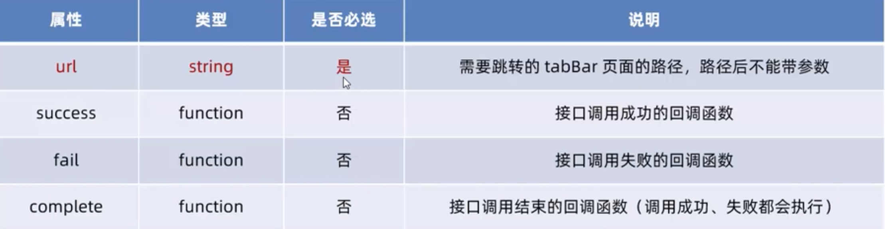
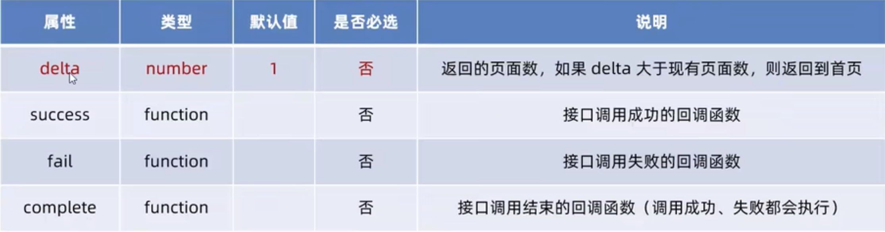
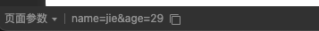
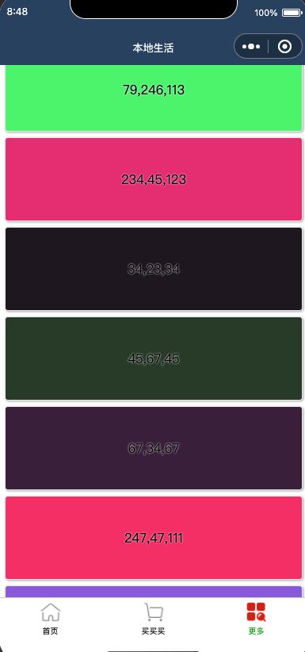
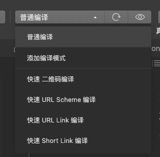
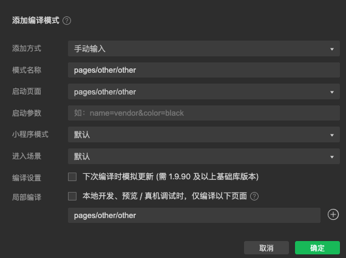

## 学习目标
- 能够知道如何实现页面之间的导航跳转
- 能够知道如何实现下拉刷新效果
- 上拉加载更多效果
- 常用生命周期函数

## 目录
- 页面导航
- 页面事件
- 生命周期
- WXS 脚本
- 案例 - 本地生活（列表页面）


## 1. 页面导航

### 1.1 小程序实现页面导航的方式

#### 1.1.1 声明式导航
- 在页面上声明一个 `navigator>`导航组件
- 通过点击 `navigator>`组件实现页面跳转

##### 导航到 tabBar 页面
- `<navigator>`组件
    - `url` 属性
    - `open-type`属性，表示跳转方式， 必须为`switchTab`


```html
<navigator url="/pages/cart/cart" open-type="switchTab">导航到买买买页面</navigator>
```

##### 导航到非tabBar 页面

- `<navigator>`组件
    - `url` 属性
    - `open-type`属性，表示跳转方式， 必须为`navigate`，可省略

```html
<navigator url="/pages/info/info" open-type="navigate">导航到info页面</navigator>
```

```html
<navigator url="/pages/info/info">导航到info页面</navigator>
```

##### 后退导航

如果需要后退导上一个页面或者多级页面，需要制定 open-type 属性和 delta 属性，其中：
- open-type 属性必须为: `navigateBack`
- delta 的值是数字，表示后退的层级,值为 1 的时候可以省略

```html
<navigator open-type="navigateBack" delta="1">返回上一页</navigator>

<navigator open-type="navigateBack" >返回上一页</navigator>
```

#### 1.1.2 编程式导航
- 调用小程序的导航 API，实现页面的跳转

##### 导航到 tabBar 页面
调用`wx.switchTab(Object object)`方法，可以跳转到 tabBar 页面，其中 Object 参数对象的属性列表如下：



```html
<button bind:tap="goToCart">跳转到 cart</button>
```

```js
  goToCart() {
    wx.switchTab({
      url: '/pages/cart/cart',
    })
  },
```

##### 导航到非tabBar 页面

```html
<button bind:tap="goToInfo">跳转到 info</button>
```

```js

  goToInfo() {
    wx.navigateTo({
      url: '/pages/info/info',
    })
  },
```
##### 后退导航

调用`wx.navigateBack(Object object)`方法，可以返回上一级或多级页面，其中 Object 参数对象的属性列表如下：


```html
<button bind:tap="gotoBack">后退</button>
```

```js
  gotoBack() {
    wx.navigateBack()
  },
```


### 1.2 导航传参

#### 声明式导航传参
navigator 组件的 url 属性用来指定将要跳转的页面的路径。同时，路径的后面还可以携带参数：
- 参数与路径之间使用`?`分隔
- 参数键与参数值用`=`相连
- 不同参数用`&`分隔

```html
<navigator url="/pages/info/info?name=jie&age=29">导航到info页面并携带参数</navigator>
```



#### 编程式导航传参

```js
 goToInfo2() {
    wx.navigateTo({
      url: '/pages/info/info?name=haha&age=3',
    })
  },
```

#### 在onLoad中接收导航参数
通过声明式导航传参或编程式导航传参所携带的参数，可以直接在 onLoad 事件中直接获取到

```js
  onLoad(options) {
    console.log(options);
  },
```


## 2. 页面事件

### 2.1 下拉刷新

移动端专属

#### 启用方式

- 全局开启下拉刷新
  - `app.json`的`window`节点中，将`enablePullDownRefresh`设置为 true

- 局部开启下拉刷新（推荐）
  - 在页面的`.json`配置文件中，将`enablePullDownRefresh`设置为 true


#### 配置下拉刷新窗口的样式

```json
{
  "usingComponents": {},
  "enablePullDownRefresh": true,
  "backgroundColor": "#efefef",
  "backgroundTextStyle": "dark"
}
```


#### 监听下拉刷新事件

```html
<view>count 值是：{{count}}</view>

<button bind:tap="addCount">+1</button>

```

```js
 onPullDownRefresh() {
    console.log('触发了下拉刷新');
    this.setData({
      count: 0
    });
  },
```


#### 停止下拉刷新的效果

```js
  onPullDownRefresh() {
    console.log('触发了下拉刷新');
    this.setData({
      count: 0
    });

    wx.stopPullDownRefresh();
  },

```


### 2.2 上拉触底

通过手指在屏幕上的上拉滑动操作，从而加载更多数据的行为

#### 监听页面的上拉触底事件

`onReachBottom`


#### 配置上拉触底距离

```json
"onReachBottomDistance": 100

```


#### 上拉触底案例

1. 定义获取随机颜色的方法
2. 在页面加载时获取初始数据
3. 渲染 UI 结构并梅花页面效果
4. **在上拉触底时调用获取随机颜色的方法**
5. **添加 loading 提示效果**
6. **对上拉触底进行节流处理**


```html
<view wx:for="{{colorList}}" wx:key="index" class="num-item" style="background-color: rgba({{item}});">{{item}}</view>
```


```js
// pages/other/other.js
Page({

  /**
   * 页面的初始数据
   */
  data: {
    colorList: [
      
    ],
    isLoading: false,
  },

  getColors() {
    this.data.isLoading = true;
    wx.showLoading({
      title: '数据加载中。。。',
    });
    const arr = Array.of(
      [247, 47, 111],
      [147, 101, 225],
      [60, 123, 49],
      [36, 90, 21],
      [125, 147, 44],
      [79, 246, 113],
      [234, 45, 123],
      [34, 23, 34],
      [45, 67, 45],
      [67, 34, 67],
    );
    this.setData(
      {
        colorList: [...this.data.colorList, ...arr ]
      }
    );
    wx.hideLoading();
    this.data.isLoading = false;
  },

  /**
   * 生命周期函数--监听页面加载
   */
  onLoad(options) {
    this.getColors();
  },

  /**
   * 生命周期函数--监听页面初次渲染完成
   */
  onReady() {

  },

  /**
   * 生命周期函数--监听页面显示
   */
  onShow() {

  },

  /**
   * 生命周期函数--监听页面隐藏
   */
  onHide() {

  },

  /**
   * 生命周期函数--监听页面卸载
   */
  onUnload() {

  },

  /**
   * 页面相关事件处理函数--监听用户下拉动作
   */
  onPullDownRefresh() {

  },

  /**
   * 页面上拉触底事件的处理函数
   */
  onReachBottom() {
    if (this.data.isLoading) return;
    this.getColors();
  },

  /**
   * 用户点击右上角分享
   */
  onShareAppMessage() {

  }
})
```

```css
.num-item {
  border: 1px solid #efefef;
  border-radius: 8rpx;
  line-height: 200rpx;
  margin: 15rpx;
  text-align: center;
  text-shadow: 0rpx 0rpx 5rpx #fff;
  box-shadow: 1rpx 1rpx 6rpx #aaa;
}

```





#### 扩展

自定义编译模式




## 3. 生命周期

### 3.1 理论知识

1. 生命周期的分类

两类：

应用生命周期：特指小程序从启动 ->运行-> 销毁的过程
页面生命周期: 每个页面的加载->渲染->销毁的过程

2. 生命周期函数

生命周期函数：内置的函数，自动按生命周期的次序执行

分类:
应用生命周期函数
页面的生命周期函数

### 3.2 实践

#### 3.2.1 生命周期函数
1. 应用的生命周期函数
应用的生命周期函数需要在`app.js`文件中声明：

```js
App({
  onLaunch(){},
  onShow(){},
  onHide(){}
})
```

2. 页面的生命周期函数
需要在页面的`.js`文件中声明：

```js
Page(
  {
    onLoad(){},
    onShow(){},
    onReady(){},
    onHide(){},
    onUnload(){}
  }
)

#### 3.2.2 WXS脚本

##### 概述
WXS 的应用场景
wxml 中无法调用再页面的`.js`中定义的函数，但是 wxml 中可以调用 wxs 中定义的函数。

所以，小程序中 wxs 的典型应用场景就是"过滤器"

##### WXS 和 JavaScript 的关系

- WXS 有自己的数据类型：
number, string, boolean, object, function, array, date, regexp

- wxs 不支持类似于 ES6 及以上的语法形式
不支持: let, const, 解构赋值，展开运算符，箭头函数，对象属性简写，etc..
支持: var 定义变量,普通 function 函数等类似于ES5 的语法

- WXS 遵循 CommonJS 规范
module 对象
`require()`函数
`module.exports` 对象

##### WXS 基础语法

1. 内嵌 WXS 脚本
WXS 代码可以编写在 WXML 文件中的`<wxs>`标签内，就像 JavaScript 代码可以编写在 html 文件中的`<script>`标签内一样

必须提供 module 属性，用来指定当前`wxs`模块的名称，方便再 wxml 中访问 模块中的成员

```html
<view>{{m1.toUpper(username)}}</view>
<wxs module="m1">
  module.exports.toUpper = function(str) {
    return str.toUpperCase();
  }
</wxs>
```

1. 外联的 WXS 脚本
wxs 代码还可以编写在以`.wxs`为后缀名的文件内，就像 JavaScript 代码可以编写在以`.js`为后缀名的文件中一样

```js
function toLower(str) {
  return str.toLowerCase();
}

module.exports = {
  toLower: toLower
}
```

在`wxml`中引入外联的`wxs`脚本时，必须为`<wxs>`标签添加 module 和 src 属性，其中：

- module 用来指定模块的名称
- src 用来指定要引入的脚本路径，且必须是**相对路径**

```
<view>{{m2.toLower(username)}}</view>

<wxs src="../../utils/toos.wxs" module="m2"></wxs>
```

##### WXS特点

1. 与 JavaScript不同
为了降低 wxs 的学习成本，wxs 语言在设计时借鉴了大量了的 JavaScript 语法，但本质上，wxs 和 JavaScript 是完全不同的两种语言！


2. 不能作为组件的事件回调

wxs典型的应用场景就是"过滤器",经常配合 Mustache 语法进行使用：
`<view>{{m1.toUpper(username)}}</view>`

但是，wxs 中定义的函数不能作为组件的事件回调函数使用，比如下面的方式是错误的：
`<button bind:tap="m1.toUpper">按钮</button>`

3. 隔离性
隔离性指的是 wxs 的运行环境和其他 JavaScript 代码是隔离的：
a. wxs 不能调用 js 中定义的函数
b. wxs 不能调用小程序提供的 API

4. 性能好
- 在 IOS 设备上，小程序内的 WXS 会比 JavaScript 代码快 2-20 倍
- 在 android 设备上，二者运行效率无差异


## 案例

### 跳转

#### 跳转带参数

```html
<view class="grid-list">
    <navigator class="grid-item" wx:for="{{gridList}}" wx:key="id"
    url="/pages/shoplist/shoplist?id={{item.id}}&title={{item.name}}"
    >
      <image src="{{item.icon}}"></image>
      <text>{{item.name}}</text>
    </navigator>
</view>
```

#### 跳转后修改 title

```html
// pages/shoplist/shoplist.js
Page({

  /**
   * 页面的初始数据
   */
  data: {
    query: {

    }
  },

  /**
   * 生命周期函数--监听页面加载
   */
  onLoad(options) {
    this.setData({
      query: options
    })
  },

  /**
   * 生命周期函数--监听页面初次渲染完成
   */
  onReady() {
    wx.setNavigationBarTitle({
      title: this.data.query.title,
    })
  },

  /**
   * 生命周期函数--监听页面显示
   */
  onShow() {

  },

  /**
   * 生命周期函数--监听页面隐藏
   */
  onHide() {

  },

  /**
   * 生命周期函数--监听页面卸载
   */
  onUnload() {

  },

  /**
   * 页面相关事件处理函数--监听用户下拉动作
   */
  onPullDownRefresh() {

  },

  /**
   * 页面上拉触底事件的处理函数
   */
  onReachBottom() {

  },

  /**
   * 用户点击右上角分享
   */
  onShareAppMessage() {

  }
})
```

### 列表页面

###