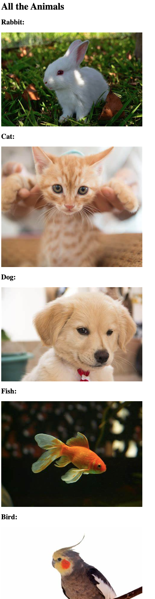

- 计算机文件路径
    - 绝对路径
    - 相对路径


- 练习：
- 目标：


请保持图片位置不变：

```shell
(base) ➜  1-computer-file-paths git:(master) ✗ tree
.
├── Folder0
│   ├── Folder3
│   │   └── cat.png
│   ├── goal.png
│   ├── index.html
│   ├── rabbit.png
│   └── solution.html
├── Folder1
│   ├── Folder2
│   │   └── bird.png
│   └── fish.png
└── dog.png
```

给你的初始HTML
```html
<h1>All the Animals</h1>
<h2>Rabbit:</h2>

<h2>Cat:</h2>

<h2>Dog:</h2>

<h2>Fish:</h2>

<h2>Bird:</h2>
```

- 实现：