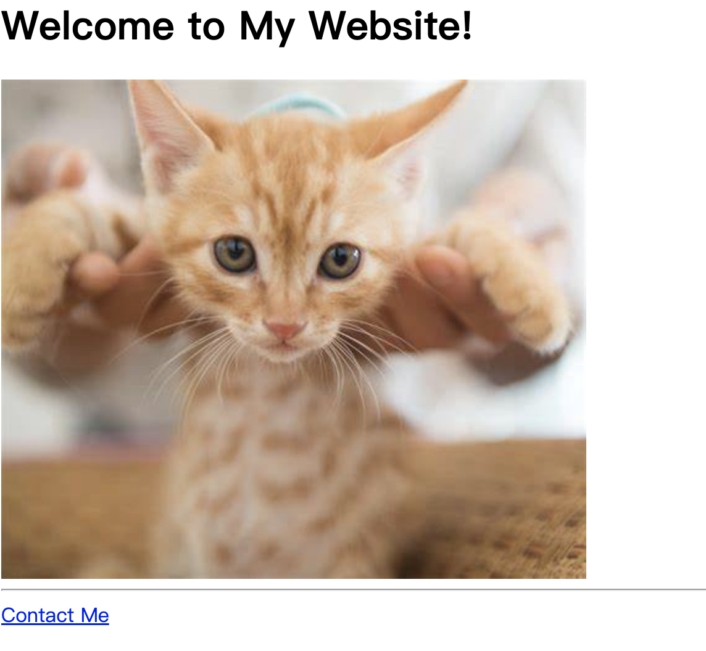

## 练习

- 初始目录不动：

```shell
(base) ➜  2-webpages git:(master) ✗ tree
.
├── assets
│   └── images
│       └── cat.png
├── goal.png
├── goal2.png
├── index.html
├── public
│   ├── about.html
│   └── contact.html
└── solution.html
```

- 目标: 可以点击一个图片进入 `about.html` 页面，点击 contact me 超链接进入 `contact.html` 页面



- 实现：

