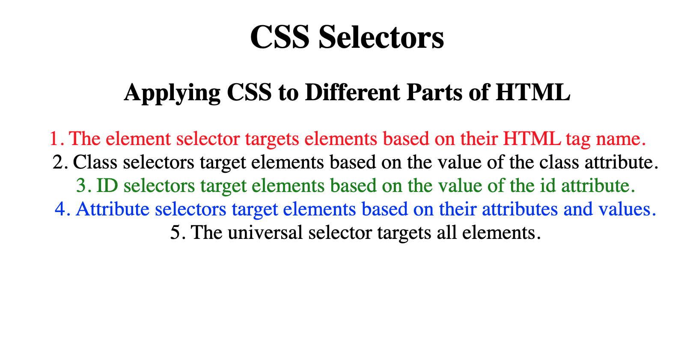

```css

h1 {
    color: blue;
}

```


```index.html

<h2>Read</h2>
<h2>Green</h2>
<h2>Blue</h2>

```
```css
h2 {
    color: red;
}

```


- Class Sector

```css
.red-heading {
    color: red;
}

```


```html
<h2 class="red-text">Red</h2>
<h2>Green</h2>
<h2>Blue</h2>
```

```css
.red-text {
    color: red;
}
```


```html

<h2 class="red-text"> Heading 2 </h2>
<h3>Heading 3</h3>
<p class="red-text">Paragraph</p>

```


```css
.red-text {
    color: red;
}
```


- ID Selector
    - Class Selector可以作用在多个元素上
    - ID selector仅仅可以作用在一个元素上


```html
<h2 id = "main"> Red </h2>
<h2>Green</h2>
<h2>Blue</h2>
```


```css
#main {
    color: red;
}

```

- Attribute Selector


```html
<p draggable="true">Drag me</p>
<p draggable="false">Don't Drag me</p>
<p draggable="false">Don't Drag me</p>
```

```css
p[draggable="false"] {
    color: red;
}
```

- Universal Selector

```html
<h1 class="title">Hello</h1>
<h2 id="heading">World</h2>

<p draggable="true">This is a website</p>

```

```css
* {
    color: red;
}
```


- 练习

给你如下 HTML 代码不要动：

```html
<!DOCTYPE html>
<html lang="en">

<head>
  <meta charset="UTF-8">
  <title>CSS Selectors</title>
  <link rel="stylesheet" href="./style.css" />
</head>

<body>
  <h1>CSS Selectors</h1>
  <h2>Applying CSS to Different Parts of HTML</h2>
  <!-- TODO 1: Set the CSS for all paragraph tags to "color: red" -->
  <p class="note">1. The element selector targets elements based on their HTML tag name.</p>

  <ol>
    <!-- TODO 2: Set the CSS for all elements with a class of "note" to "font-size: 20px" -->
    <li class="note" value="2">Class selectors target elements based on the value of the class attribute.</li>

    <!-- TODO 3: Set the CSS for the element with an id of "id-selector-demo" to "color: green" -->
    <li class="note" id="id-selector-demo" value="3">ID selectors target elements based on the value of the id
      attribute.</li>

    <!-- TODO 4: Set the CSS for the li elements that have the "value" attribute set to "4" to have "color: blue" -->
    <li class="note" value="4">Attribute selectors target elements based on their attributes and values.</li>

    <!-- TODO 5: Set all elements to have "text-align: center" -->
    <li class="note" value="5">The universal selector targets all elements.</li>
  </ol>
</body>

</html>
```

目标：



- 修改 CSS：

