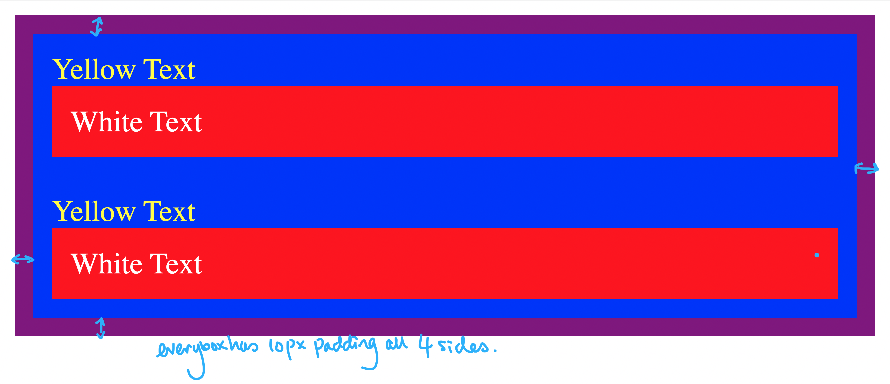

- 练习

目标：


原来的 HTML:

```html
<!DOCTYPE html>
<html lang="en">

<head>
  <meta charset="UTF-8">
  <title>CSS Cascade</title>
  <link rel="stylesheet" href="./style.css">
</head>

<body>
  <div id="outer-box" class="box">
    <div class="box">
      <p>Yellow Text</p>
      <div class="box inner-box">
        <p class="white-text">White Text</p>
      </div>
    </div>
    <div class="box">
      <p>Yellow Text</p>
      <div class="box inner-box">
        <p class="white-text">White Text</p>
      </div>
    </div>
  </div>
</body>

</html>
```

原来的 CSS：

```css
/* Don't change the existing CSS. */

.box {
  background-color: blue;
  padding: 10px;
}

p {
  color: yellow;
  margin: 0;
  padding: 0;
}
```

参考解析：
```css

#outer-box {
  background-color: purple;
}

.box {
  background-color: blue;
  padding: 10px;
}

.inner-box {
  background-color: red;
}

p {
  color: yellow;
  margin: 0;
  padding: 0;
}

.white-text {
  color: white;
}


```