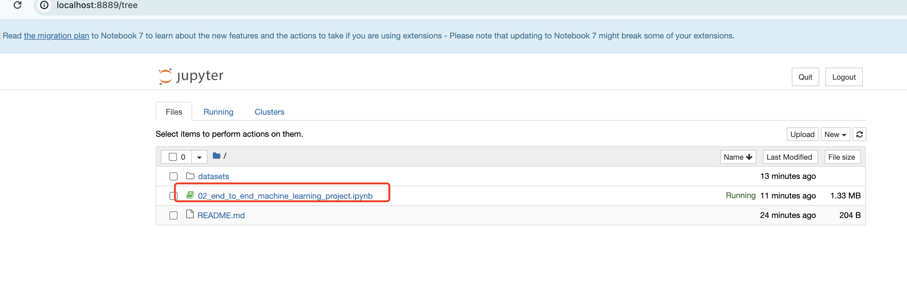

本章是本书比较精彩的一个开头，通过使用真实的数据，

来向初学者阐述如何从一个业务系统中构造一个机器学习项目，

并利用这个机器学习模块来最终为业务系统产生价值。

下面是我的笔记部分，当然由于篇幅原因，省略了文中的大段描写，感兴趣的读者请购买正版书籍进行阅读学习：

# 1. 问题引入以及框架确定

本章希望用数据为房产公司来做投资分析使用，

比如根据获得的一部分区域的房价数据，来为这个区域的房价进行预测，最终结合其他信息来指导公司的投资。

 
## 1.1 框架问题
是有监督学习，无监督学习还是强化学习？
是分类任务，回归任务还是其他任务？
使用批量学习还是在线学习技术？

答：这是一个典型的有监督学习任务，因为已经给出了标记的训练示例，并且是一个典型的回归任务，因为需要对某个值进行预测

具体的说，是一个**多重回归**问题，因为系统需要使用多个特征进行预测（使用区域的人口，收入中位数等）

并且也是**一元回归**问题，因为仅仅尝试预测每个区域的单个值

如果试图预测每个区域的多个值，那将是**多元回归**问题


## 1.2 选择性能指标

### 1.2.1 RMSE(均方根误差)

```
$$
RMSE(X, h) = \sqrt{\frac{1}{m}\sum_{i=1}^{m}(h(x_i) - y_i)^2}
$$
```

- 本质上也是测量两个向量之间的距离，RMSE和欧几里得范数相对应，也称为L2范数

### 1.2.2 MAE(平均绝对误差)

```shell
$$
RMSE(X, h) = \frac{1}{m}\sum_{i=1}^{m}|h(x_i) - y_i|
$$
```

- 称为L1范数，曼哈顿范数


- 其他范数：
    - 范数指标k越大，它越关注大值而忽略小值，所以RMSE对异常值比MAE更敏感
    - 但是当离群值呈指数形式稀有时（如钟形曲线），RMSE表现非常好，通常是首选

```shell
$$
\|x\|_k = \left( \sum_{i=1}^{n} |x_i|^k \right)^{\frac{1}{k}}
$$
```


## 1.3 检查假设
- 列举和验证到目前为止做出的假设，是一个非常好的习惯，可以在初期检查出严重的问题

# 2 获取数据
- 原书第二版的github: https://github.com/ageron/handson-ml2
- 原书第三版的github: https://github.com/ageron/handson-ml3

- 这里作者原书非常提倡使用jupyter notebook来学习，所以我们也照旧

- 可以去我的github拉取中文版的代码来运行学习：
    - https://github.com/www-chengxuyuancd-com/books-hands-on-ml

## 2.1 下载数据

- 原书提供的下载路径是：https://raw.githubusercontent.com/ageron/handson-ml2/master/datasets/housing/housing.tgz
- 我把此文件下载放入了我的仓库中，防止之前的链接突然不可用

- 此时就可以打开我提供的jupyter notebook 文件或者作者提供的文件进行学习,下面以我的仓库作为示例：

- 先找一个常用的本地学习目录，并进入，比如我这里`/Users/jie.xu/coding/teaching/machine-learning/`

- 进入仓库页面: https://github.com/www-chengxuyuancd-com/books-hands-on-ml


- 点击`Fork`把我的代码拉到自己的仓库这样便于后续你自己记笔记或者直接克隆代码到你本地（这样后续你可能不方便提交代码记笔记） `git clone https://github.com/www-chengxuyuancd-com/books-hands-on-ml.git`

- 拉取成功之后
    - 进入到项目目录中`cd books-hands-on-ml`
    - 用jupyter 进行打开: `jupyter notebook`
    - 打开后可以看到如下的内容：



直接打开文件`02_end_to_end_machine_learning_project.ipynb`


