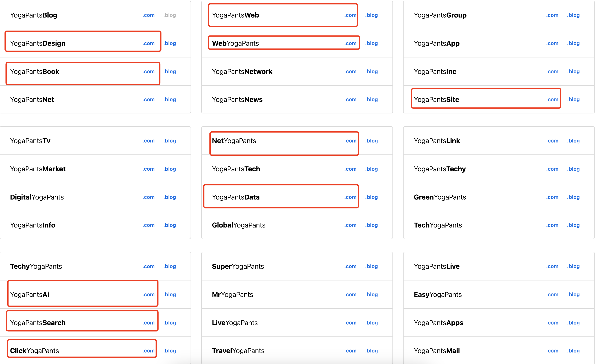

## 域名挑选

做国外站不要在国内阿里云，腾讯云这些购买域名，容易被墙和监控，虽然咱做的是合法的事儿，但是还是放外面的好，贵点就贵点

- 尽量选`.com`域名
- 不使用`-`连字符，越短越好
- [可以参考下这个网站，可以帮助你选域名](https://leandomainsearch.com/)

// TODO

- 如何批量使用脚本验证域名是否被注册

// TODO

- 老域名

## 国外几个域名平台介绍

### GoDaddy

### NameCheap
