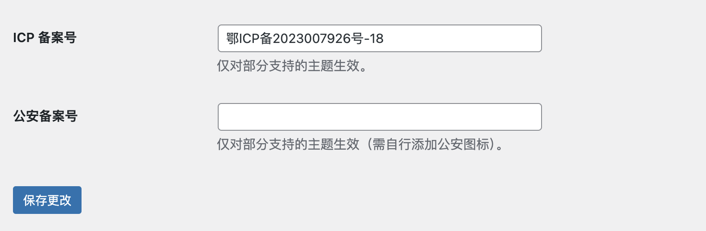

# 1. 必要配置

## 1.1 备案号填写（如果是国内备案了的网站）
- 现在做国内站，不备案基本没流量，所以正规网站还是最好备案下
- 公安备案尽量不要做，不方便后续出手而且限制极多，之前公安备案了一个网站，要求最好不开通留言功能，因为认为这种留言功能可能有社会不稳定因素

### 1.1.1 如果没有使用其他主题
- 设置->常规->拉到最下方有个 “ICP 备案号”以及“公安备案号”

填写之后在 wordpress 即可看到

### 1.1.2 使用了其他主题
我使用的是日主题
按上述修改后无法生效
是因为这种主题有特定的页脚样式，需要直接修改：

以日主题为例：
主题设置->布局设置->网站底部设置->网站备案链接

直接修改即可
