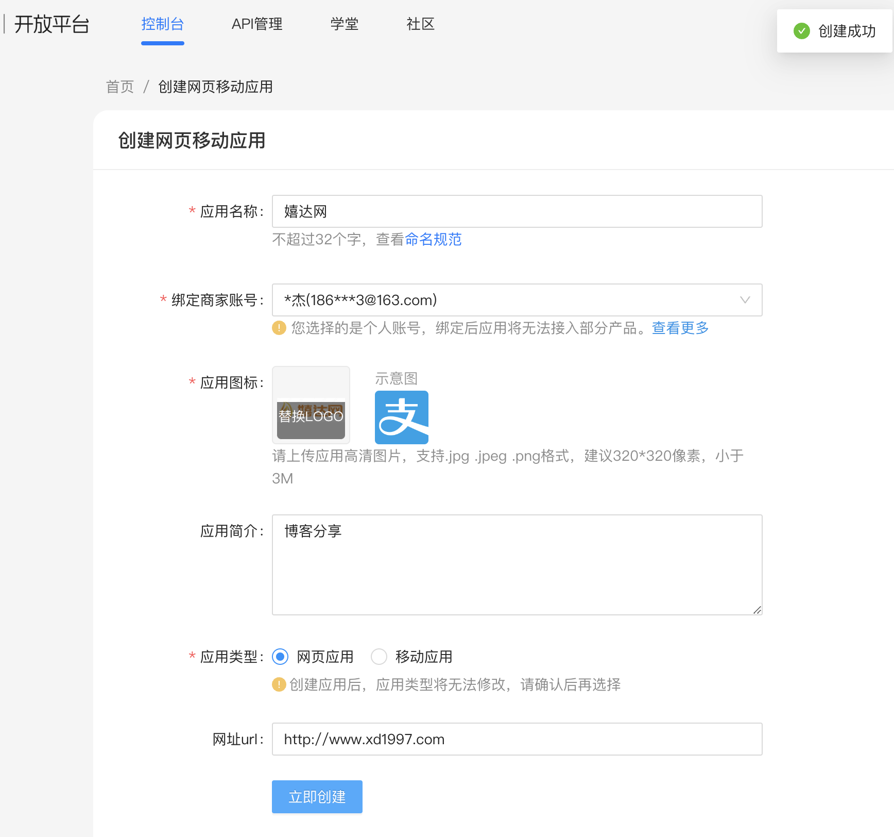
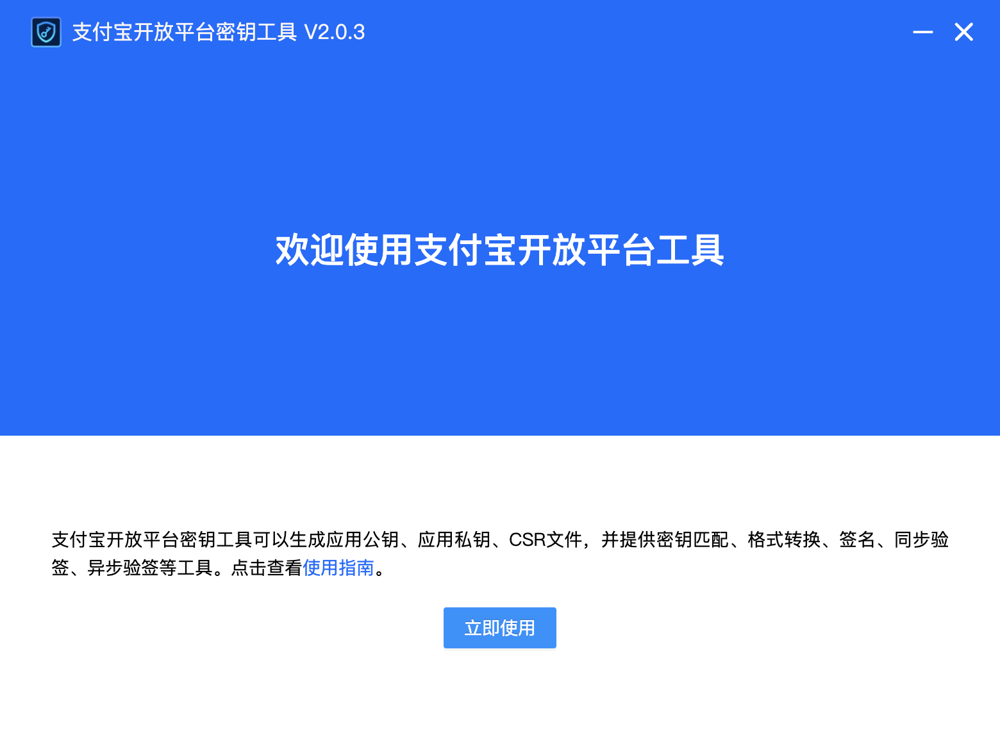
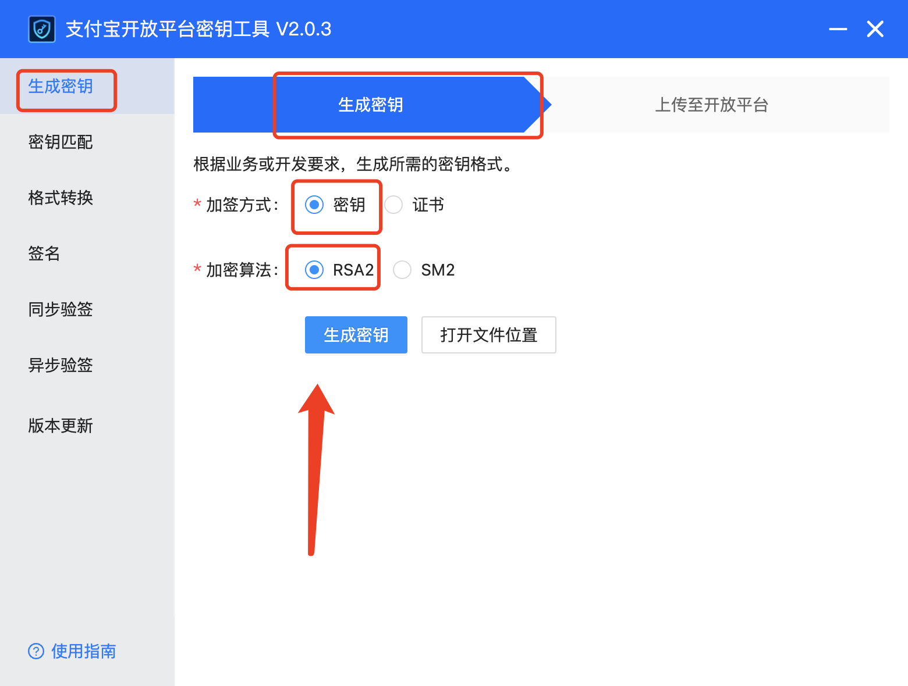
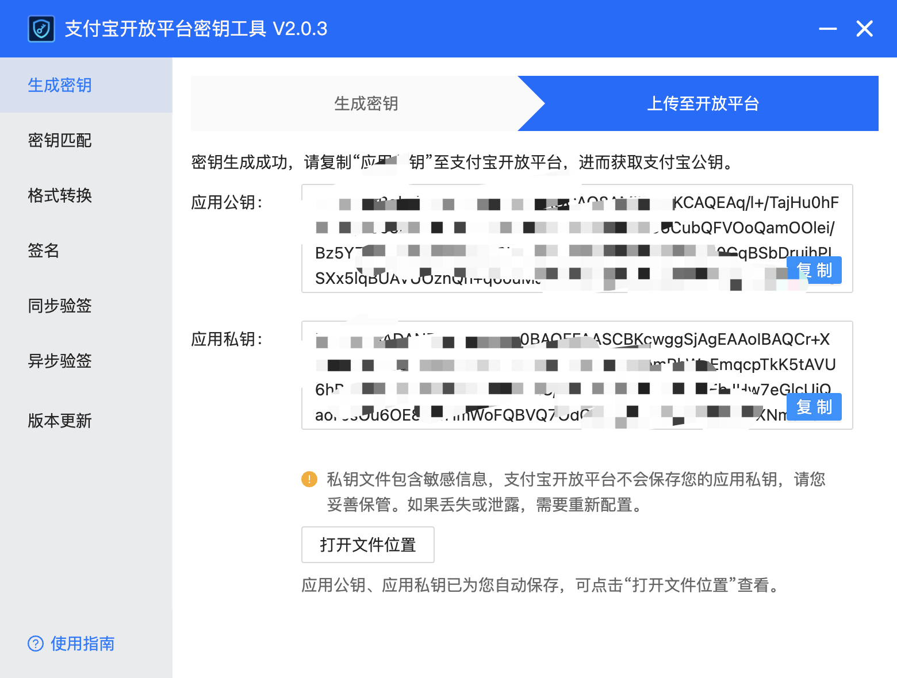
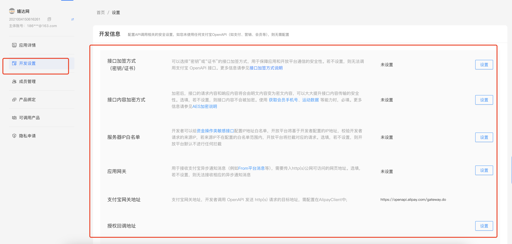
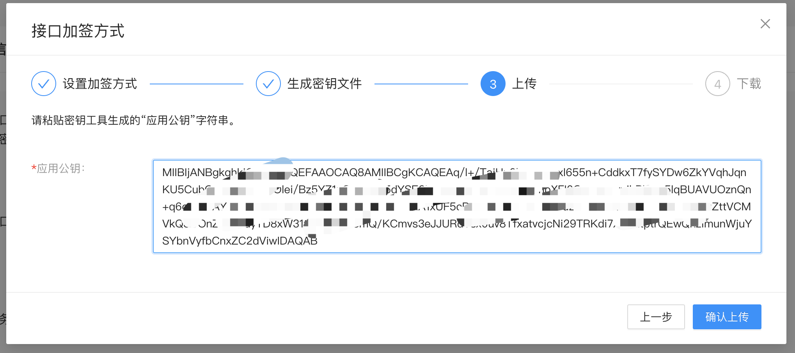
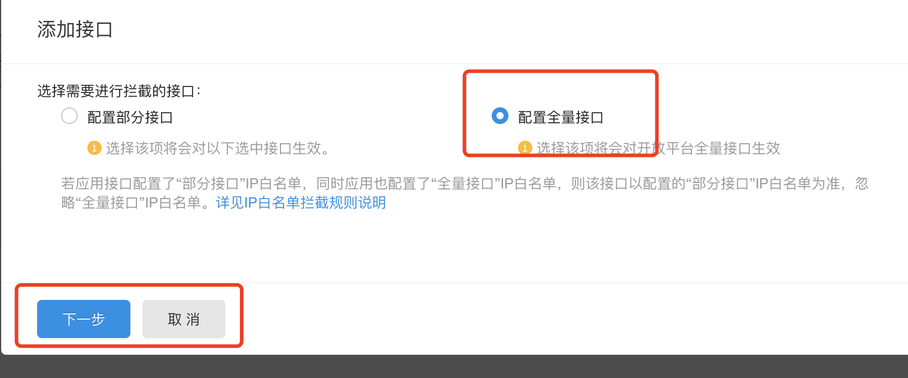
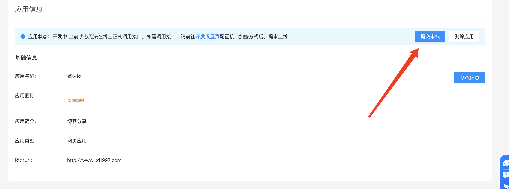

# 1. 支付宝当面付配置教程

## 1.0 当面付签约开通
- https://open.alipay.com/ait/sop/DEF2023121804189696
- https://b.alipay.com/page/ar-center/merchant-sign/form?productCode=I1011000100000000001
- https://b.alipay.com/page/products-sign/dynlink/productSign/sign.htm?productCode=I1011000100000000001&orderNo=20240610034000100000054284220154&isSubmitted=1&productName=%E5%BD%93%E9%9D%A2%E4%BB%98

- https://b.alipay.com/page/products-sign/dynlink/productSign/signManage.htm

## 1.1 首先创建应用
我们打开支付宝开放平台官网：https://open.alipay.com/，登录账号“进入管理中心”，在“我的应用”区域右上角，依次点击“创建应用”>>“网页&移动应用”>>“支付接入”，如图所示：

## 1.2 配置
上面创建应用之后还无法使用，需要

先来到教程页面：https://opendocs.alipay.com/common/02kipk?pathHash=0d20b438

下载密钥工具，然后打开：

我们用“支付宝开放平台开发助手”生成的公钥与密钥文件一定要自己保存好，同时我们需要保留这里的私钥内容以做备用！

然后我们返回第一步的开放平台应用编辑页面，在“开发信息”中，设置“接口加密方式”，如图：

## 1.3 配置 IP 白名单

## 1.4 网关
设置为自己的网站

## 1.5 提交审核

