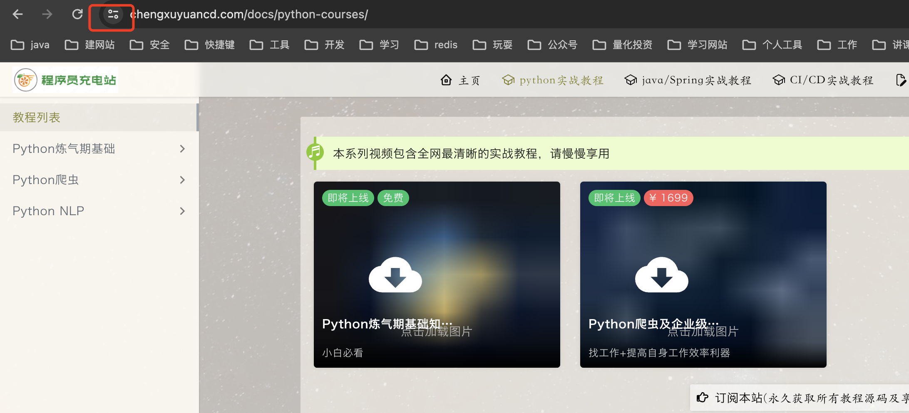
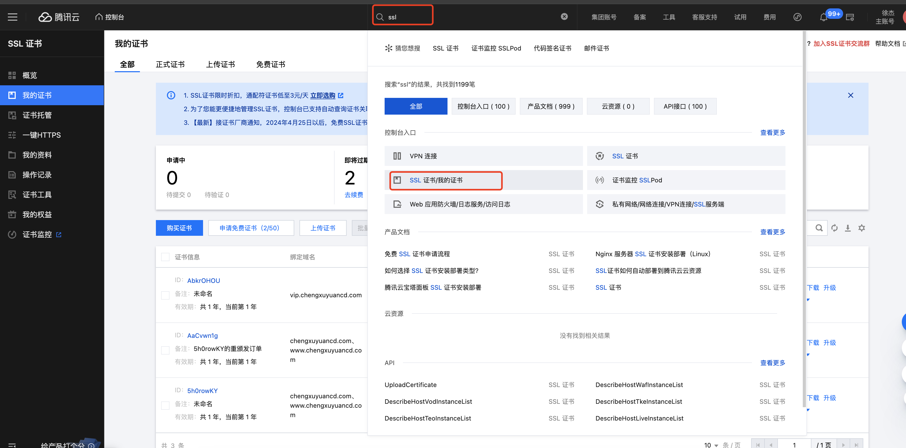
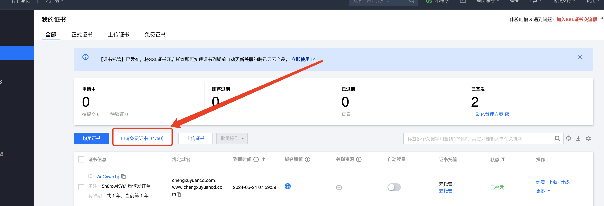
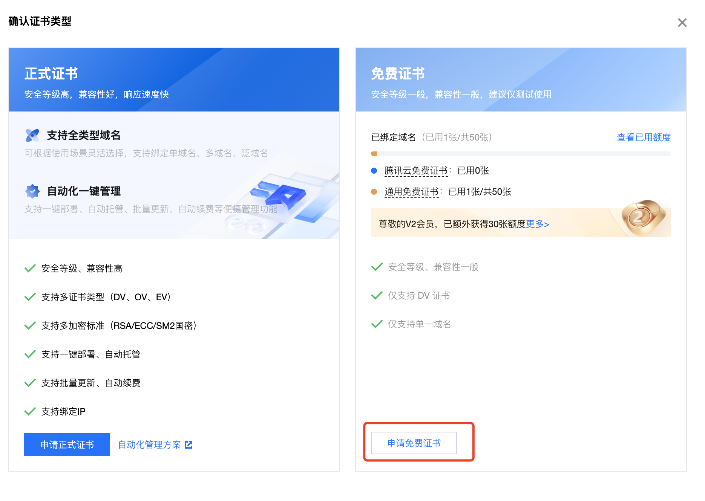
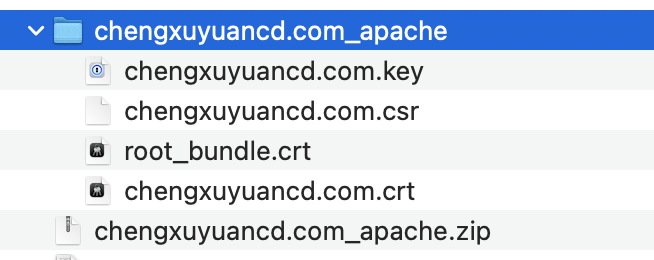
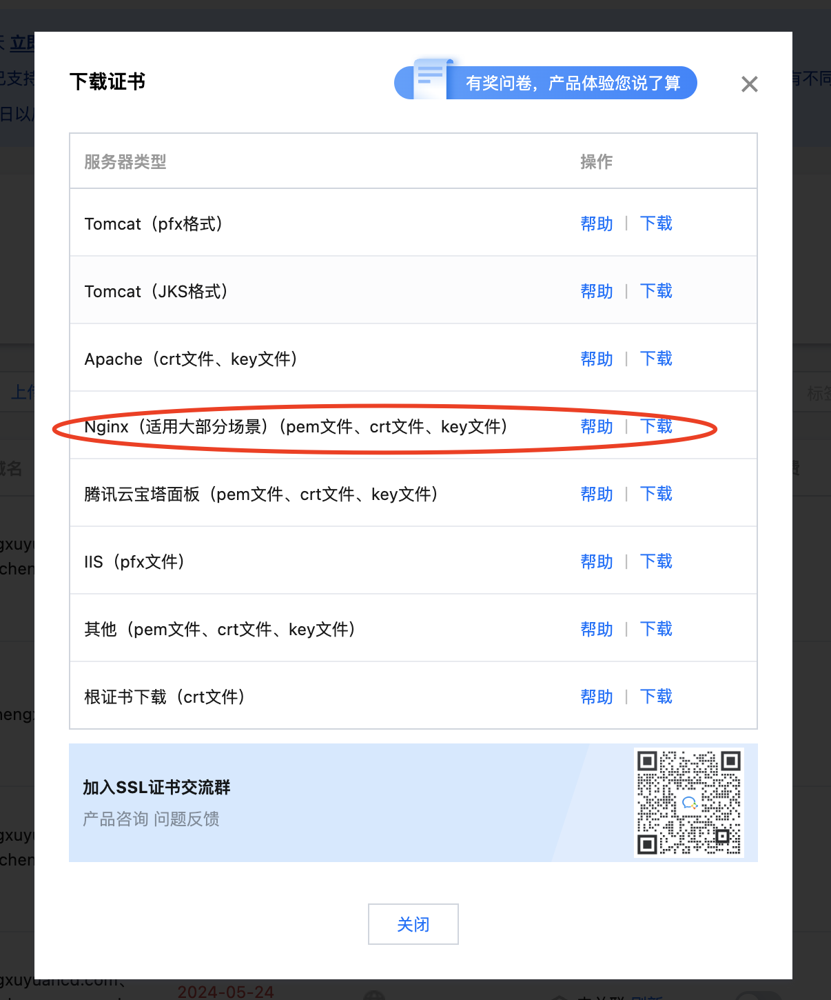
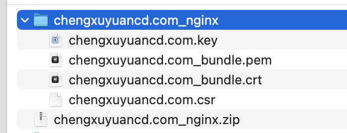

# 1. SSL证书官方介绍
SSL（安全套接层）证书是一种数字证书，用于在互联网上建立安全连接。它们通过加密数据传输来确保信息的安全性和完整性。SSL证书是由经过认证的证书颁发机构（CA）签发的，用于验证网站身份，并为网站和其访问者之间的通信提供加密保护。

SSL证书的主要作用包括：

1. **身份验证**：SSL证书确认网站的身份。这确保了访问者正在与期望的网站进行通信，而不是被中间人攻击的网站。

2. **数据加密**：SSL证书使用加密算法对数据进行加密，使其在传输过程中无法被窃取或篡改。这对于保护用户的敏感信息（如个人资料、信用卡号码等）至关重要。

3. **完整性保护**：SSL证书还提供了数据完整性保护。它们通过使用消息摘要算法（如SHA-256）来确保传输的数据在传输过程中未被篡改。

SSL证书通常包含以下信息：

- **证书持有者的名称和地址**
- **证书颁发机构的名称**
- **证书有效期限**
- **公钥**
- **证书的数字签名**

常见的SSL证书类型包括单域名证书（用于单个域名）、多域名证书（用于多个域名）、通配符证书（用于一个主域名及其所有子域名）等。

通过使用SSL证书，网站可以增强其安全性，建立用户信任，并遵守数据保护法规和标准。

# 2. SSL证书直观感受

## 2.1 没安装SSL证书之前
如下图，如果我直接访问: www.chengxuyuancd.com, 则会看到地址栏左侧显示：'Not Secure'或者说不安全


## 2.1 安装SSL证书之后


# 3. 如何安装
- 首先去你域名的服务器上申请免费的SSL或者购买正式的SSL证书（正式的太贵。。几千块一年，买不起买不起），但需要注意，免费的证书从2024年4月起一般都是只有三个月了，三个月到期后需要重复下这个步骤
- 每个域名服务商不太一致，先介绍下腾讯云的，其他的后续补充

## 3.1 腾讯云申请SSL证书
在控制台搜索SSL，找到'SSL 证书/我的证书'



接着点击 '申请免费证书'


在弹出的窗口中继续接着点击 '申请免费证书'


在弹出的窗口中，我们输入我们购买的域名，比如这里我输入：chengxuyuancd.com

后面如果域名是在腾讯云购买的，则会直接帮你选择 '自动DNS验证'，
其他两种验证方式也比较简单

接着输入你的申请邮箱

最后提交申请，然后等待审核通过即可

申请通过后即可看到多了一条记录：


## 3.2 配置SSL证书
点击刚申请成功的记录的最后一个'下载'按钮


在弹出的窗口中会让你选择何种类型的证书，需要根据你服务器的种类来决定，我这里提供两种
### 3.2.1 Apache


下载的是一个zip压缩包，解压缩之后出现几个文件：




- 然后把相应的证书拷贝到服务器相应的目录下：
    - `scp -i qq_2he_2G_1year_22_04_05 ~/Downloads/chengxuyuancd.com_apache/root_bundle.crt [root@](mailto:root@101.35.232.5)xxx:/opt/lampp/etc`
    - `scp -i qq_2he_2G_1year_22_04_05 ~/Downloads/chengxuyuancd.com_apache/chengxuyuancd.com.crt [root@](mailto:root@101.35.232.5)xxxx:/opt/lampp/etc/ssl.crt/`
    - `scp -i qq_2he_2G_1year_22_04_05 ~/Downloads/chengxuyuancd.com_apache/chengxuyuancd.com.key [root@](mailto:root@101.35.232.5)xxxx:/opt/lampp/etc/ssl.key/`

- 修改文件`sudo vi /opt/lampp/etc/extra/httpd-ssl.conf`

```shell
SSLCertificateFile "/opt/lampp/etc/ssl.crt/chengxuyuancd.com.crt"
SSLCertificateKeyFile "/opt/lampp/etc/ssl.key/chengxuyuancd.com.key"
SSLCertificateChainFile "/opt/lampp/etc/root_bundle.crt"
```


- 重启
    - `sudo /opt/lampp/lampp restart`


再次访问我们的网址就会发现没有不安全的警告啦：


### 3.2.2 Nginx
也可以参考官方教程：https://cloud.tencent.com/document/product/400/35244?from_cn_redirect=1



下载成功解压后得到：


通过运行命令: `nginx -t` 找到nginx配置文件的路径为: `/etc/ngnix/`


通过scp命令上传两个文件到上面的路径：

```shell
scp -i /Users/jie.xu/secrets/tengxunyun/qq_2he_2G_1year_22_04_05 ~/Downloads/chengxuyuancd.com_nginx/chengxuyuancd.com_bundle.crt root@101.35.232.5:/etc/nginx/


 scp -i /Users/jie.xu/secrets/tengxunyun/qq_2he_2G_1year_22_04_05 ~/Downloads/chengxuyuancd.com_nginx/chengxuyuancd.com.key root@101.35.232.5:/etc/nginx/
```

按官方教程将之前被注释掉的ssl部分按下面的格式改一下：
`vi /etc/nginx/nginx.conf`:

```conf
    server {
        listen       443 ssl http2;
        listen       [::]:443 ssl http2;
        server_name  _;
        root         /usr/share/nginx/html;

        ssl_certificate "/etc/nginx/chengxuyuancd.com_bundle.crt";
        ssl_certificate_key "/etc/nginx/chengxuyuancd.com.key";
        ssl_session_cache shared:SSL:1m;
        ssl_session_timeout  10m;
        ssl_ciphers HIGH:!aNULL:!MD5;
        ssl_prefer_server_ciphers on;

        # Load configuration files for the default server block.
        include /etc/nginx/default.d/*.conf;

        error_page 404 /404.html;
            location = /40x.html {
        }

        error_page 500 502 503 504 /50x.html;
            location = /50x.html {
        }
    }

```


- 重新启动nginx:

`nginx -s reload`

将会看到上面同样的效果


### 3.2.3 宝塔面板

如果你使用的是宝塔面板，同样非常简单
